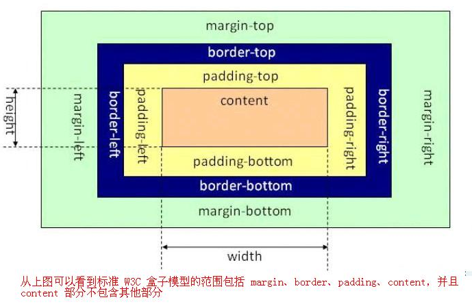

#### 1.CSS 选择器的优先级是如何计算的？

```
浏览器通过优先级规则，判断元素展示哪些样式。优先级通过 4 个维度指标确定，我们假定以a、b、c、d命名，分别代表以下含义：

1. a表示是否使用内联样式（inline style）。如果使用，a为 1，否则为 0。
2. b表示 ID 选择器的数量。
3. c表示类选择器、属性选择器和伪类选择器数量之和。
4. d表示标签（类型）选择器和伪元素选择器之和。

优先级的结果并非通过以上四个值生成一个得分，而是每个值分开比较。a、b、c、d权重从左到右，依次减小。判断优先级时，从左到右，一一比较，直到比较出最大值，即可停止。所以，如果b的值不同，那么c和d不管多大，都不会对结果产生影响。比如0，1，0，0的优先级高于0，0，10，10。

当出现优先级相等的情况时，最晚出现的样式规则会被采纳。如果你在样式表里写了相同的规则（无论是在该文件内部还是其它样式文件中），那么最后出现的（在文件底部的）样式优先级更高，因此会被采纳。

在写样式时，我会使用较低的优先级，这样这些样式可以轻易地覆盖掉。尤其对写 UI 组件的时候更为重要，这样使用者就不需要通过非常复杂的优先级规则或使用!important的方式，去覆盖组件的样式了。
```

* https://www.smashingmagazine.com/2007/07/css-specificity-things-you-should-know/
* https://www.sitepoint.com/web-foundations/specificity/


#### 2.重置（resetting）CSS 和 标准化（normalizing）CSS 的区别是什么？你会选择哪种方式，为什么？

**reset** 的目的，是将**所有**的浏览器的自带样式**重置**掉，这样更易于保持各浏览器渲染的一致性。

**normalize** 的理念则是**尽量保留**浏览器的默认样式，不进行太多的重置。

最主要的区别是Normalize.css保留不同浏览器同标签相同的默认值，只重置不同默认样式的差异，可以说css reset的高级版。

相对于普通的css reset，Normalize的的浏览器的兼容性更好，normalize.css支持更多的浏览器（包括手机端）


* 重置（Resetting）： 重置意味着除去所有的浏览器默认样式。对于页面所有的元素，像`margin`、`padding`、`font-size`这些样式全部置成一样。你将必须重新定义各种元素的样式。
* 标准化（Normalizing）： 标准化没有去掉所有的默认样式，而是保留了有用的一部分，同时还纠正了一些常见错误。

当需要实现非常个性化的网页设计时，我会选择重置的方式，因为我要写很多自定义的样式以满足设计需求，这时候就不再需要标准化的默认样式了。

https://stackoverflow.com/questions/6887336/what-is-the-difference-between-normalize-css-and-reset-css


#### 3.请阐述`Float`定位的工作原理。

浮动（float）是 CSS 定位属性。浮动元素从网页的正常流动中移出(脱标)，但是保持了部分的流动性，会影响其他元素的定位（比如文字会围绕着浮动元素）。这一点与绝对定位不同，绝对定位的元素完全从文档流中脱离。


#### 4.请阐述`z-index`属性，并说明如何形成层叠上下文（stacking context）。

```
1.CSS 中的z-index属性控制重叠元素的垂直叠加顺序。z-index只能影响position值不是static的元素。
2.没有定义z-index的值时，元素按照它们出现在 DOM 中的顺序堆叠（层级越低，出现位置越靠上）。
3.非静态定位的元素（及其子元素）将始终覆盖静态定位（position不写的时候就是static定位）的元素，而不管 HTML 层次结构如何。
4.层叠上下文是包含一组图层的元素。 在一组层叠上下文中，其子元素的z-index值是相对于该父元素而不是 document root 设置的。每个层叠上下文完全独立于它的兄弟元素。如果元素 B 位于元素 A 之上，则即使元素 A 的子元素 C 具有比元素 B 更高的z-index值，元素 C 也永远不会在元素 B 之上.
```

* https://css-tricks.com/almanac/properties/z/z-index/
* https://philipwalton.com/articles/what-no-one-told-you-about-z-index/
* https://developer.mozilla.org/en-US/docs/Web/CSS/CSS_Positioning/Understanding_z_index/The_stacking_context


#### 5.请阐述块格式化上下文（Block Formatting Context）及其工作原理。

块格式上下文（BFC）是它是一个独立的渲染区域，只有Block-level box参与， 它规定了内部的Block-level Box如何布局，并且与这个区域外部毫不相干。

一个 HTML 盒（Box）满足以下任意一条，会创建块格式化上下文：

* `float`的值不是`none`.
* `position`的值不是`static`或`relative`.
* `display`的值是`table-cell`、`table-caption`、`inline-block`、`flex`、或`inline-flex`。
* `overflow`的值不是`visible`。

BFC特性：

```
1.在BFC中，盒子从顶端开始垂直地一个接一个地排列.
2.盒子垂直方向的距离由margin决定。属于同一个BFC的两个相邻盒子的margin会发生重叠
3.在BFC中，每一个盒子的左外边缘（margin-left）会触碰到容器的左边缘(border-left)（对于从右到左的格式来说，则触碰到右边缘）
4.BFC的区域不会与浮动盒子产生交集，而是紧贴浮动边缘。
5.计算BFC的高度时，自然也会检测浮动或者定位的盒子高度。
6.BFC就是页面上的一个隔离的独立容器，容器里面的子元素不会影响到外面元素，反之亦然
```

#### 6.有哪些清除浮动的技术，都适用哪些情况？

父级div定义伪类:after和zoom和:before

```css
 .clearfix:after{display:block;clear:both;content:"";visibility:hidden;height:0}
 .clearfix{zoom:1}
 
 <div class="clearfix">
 	<li class="item">
 	</li>
 </div>
 
原理：IE8以上和非IE浏览器才支持:after，zoom(IE转有属性)可解决ie6,ie7浮动问题。
优点：浏览器支持好，不容易出现怪问题（目前：大型网站都有使用，如：腾迅，网易，新浪等等）。
缺点：代码多，要两句代码结合使用，才能让主流浏览器都支持建议：推荐使用，建议定义公共类，以减少CSS代码
在大型项目中，我会使用 clearfix 方法，在需要的地方使用.clearfix
```

父级div定义height

```css
原理：父级div手动定义height，就解决了父级div无法自动获取到浮动子元素脱标的高度的问题。
优点：简单，代码少，容易掌握
缺点：只适合高度固定的布局，要给出精确的高度，如果高度和父级div不一样时，会产生问题
```

父级div定义overflow:hidden

```css
原理：必须定义zoom:1，同时不能定义height，使用overflow:hidden时，浏览器会自动检查浮动区域的高度
优点：简单，代码少，浏览器支持好
缺点：不能和position配合使用，因为超出的尺寸的会被隐藏。
建议：只推荐没有使用position或对overflow:hidden理解比较深的朋友使用


<head>
    <meta charset="UTF-8">
    <title>Document</title>

    <style>
        .box {
            background: skyblue;
            overflow: hidden;
            zoom: 1;
        }

        .kid {
            width: 100px;
            height: 100px;
            float: left;
        }

        .kid1 {
            background: yellow;
        }

        .kid2 {
            background: orange;
        }

        .wrap {
            width: 300px;
            height: 150px;
            background: blue;
            color: white;
        }
    </style>
</head>

<body>
    <div class="box">
        <div class="kid kid1">子元素1</div>
        <div class="kid kid2">子元素2</div>
    </div>
    <div class="wrap">其他部分</div>
</body>
```

父级div定义overflow:auto

```css
原理：必须定义zoom:1，同时不能定义height(定义高度之后就超出范围隐藏了)，使用overflow:auto时，浏览器会自动检查浮动区域的高度
优点：简单，代码少，浏览器支持好
缺点：内部宽高超过父级div时，会出现滚动条。
建议：不推荐使用，如果你需要出现滚动条或者确保你的代码不会出现滚动条就使用吧。
```

使用空div隔墙(内墙)法：` <div style="clear:both;"></div>`

```
原理：添加一个空div，利用css提供的clear:both清除浮动
优点：通俗易懂，容易掌握
缺点：会添加很多无意义的空标签，在后期维护中将是噩梦
建议：不推荐使用，但此方法是以前主要使用的一种清除浮动方法
```

#### 7.请解释什么是雪碧图（css sprites），以及如何实现？

	雪碧图是把多张图片整合到一张上的图片。它被运用在众多使用了很多小图标的网站上（Gmail 在使用）。实现方法：

1. 使用生成器将多张图片打包成一张雪碧图，并为其生成合适的 CSS。
1. 每张图片都有相应的 CSS 类，该类定义了`background-image`、`background-position`和`background-size`属性。
1. 使用图片时，将相应的类添加到你的元素中。

好处：

* 减少加载多张图片的 HTTP 请求数（一张雪碧图只需要一个请求）。但是对于 HTTP2 而言，加载多张图片不再是问题。
* 提前加载资源，防止在需要时才在开始下载引发的问题，比如只出现在`:hover`伪类中的图片，不会出现闪烁。

https://css-tricks.com/css-sprites/

#### 8.什么是外边距重叠（外边距坍塌）？重叠的结果是什么？

在 CSS 当中，相邻的两个盒子（可能是兄弟关系也可能是祖先关系）的外边距可以结合成一个单独的外边距。这种合并外边距的方式被称为折叠，并且因而所结合成的外边距称为折叠外边距。

折叠结果遵循下列计算规则：

1. 两个相邻的外边距都是正数时，折叠结果是它们两者之间较大的值。
2. 两个相邻的外边距都是负数时，折叠结果是两者绝对值的较大值。
3. 两个外边距一正一负时，折叠结果是两者的相加的和。

#### 9.有什么不同的方式可以隐藏内容（使其仅适用于屏幕阅读器）？

这些方法与可访问性有关。

* `visibility: hidden`：元素仍然在页面流中，并占用空间。
* `width: 0; height: 0`：使元素不占用屏幕上的任何空间，导致不显示它。
* `position: absolute; left: -99999px`： 将它置于屏幕之外。
* `text-indent: -9999px`：这只适用于`block`元素中的文本。


#### 10.除了`screen`，你还能说出一个 @media 属性的例子吗？

```
- all      适用于所有设备。
- print    为了加载合适的文档到当前使用的可视窗口. 需要提前咨询 paged media（媒体屏幕尺寸）, 以满足个别设备网页尺寸不匹配等问题。
- screen   主要适用于彩色的电脑屏幕
- speech   解析speech这个合成器. 注意: CSS2已经有一个相似的媒体类型叫aural.
```

#### 11.编写高效的 CSS 应该注意什么？

```
1.根据关键选择器，浏览器从 DOM 中筛选出元素，然后向上遍历被选元素的父元素，判断是否匹配。因此选择器匹配语句链越短，浏览器的匹配速度越快
2.避免使用标签和通用选择器作为关键选择器，因为它们会匹配大量的元素，浏览器必须要进行大量的工作，去判断这些元素的父元素们是否匹配
3.BEM(Block Element Modifier)原则上建议为独立的 CSS 类命名，并且在需要层级关系时，将关系也体现在命名中，这自然会使选择器高效且易于覆盖。
4.搞清楚哪些 CSS 属性会触发重新布局（reflow）、重绘（repaint）和合成（compositing）。在写样式时，避免触发重新布局的可能。
```

#### 12.使用 CSS 预处理的优缺点分别是什么？

优点：

* 提高 CSS 可维护性。
* 易于编写嵌套选择器。
* 引入变量，增添主题功能。可以在不同的项目中共享主题文件。
* 通过混合（Mixins）生成重复的 CSS。
* Splitting your code into multiple files. CSS files can be split up too but doing so will require a HTTP request to download each CSS file.
* 将代码分割成多个文件。不进行预处理的 CSS，虽然也可以分割成多个文件，但需要建立多个 HTTP 请求加载这些文件。

缺点：

* 需要预处理工具。
* 重新编译的时间可能会很慢。

#### 13.对于你使用过的 CSS 预处理，说说喜欢和不喜欢的地方？

喜欢：

* 绝大部分优点上题以及提过。
* Less 用 JavaScript 实现，与 NodeJS 高度结合。

Dislikes:

* 我通过`node-sass`使用 Sass，它用 C ++ 编写的 LibSass 绑定。在 Node 版本切换时，我必须经常重新编译。
* Less 中，变量名称以`@`作为前缀，容易与 CSS 关键字混淆，如`@media`、`@import`和`@font-face`。

#### 14.如何实现一个使用非标准字体的网页设计？

使用`@font-face`并为不同的`font-weight`定义`font-family`。

#### 15.解释浏览器如何确定哪些元素与 CSS 选择器匹配。

	浏览器从最右边的选择器（关键选择器）根据关键选择器，浏览器从 DOM 中筛选出元素，然后向上遍历被选元素的父元素，判断是否匹配。选择器匹配语句链越短，浏览器的匹配速度越快。

	例如，对于形如`p span`的选择器，浏览器首先找到所有`<span>`元素，并遍历它的父元素直到根元素以找到`<p>`元素。对于特定的`<span>`，只要找到一个`<p>`，就知道'<span>`已经匹配并停止继续匹配。

* https://stackoverflow.com/questions/5797014/why-do-browsers-match-css-selectors-from-right-to-left

#### 16.描述伪元素及其用途。

伪元素指的是两个冒号的选择器   div::before   div::after    p::first-letter

伪元素的原理 添加一个子元素 来实现对应的功能

伪元素的用途：
1.用after清除浮动

```
.clearfix:after {content:"."; display:block; height:0; visibility:hidden; clear:both; }
.clearfix { *zoom:1; }
```

2.结合字体图标的使用
3.超链接特效

```
a {
    position: relative;
    display: inline-block;
    outline: none;
    color: #fff;
    text-decoration: none;
    font-size: 32px;
	padding: 5px 20px;
}
a:hover::before, a:hover::after { position: absolute; }
a:hover::before { content: "\5B"; left: -10px; }
a:hover::after { content: "\5D"; right:  -10px; }</style><a>鼠标移上去出现方括号</a>
```

#### 17.说说你对盒模型的理解，以及如何告知浏览器使用不同的盒模型渲染布局。

CSS盒子模型：外边距(margin) + 内边距(padding) +边框(border)



CSS 盒模型负责计算：

* 块级元素占用多少空间。
* 边框是否重叠，边距是否合并。
* 盒子的尺寸。

```
盒模型有以下规则：
- 块级元素的大小由width、height、padding、border决定。
- 如果没有指定height，则块级元素的高度等于其包含子元素的内容高度加上padding（除非有浮动元素，请参阅下文）。
- 如果没有指定width，则非浮动块级元素的宽度等于其父元素的宽度减去父元素的padding。
- 元素的height是由内容的height来计算的。
- 元素的width是由内容的width来计算的。
- 默认情况下，padding和border不是元素width和height的组成部分。
```

我们可以指定box-sizing:border-box/context-box  来指定采用IE盒子模型还是W3C标准盒子模型。

当指定box-sizing:border-box的时候，元素的padding和border不会撑大盒子本身

当指定box-sizing:content-box的时候，盒子的宽度=盒子内容的宽度+左右padding+左右border

#### 18.` { box-sizing: border-box; }`会产生怎样的效果？

```
盒子模型有两种：
1.IE盒子模型  border-box    padding和boder不会撑大盒子本身
2.W3C盒子模型 content-box （标准盒子模型，如果我们没有写box-sizing: border-box此时默认就是W3C盒子模型）
```

* 元素默认应用了`box-sizing: content-box`，元素的宽高只会决定内容（content）的大小。
* `box-sizing: border-box`改变计算元素`width`和`height`的方式，`border`和`padding`的大小也将计算在内。
* 元素的`height` = 内容（content）的高度 + 垂直方向的`padding` + 垂直方向`border`的宽度
* 元素的`width` = 内容（content）的宽度 + 水平方向的`padding` + 水平方向`border`的宽度

#### 19.`display`的属性值都有哪些？

* `none`, `block`, `inline`, `inline-block`, `table`, `table-row`, `table-cell`, `list-item`.


#### 20.`inline`和`inline-block`有什么区别？

我把`block`也加入其中，为了获得更好的比较。

|                                 | `block`                                                     | `inline-block`                             | `inline`                                                                                                           |
| ------------------------------- | ----------------------------------------------------------- | ------------------------------------------ | ------------------------------------------------------------------------------------------------------------------ |
| 大小                            | 填充其父容器的宽度。                                        | 取决于内容。                               | 取决于内容。                                                                                                       |
| 定位                            | 从新的一行开始，并且不允许旁边有 HTML 元素（除非是`float`） | 与其他内容一起流动，并允许旁边有其他元素。 | 与其他内容一起流动，并允许旁边有其他元素。                                                                         |
| 能否设置`width`和`height`       | 能                                                          | 能                                         | 不能。 设置会被忽略。                                                                                              |
| 可以使用`vertical-align`对齐    | 不可以                                                      | 可以                                       | 可以                                                                                                               |
| 边距（margin）和填充（padding） | 各个方向都存在                                              | 各个方向都存在                             | 只有水平方向存在。垂直方向会被忽略。 尽管`border`和`padding`在`content`周围，但垂直方向上的空间取决于'line-height' |
| 浮动（float）                   | -                                                           | -                                          | 就像一个`block`元素，可以设置垂直边距和填充。                                                                      |

#### 21.`relative`、`fixed`、`absolute`和`static`四种定位有什么区别？

定位的元素，其`position`属性值必然是`relative`、`absolute`、`fixed`或`static`。

* `static`：默认定位属性值。该关键字指定元素使用正常的布局行为，即元素在文档常规流中当前的布局位置。此时 top, right, bottom, left 和 z-index 属性无效。
* `relative`：该关键字下，元素先放置在未添加定位时的位置，再在不改变页面布局的前提下调整元素位置（因此会在此元素未添加定位时所在位置留下空白）。
* `absolute`：不为元素预留空间，通过指定元素相对于最近的非 static 定位祖先元素的偏移，来确定元素位置。绝对定位的元素可以设置外边距（margins），且不会与其他边距合并。
* `fixed`：不为元素预留空间，而是通过指定元素相对于屏幕视口（viewport）的位置来指定元素位置。元素的位置在屏幕滚动时不会改变。打印时，元素会出现在的每页的固定位置。fixed 属性会创建新的层叠上下文。当元素祖先的 transform 属性非 none 时，容器由视口改为该祖先。

#### 22.你使用过哪些现有的 CSS 框架？你是如何改进它们的？

* Bootstrap： 更新周期缓慢。Bootstrap 4 已经处于 alpha 版本将近两年了。添加了在页面中广泛使用的微调按钮组件。
* Amaze UI：国人开发的一款响应式UI框架。类似于Bootstrap，有一定的使用人群
* jQuery UI ：jQuery的UI框架，样式比较老。
* MUI ：移动端的UI框架，以iOS 7为基础，补充部分Android特有控件

除此之外，在Vue和React中，还有很多的UI组件，包括vux、mint-UI、antdesign、element-ui等等

#### 23.你了解 CSS Flex 和 Grid 吗？

Flex 主要用于一维布局，而 Grid 则用于二维布局。

Flex：flex容器中存在两条轴， 横轴和纵轴， 容器中的每个单元称为flex item。

```
在容器上可以设置6个属性：
- flex-direction    主轴方向
- flex-wrap         主轴超出范围是否换行
- flex-flow         flex-direction和flex-wrap的复合属性
- justify-content   元素在主轴的对齐方式
- align-items       元素在侧轴的对齐方式
- align-content     元素在侧轴的对齐方式（多行）

注意：当设置 flex 布局之后，子元素的 float、clear、vertical-align 的属性将会失效。

Flex 有六种属性可运用在 item 项目上:
1. order            flex-item的排序
2. flex-basis       flex-item的宽度
3. flex-grow        flex-item占据剩余空间的比例
4. flex-shrink      flex-item占据收缩空间的比例
5. flex             flex-grow\flex-shrink\flex-basis的复合属性
6. align-self       规定flex-item自己的对齐方式
```

Grid：像表格一样，网格布局让我们能够按行或列来对齐元素。 但是，使用CSS网格可能还是比CSS表格更容易布局。 例如，网格容器的子元素可以自己定位，以便它们像CSS定位的元素一样，真正的有重叠和层次。

#### 24.响应式设计与自适应设计有何不同？

响应式设计和自适应设计都以提高不同设备间的用户体验为目标，根据视窗大小、分辨率、使用环境和控制方式等参数进行优化调整。

响应式设计：网站应该凭借一份代码，在各种设备上都有良好的显示和使用效果。响应式网站通过使用媒体查询，自适应栅格和响应式图片，基于多种因素进行变化，创造出优良的用户体验。就像一个球通过膨胀和收缩，来适应不同大小的篮圈。

自适应布局：需要开发多套界面来适应不同的终端。

* https://developer.mozilla.org/en-US/docs/Archive/Apps/Design/UI_layout_basics/Responsive_design_versus_adaptive_design
* http://mediumwell.com/responsive-adaptive-mobile/
* https://css-tricks.com/the-difference-between-responsive-and-adaptive-design/

#### 25.你有没有使用过视网膜分辨率的图形？当中使用什么技术？

1.使用高分辨率的图形（显示尺寸的两倍）来处理视网膜显示，也就是使用2倍图。

2.更好的做法是使用媒体查询，像`@media only screen and (min-device-pixel-ratio: 2) { ... }`，然后改变`background-image`，不同分辨率的屏幕使用不同的图片。

3.对于图标类的图形，我会尽可能使用 svg 和字体图标，因为它们在任何分辨率下都不会失真。

4.还有一种方法是在检查了`window.devicePixelRatio`的值后，利用 JavaScript 将``的`src`属性修改，用更高分辨率的版本进行替换。

* https://www.sitepoint.com/css-techniques-for-retina-displays/


#### 26.什么情况下，用`translate()`而不用绝对定位？什么时候，情况相反。

1.`translate()`是`transform`的一个值。改变`transform`或`opacity`不会触发浏览器重新布局（reflow）或重绘（repaint），只会触发复合（compositions）。而改变绝对定位会触发重新布局，进而触发重绘和复合。

2.`transform`使浏览器为元素创建一个 GPU 图层，但改变绝对定位会使用到 CPU。 因此`translate()`更高效，可以缩短平滑动画的绘制时间。

3.当使用`translate()`时，元素仍然占据其原始空间（有点像`position：relative`），这与改变绝对定位不同。

4.因此，如果要基于元素原来的位置做调整，我们可以使用translate进行平移变化；而如果要把元素放在页面或者父元素的指定位置，我们可以使用绝对定位脱标布局


#### 27.行内元素、块级元素区别
行内元素：在一行显示，不可以设置宽高。代表  span   a   input   select  strong

块级元素：换行显示，可以设置宽高。代表  div  dl  dd  dt  form   p   table  tr  th  td

行内块级元素：在一行显示，可以设置宽高。代表 img  input

#### 28.水平垂直居中的方式
flex

```
// 父容器
display: flex;
justify-content: center;
align-items: center;
```
position

```
// 父容器
position: relative;

// 子容器
position:absolute;
margin:auto;
top:0;
bottom:0;
left:0;
right:0;
```
position+transform

```
// 父容器
position: relative;

// 子容器
position: absolute;
top: 50%;
left: 50%;
transform: translate(-50%, -50%);
```
table-cell

```
<div class="box">
    <div class="content">
        <div class="inner"></div>
    </div>
</div>

html, body {
    height: 100%;
    width: 100%;
    margin: 0;
}
.box {
    display: table;
    height: 100%;
    width: 100%;
}
.content {
    display: table-cell;
    vertical-align: middle;
    text-align: center;
}
.inner {
    background-color: #000;
    display: inline-block;
    width: 200px;
    height: 200px;
}
```
#### 29.display:none、visibile:hidden、opacity:0的区别
| |是否隐藏 |是否在文档中占用空间|是否会触发事件|
|-|-|-|-|
|display: none|是|否|否|
|visibile: hidden|是|是|否|
|opacity: 0|是|是|是|

display:none之后，该元素及所有的后代元素都会隐藏，不占据空间。

visibility:hidden之后，子元素会继承父亲的属性值，但是重新给子元素设置visibility:visible之后，子元素又会显示出来。

#### 30.CSS中link和@import的区别

* link属于HTML标签，而@import是CSS提供的
* 页面被加载的时，link会被加载，而@import引用的CSS会等到页面被加载完再加载
* import只在IE5以上才能识别，而link是HTML标签，无兼容问题
* link方式的样式的权重 高于@import的权重

#### 31.文本超出部分显示省略号
单行

```
overflow: hidden;
text-overflow:ellipsis;
white-space: nowrap;
```
多行

```
display: -webkit-box;
-webkit-box-orient: vertical;
-webkit-line-clamp: 3; // 最多显示几行
overflow: hidden;
```
#### 32.利用伪元素画三角
```
.info-tab {
    position: relative;
}
.info-tab::after {
    content: '';
    border: 4px solid transparent;
    border-top-color: #2c8ac2;   
    position: absolute;
    top: 0;
}
```
#### 33.CSS选择符有哪些？哪些属性可以继承？

```
1.id选择器（ # myid）
2.类选择器（.myclassname）
3.标签选择器（div, h1, p）
4.相邻选择器（h1 + p）
5.子选择器（ul > li）
6.后代选择器（li a）
7.通配符选择器（ * ）
8.属性选择器（a[rel = "external"]）
9.伪类选择器（a:hover, li:nth-child）
 

可继承的样式： font-size   font-family color  line-height  text开头的  opacity
不可继承的样式：border paddingmargin width height

```

#### 34.css定义权重和优先级

```
我们可以给标签的权重为1，class的权重为10，id的权重为100，!important权重无限大来计算css样式的优先级。


优先级算法：
1.优先级就近原则，同权重情况下样式定义最近者为准;
2.载入样式同权重下以最后载入的定位为准;
3.!important > 内联  > id > class > tag

```

#### 35.如果需要手动写动画，你认为最小时间间隔是多久，为什么？

   多数显示器默认频率是60Hz，即1秒刷新60次，所以理论上最小间隔为1/60＊1000ms ＝ 16.7ms

#### 36.超链接访问过后hover样式就不出现了 被点击访问过的超链接样式不在具有hover和active样式了

```
解决方法是改变CSS属性的排列顺序:
  L-V-H-A :  a:link {} a:visited {} a:hover {} a:active {}
```

#### 37.低版本浏览器不支持display:inline-block属性，请问怎么兼容

display:inline;zoom:1;

#### 38.在使用display:inline-block时，inline-block元素会有4px左右的空隙，这是什么原因导致的以及解决方法

空白折叠现象

（1） 取消换行和空格

（2） 设置父元素的font-size为0，在给子元素设置自身的字体大小

#### 39.写出下面三个的区别？

color{}

_color{}

+color{}

```
.ie6_7_8{
    color:blue;       /*所有浏览器*/
    color:red\9;      /*IE10以及以下版本浏览器*/
    *color:green;     /*IE7及其以下版本浏览器*/
    _color:purple;    /*IE6浏览器*/
    +color:yellow;    /*IE6 IE7浏览器*/
    color\0:pink;     /*IE8、9、10、11*/
    color\9\0:black;  /*IE8、9、10（其他不支持）*/  
}
```

#### 40.Inline-block默认的对其方式是什么？在使用inline-block时在内容不同的时候想要保持内容水平对齐，说一下你采用的方法？

默认对齐方式：base-line  基线对齐

水平对齐：vertical-align:top;

#### 41.HTML5、CSS3里面都新增了那些新特性？

```
HTML5新增如下：
1.更多新的语义化的标签（header,nav,footer,aside,article,section）
2.更多的表单的type属性值和表单的属性
3.多媒体方面的标签  (audio,video)
4.html5的接口(地理定位   拖拽   全屏   文件读取)
5.应用数据的缓存 (demo.appache)
6.本地存储的技术(localstorge  sessionstorage)
7.canvas(画布)
8.websocket / webworker
```

```
CSS3新增如下：
- 更多的选择器  伪元素和伪类选择器，属性选择器
- css3更多的属性   文字阴影(text-shadow)  边框阴影(box-shadow)  边框图(border-image)  边框圆角(border-radius)  颜色渐变(linear-gradient)  背景(background-origin  background-clip)相关的属性
- css3的动画   transition  animation
- 2d和3d变化  transform
- css3媒体查询、伸缩盒子
```

#### 42.HTML5 为什么只需要写 <!DOCTYPEHTML>？

 HTML5 不基于 SGML（标准通用标记语言），因此不需要对DTD进行引用，但是需要doctype来规范浏览器的行为（让浏览器按照它们应该的方式来运行）；

 而HTML4.01基于SGML,所以需要对DTD进行引用，才能告知浏览器文档所使用的文档类型。

#### 43.如何处理HTML5新标签的浏览器兼容问题？

IE8/IE7/IE6支持通过document.createElement方法产生的标签，可以利用这一特性让这些浏览器支持HTML5新标签，浏览器支持新标签后，还需要添加标签默认的样式。

```javascript
<!--[if lt IE 9]>
<script type="text/javascript"src="js/html5shiv.js"></script>
<![endif]-->

//将上代码复制到head部分，记住一定要是head部分（因为IE必须在元素解析前知道这个元素，所以这个js文件不能在其他位置调用，否则失效）

//最后在css里面加上这段,主要是让这些html5标签成块状，像div那样。：
article,aside,dialog,footer,header,section,footer,nav,figure,menu{display:block}
```

#### 44.什么叫优雅降级和渐进增强？

优雅降级：Web站点在所有新式浏览器中都能正常工作，如果用户使用的是老式浏览器，则代码会针对旧版本的IE进行降级处理了,使之在旧式浏览器上以某种形式降级体验却不至于完全不能用。

如：border-shadow


渐进增强：从被所有浏览器支持的基本功能开始，逐步地添加那些只有新版本浏览器才支持的功能,向页面增加不影响基础浏览器的额外样式和功能的。当浏览器支持时，它们会自动地呈现出来并发挥作用。

如：默认使用flash上传，但如果浏览器支持 HTML5 的文件上传功能，则使用HTML5实现更好的体验；

#### 45.transition和animation的区别

transition是过渡动画，animation是帧动画。

transition只能从一种状态过渡到另外一种状态，animation可以定制复杂动画(多个帧)，可以定义动画的区间等。

transition必须通过一些行为才能触发（js或者伪类来触发），animation的话直接就可以触发。

#### 46.margin-left:calc(-100%-100px) 代码中用到了一个calc（），这个函数的作用是什么？

答：通过计算来确定CSS属性值。

calc是英文单词calculate(计算)的缩写，是css3的一个新增的功能，你可以使用calc()给元素的border、margin、pading、font-size和width等属性设置动态值。calc()可以使用数学运算中的简单加（+）、减（-）、乘（）和除（/）来解决问题，而且还可以根据单位如px,em,rem和百分比来转化计算

#### 47.简述HTML5新增的canvas、audio、svg标签的作用

canvas被称作画布，canvas 元素使用 JavaScript 在网页上绘制图像。 画布是一个矩形区域,可以控制其每一像素。

audio标签可以引用音频资源，在页面上播放音乐

svg用XML格式定义图形，可以用来制作矢量图形。

#### 48.简述如何通过CSS进行响应式布局的方式

响应式布局使用媒体查询@media 定义多个分辨率下的样式，使页面在不同的分辨率下显示不同的样式

#### 49.CSS的单位中，设定元素的长度或宽度与父元素字体大小相关的单位是什么？与html文档元素大小相关的单位是什么？

em 、rem

em是相对于父元素的尺寸单位

rem表示“Root EM”，相对于html元素的尺寸单位（html默认font-size:16px）

#### 50.CSS3实现一段阴影文本持续淡入淡出？

HTML结构 ： 

```
<div class="box">文本</div>
```

CSS样式：

    .box {
        text-shadow: 1px 1px 2px #F00;
        animation:fade 1s infinite;
    }
    
    @keyframes fade {
        0%{ opacity: 0;}
        50%{ opacity: 100;}
        100%{ opacity: 0;}
    }

#### 51.如何使用Canvas来画一条简单的线？

```javascript
var canvas=document.getElementById("canvas");   //拿到canvas画布
var cxt=canvas.getContext('2d');   //得到画布上下文
cxt.beginPath();   //开始绘制线
cxt.lineWidth=10;   //设置线宽
cxt.strokeStyle="#00ff00";   //设置描边颜色
cxt.moveTo(20,20);   //移动画笔到20,20
cxt.lineTo(100,20);  //从20,20向100,20画一条线
cxt.stroke();        //描边
cxt.closePath();     //闭合路径
```

#### 52.rgba和opacity的透明效果有什么不同？

opacity会继承父元素的 opacity 属性，而RGBA设置的元素的后代元素不会继承不透明属性。

比如rgba的话,内部的文字透明度不会发生变化，而opacity的话，会影响到内部的文字 

#### 53.FontAwesome和iconfont是什么？他们有什么异同，问什么要使用它，有什么弊端？

两个都是图标字体。Font Awesome 是一套完美的图标字体,主要目的是和 Bootstrap 搭配使用

Iconfont是阿里的字体库，可以定制自己要的字体图标。

```
使用字体图标的优势：
1、轻量性：一个图标字体比一系列的图像（特别是在Retina屏中使用双倍图像）要小。可以减少HTTP请求，还可以配合HTML5离线存储做性能优化。
2、灵活性：图标字体可以用过font-size属性设置其任何大小，还可以加各种文字效果，包括颜色、Hover状态、透明度、阴影和翻转等效果。
3、兼容性：网页字体支持所有现代浏览器，包括IE低版本。

使用字体图标的弊端：
1.跨域问题
2.字体图标库似乎体积显得有些过大
```

#### 54.解释下这个CSS选择器什么发生什么？

```
[role=navigation] > ul a:not([href^=mailto]) {}
```

定义了role属性，并且值为navigation的任何元素，其子元素列表下的除邮箱链接之外的所有链接元素。

#### 55.经常遇到的浏览器的兼容性有哪些？原因，解决方法是什么，常用hack的技巧 ？

1.IE不支持h5新标签和c3媒体查询的问题

```
引入html5shiv.js在IE浏览器下创建h5标签
引入respond.js让IE浏览器支持C3的媒体查询
```

2.js代码兼容性问题

```
根据兼容需求选择技术框架/库(jquery)
```

3.css兼容性问题

```
A.使用Reset CSS或Normalize.css做样式的重置
B.使用autoprefixer添加浏览器前缀
C.使用条件注释针对不同的浏览器引入单独的样式表
D.使用已经处理好兼容问题的库，比如BootStrap
E.渐进增强(progressive enhancement): 针对低版本浏览器进行构建页面，保证最基本的功能，然后再针对高级浏览器进行效果、交互等改进和追加功能达到更好的用户体验
F.优雅降级 (graceful degradation): Web站点在所有新式浏览器中都能正常工作，然后再针对低版本浏览器进行兼容。
G.使用CSS hack技术做样式兼容
```


常见的兼容性问题：

```
display:inline-block（IE7及以下不支持）
需要对低版本IE特殊处理：{display:inline-block;display:inline;zoom:1;}

display:inline-block 什么时候会显示间隙？怎样消除间隙？
父元素font-size设置成0，子元素重新设置font-size

display:inline-block滥用容易出现布局方面的问题，尤其在左中右、左右等布局方面的问题尤为突出。因此如果是左右布局的话，尽量都用浮动来代替

z-index在IE7及以下版本的话，有时会发现不是谁z-index设置的越高谁就显示在最上面。碰到这种问题需要设置父元素有相对定位属性元素的z-index。先比较父元素的z-index再比较子元素的

IE6双边距：IE6中，元素向左浮动并且设置了左侧的外边距出现了这样的双边距bug。同理，元素向右浮动并且设置右边距也会出现同样的情况。同一行如果有多个浮动元素，第一个浮动元素会出现这个双边距bug，其它的浮动元素则不会。只需要给浮动元素加上display:inline;这样的CSS属性就可以了。

margin-top，margin-bottom的bug
父元素的第一个子元素设置了margin-top,会作用于父元素（值为父元素的margin-top与该margin-top两者中的最大值)，而子元素和父元素的边距则没有发生变化。

超链接访问之后hover样式不出现了，被点击后也不具有active和hover样式。
方法：按照顺序写 ：a:link{   }  a:visited{  } a:hover{  } a:active{   }

IE没有办法定义1像素左右的宽度容器（IE6默认的行高造成的，使用over:hidden,zoom:0.08;line-height:1px）

IE5-8不支持opacity
方法：
.opacity{
    opacity:0.4,
    filter:alpha(opacity=60);
    -ms-filter:"progid:DXImageTransform.Microsoft.Alpha(Opacity=60)"
}

IE6不支持PNG透明管背景色，IE6下使用gif图片,png24的图片在ie6浏览器上显示背景色，做成png8的

IE下even对象只有x,y属性，但是没有pagex和pagey属性，火狐只有pagex pagey属性。

谷歌下默认会将小于12px的文本设置按照12px显示，可是通过加入-webkit-text-size-adjust:none;
```

#### 56.CSS Hack技术

什么是CSS hack

```
由于不同厂商的流览器或某浏览器的不同版本（如IE6-IE11,Firefox/Safari/Opera/Chrome等），对CSS的支持、解析不一样，导致在不同浏览器的环境中呈现出不一致的页面展现效果。这时，我们为了获得统一的页面效果，就需要针对不同的浏览器或不同版本写特定的CSS样式，我们把这个针对不同的浏览器/不同版本写相应的CSS code的过程，叫做CSS hack!
```

CSS hack的原理

```
由于不同的浏览器和浏览器各版本对CSS的支持及解析结果不一样，以及CSS优先级对浏览器展现效果的影响，我们可以据此针对不同的浏览器情景来应用不同的CSS。
```

CSS hack分类

```
lte：就是Less than or equal to的简写，也就是小于或等于的意思。
lt ：就是Less than的简写，也就是小于的意思。
gte：就是Greater than or equal to的简写，也就是大于或等于的意思。
gt ：就是Greater than的简写，也就是大于的意思。
! ：就是不等于的意思，跟javascript里的不等于判断符相同
```

CSS Hack大致有3种表现形式，CSS属性前缀法、选择器前缀法以及IE条件注释法（即HTML头部引用if IE）Hack，实际项目中CSS Hack大部分是针对IE浏览器不同版本之间的表现差异而引入的。

```
A.属性前缀法(即类内部Hack)：例如 IE6能识别下划线""和星号"  "，IE7能识别星号"  "，但不能识别下划线""，IE6~IE10都认识"\9"，但firefox前述三个都不能认识.

  .hack{   
        /*demo1 注意顺序，否则IE6/7下可能无法正确显示，导致结果显示为白色背景*/  
        background-color:red;                /* All browsers */  
        *background-color:black;             /* IE6, IE7 */  
        +background-color:yellow;            /* IE6, IE7*/  
        background-color:gray\9;             /* IE6, IE7, IE8, IE9, IE10 */  
        background-color:purple\0;           /* IE8, IE9, IE10, IE11 */  
        background-color:orange\9\0;          /*IE8，IE9, IE10*/  
        _background-color:green;             /* IE6 */  
    }   

B.选择器前缀法(即选择器Hack)：例如 IE6能识别 html .class{}， IE7能识别+html .class{}
*html        *前缀只对IE6生效
*+html       *+前缀只对IE7生效
@media screen\9{...}       只对IE6/7生效
@media \0screen {body { background: red; }}    只对IE8有效
@media \0screen\,screen\9{body { background: blue; }}    只对IE6/7/8有效
@media screen\0 {body { background: green; }}      只对IE8/9/10有效
@media screen and (min-width:0\0) {body { background: gray; }}      只对IE9/10有效
@media screen and (-ms-high-contrast: active), (-ms-high-contrast: none) {body { background: orange; }}              只对IE10有效

C. IE条件注释法(即HTML条件注释Hack)：
只在IE下生效 <!--[if IE]> 这段文字只在IE浏览器显示 <![endif]-->
只在IE6下生效 <!--[if IE 6]> 这段文字只在IE6浏览器显示 <![endif]-->
只在IE6以上版本生效 <--[if gte IE 6]> 这段文字只在IE6以上(包括)版本IE浏览器显示<![endif]-->
只在IE8上不生效 <!--[if ! IE 8]> 这段文字在非IE8浏览器显示 <![endif]-->
非IE浏览器生效 <!--[if !IE]> 这段文字只在非IE浏览器显示 <![endif]-->
```

#### 57.IE8-(IE8及以下)rgba模式不兼容的解决方案

IE8以及以下用滤镜， filter:Alpha(opacity=20);

#### 58.你如何对网站的文件和资源进行优化？

文件合并
文件最小化/文件压缩
使用 CDN 托管
缓存的使用

#### 59.为什么利用多个域名来存储网站资源会更有效？

CDN 缓存更方便
突破浏览器并发限制
节约 cookie 带宽
节约主域名的连接数，优化页面响应速度
防止不必要的安全问题

#### 60.知道 css 有个 content 属性吗？有什么作用？有什么应用？

css 的 content 属性专门应用在 before/after 伪元素上，用来插入生成内容。
最常见的应用是利用伪类清除浮动，字体图标

#### 61.HTML5 引入什么新的表单属性？

Datalist datetime output keygen date month week time number range email url

#### 62.简述一下 Sass、Less，且说明区别？

CSS 预处理，他们是动态的样式语言。他们规定了一种特殊的语法并且内置了编译器，可以将less/sass写的代码通过编译器编译成 CSS。

```
Less和Sass的区别：
1.变量符不一样，less 是@，而 Sass 是$;
2.Sass支持条件语句，可以使用 if{}else{},for{}循环等等。而 Less 不支持;
3.Sass是基于Ruby，需要在服务端处理的；而Less是在客户端处理，需要引入less.js
```

#### 63.写出wxss和css的区别。

答：微信小程序中通过自定义wxss样式文件来实现css样式的书写，wxss并不能完全支持css3的全部功能。

例如，wxss通过css3中的background-image属性来设置背景图片的时候只支持线上图片和base64图片，不支持本地图片；比如wxss中不支持通配符选择器。

小程序中wxml中设置wxss值时，不需要用字符串。如下面代码：

```javascript
.shop {
  padding: 20rpx;
  border-bottom: 1rpx solid #ddd;
  display: flex;
}
```

#### 64.media查询区分iPhone4/note3关联不同css

```css
/* iPhone 4屏幕分辨率：960*640   屏幕宽高 320 x 480*/
@media screen and (min-width: 320px) {
    html{
        font-size: 20px;
    }
    body{
        background-color: blue;
    }
}


/* 三星GALAXY Note III分辨率:1920*1080 屏幕宽高 360 x 640 */
@media screen and (min-width: 360px) {
    html{
        font-size: 30px;
    }
    body{
        background-color: yellow;
    }
}

```

#### 65 css 的渲染层合成是什么 浏览器如何创建新的渲染层

在 DOM 树中每个节点都会对应一个渲染对象（RenderObject），当它们的渲染对象处于相同的坐标空间（z 轴空间）时，就会形成一个 RenderLayers，也就是渲染层。渲染层将保证页面元素以正确的顺序堆叠，这时候就会出现**层合成（composite）**，从而正确处理透明元素和重叠元素的显示。对于有位置重叠的元素的页面，这个过程尤其重要，因为一旦图层的合并顺序出错，将会导致元素显示异常。

**浏览器如何创建新的渲染层**

- 根元素 document
- 有明确的定位属性（relative、fixed、sticky、absolute）
- opacity < 1
- 有 CSS fliter 属性
- 有 CSS mask 属性
- 有 CSS mix-blend-mode 属性且值不为 normal
- 有 CSS transform 属性且值不为 none
- backface-visibility 属性为 hidden
- 有 CSS reflection 属性
- 有 CSS column-count 属性且值不为 auto 或者有 CSS column-width 属性且值不为 auto
- 当前有对于 opacity、transform、fliter、backdrop-filter 应用动画
- overflow 不为 visible

> 注意！不少人会将这些**合成层的条件和渲染层产生的条件**混淆，这两种条件发生在两个不同的层处理环节，是完全不一样的 具体可以看看这篇文章 [浏览器层合成与页面渲染优化](https://juejin.cn/post/6844903966573068301)

