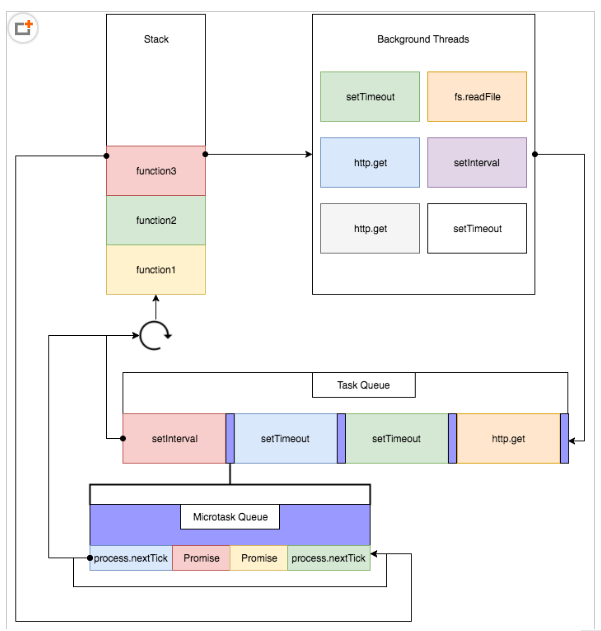

####  1.同源策略
同源策略可防止 JavaScript 发起跨域请求。源被定义为 URI、主机名和端口号的组合。此策略可防止页面上的恶意脚本通过该页面的文档对象模型，访问另一个网页上的敏感数据。

同源策略： 协议、主机、端口必须完全一致

#### 2.跨域 

前端开发中：用浏览器项服务器通过ajax发送请求，当协议、主机、端口不一致的时候，会有跨域问题

```
跨域问题产生的原因 ：浏览器的同源策略导致了跨域。当我们在前端开发中使用ajax/fetch这些技术发送网络请求的时候，当协议、主机、端口有任何一个不一致的时候，则构成跨域。
跨域的作用 ：用于隔离潜在恶意文件的重要安全机制
跨域问题的解决：
1. jsonp ，允许 script 加载第三方资源
2. 在服务器使用cors实现跨域资源共享
    res.writeHead(200, {
        "Content-Type": "text/html; charset=UTF-8",
        "Access-Control-Allow-Origin":'http://localhost',
        'Access-Control-Allow-Methods': 'GET, POST, OPTIONS',
        'Access-Control-Allow-Headers': 'X-Requested-With, Content-Type'
    });
3. 在前端的工程化项目(webpack)中,我们可以通过配置devserver的proxy来解决跨域访问的问题。他的原理是在本地开启一个服务器向数据服务器发送请求，因为服务器和服务器之间是没有跨域
4. 但是因为webpack的devserver只在开发环境下有效，当项目发布上线之后仍然会有跨域问题，为了解决项目上线的跨域问题，我们配置服务器的反向代理（Apache/ngix）来实现跨域请求 
5. 除此之外，我还知道当项目打包成apk之后就不存在跨域问题了，所以如果项目要打包成apk，我们需要在项目中的所有请求中写全路径(此时我们可以配置axios.default.baseURL来解决)
6. iframe 嵌套通讯，postmessage
```

[跨域资源共享 CORS 阮一峰](http://www.ruanyifeng.com/blog/2016/04/cors.html)

#### 3.JSONP

Jsonp 并不是一种数据格式，jsonp 是用来解决跨域获取数据的一种解决方案。

具体是通过动态创建 script 标签向服务器发送请求，然后服务器返回一段JS脚本给客户端，然后客户端收到JS脚本立马执行对应的代码。为此，服务器应该设置响应头为 application/javascript。

 //通过script标签向服务器发送请求

   var script = document.createElement("script");

   script.src = `http://localhost:3000/test?callback=${callback}`;

   document.body.appendChild(script);

https://blog.csdn.net/hansexploration/article/details/80314948

```
//JSONP中服务器给客户端返回一段js脚本
res.setContentType("application/javascript")
res.send("fun('这是你要的数据')")

//客户端接收到服务器返回的js脚本之后，执行该脚本从而获取服务器返回的数据
<script>
   fun(msg){
       console.log(msg)
   }
</script>
```

#### 4.事件绑定的方式
* 嵌入dom
```
<button onclick="func()">按钮</button>
```

* 直接绑定
```
btn.onclick = function(){}
```

* 事件监听
```
btn.addEventListener('click',function(){})
element.attachEvent(etype, eventName)
```


#### 5.事件委托
事件委托利用了事件冒泡，将子元素自己的事件交给父亲来处理。(子元素自己不绑定事件也不处理事件，委托给父元素来处理)
```
<ul>
  <li>苹果</li>
  <li>香蕉</li>
  <li>凤梨</li>
</ul>

// good  事件委托
document.querySelector('ul').onclick = (event) => {
  var ev = event || window.event;
  var target = ev.target || ev.srcElement;//IE浏览器
  if (target.nodeName === 'LI') {
    console.log(target.innerHTML)
  }
}

// bad  给每一个li绑定事件
document.querySelectorAll('li').forEach((e) => {
  e.onclick = function() {
    console.log(this.innerHTML)
  }
}) 
```


#### 6.事件循环
事件循环是一个单线程循环，用于将任务队列中的回调函数(任务)调度入栈。如果调用栈中的任务执行完毕并且任务队列中有对应的回调函数(任务)，则将回调函数出队并推送到调用栈中执行。



```
宏任务：script    setTimeout   setInterval  setImmediate, I/O, UI rendering   
微任务：process.nextTick, Promise.then, Object.observe(已废弃), MutationObserver(html5新特性)

事件循环的任务队列有宏任务队列和微任务队列，每次一个宏任务执行完毕的时候，都会把微任务队列中的微任务执行完毕之后才会再次执行下一个宏任务。
```

#### 7.事件模型
* DOM0<br>
直接绑定，没有事件流
```
<input onclick="sayHi()"/>

btn.onclick = function() {}
btn.onclick = null
```

* DOM2<br>
DOM2级事件可以冒泡和捕获
通过addEventListener绑定
通过removeEventListener解绑
```
// 绑定
btn.addEventListener('click', sayHi)
// 解绑
btn.removeEventListener('click', sayHi)
```

* DOM3<br>
DOM3具有更多事件类型
DOM3级事件在DOM2级事件的基础上添加了更多的事件类型，全部类型如下：
```
UI事件，当用户与页面上的元素交互时触发，如：load、scroll
焦点事件，当元素获得或失去焦点时触发，如：blur、focus
鼠标事件，当用户通过鼠标在页面执行操作时触发如：dbclick、mouseup
滚轮事件，当使用鼠标滚轮或类似设备时触发，如：mousewheel
文本事件，当在文档中输入文本时触发，如：textInput
键盘事件，当用户通过键盘在页面上执行操作时触发，如：keydown、keypress
合成事件，当为IME（输入法编辑器）输入字符时触发，如：compositionstart
变动事件，当底层DOM结构发生变化时触发，如：DOMsubtreeModified
```

https://www.jianshu.com/p/3acdf5f71d5b

#### 8.target和currentTarget区别
```
event.target：返回触发事件的元素
event.currentTarget：返回绑定事件的元素

ul.onclick = function(e){
    e.target   //ul  li
    e.currentTarget  //ul
}
```

#### 9.prototype和`__proto__`的关系是什么

```javascript
1.函数有一个prototype属性，这个属性表示函数的原型
  这个属性中有三部分信息：构造函数constructor   所有实例公共的属性和方法   __proto__
2.对象有一个__proto__属性，他指向函数的原型
  function Person(name,age){
      this.name = name;
      this.age = age;
  }
  var p = new Person("zhangsan",18);
  p.__proto__ == Person.prototype;
3.函数原型中的信息
  Person.prototype.constructor == Person;
  Person.prototype.__proto__ == Object.prototype;
  Object.prototype.__proto__ == null
  
  
//区别
//a.__proto__是隐式原型，prototype是显示原型
//b.prototype：每一个函数创建之后都会拥有一个名为prototype的属性，这个属性指向函数的原型对象
//c.__proto__：javascript中任意的对象都有一个内置属性，在ES5之前没有标准的方法访问这个内置属性，但是大多数浏览器都支持通过__proto__来访问。
```


#### 10.什么是Ajax,ajax常用属性和方法
Ajax(asynchronous JavaScript and XML) 是使用js向服务器发送请求的一种异步通信的机制。

Ajax的好处：

1.异步请求，可以不断向服务器发送请求

2.允许我们局部刷新页面

```
let xmlhttp
if (window.XMLHttpRequest) {
	//  IE7+, Firefox, Chrome, Opera, Safari 浏览器执行代码
	xmlhttp = new XMLHttpRequest()
} else {
	// IE6, IE5 浏览器执行代码
	xmlhttp = new ActiveXObject("Microsoft.XMLHTTP")
}
xmlhttp.onreadystatechange = () => {
	if (xmlhttp.readyState === 4 && xmlhttp.status === 200) {
		document.getElementById("myDiv").innerHTML = xmlhttp.responseText
	}
}
xmlhttp.open("GET", "/ajax/test.txt", true)
xmlhttp.send()
```
Ajax的常用方法：

```
1.open方法：与服务器建立连接
2.send方法：向服务器发送数据
3.onreadystatechange：监听服务器响应的回调
4.responseText/responseXML：获取服务器响应的数据
5.readyState：ajax的状态码，4表示ajax响应已经完成
```

#### 11.Ajax和Fetch区别

* ajax是使用XMLHttpRequest对象发起的，但是用起来很麻烦，所以ES6新规范就有了fetch，fetch发一个请求不用像ajax那样写一大堆代码。
* 使用fetch无法取消一个请求，这是因为fetch基于Promise，而Promise无法做到这一点。
* 在默认情况下，fetch不会接受或者发送cookies
* fetch没有办法原生监测请求的进度，而XMLHttpRequest可以
* fetch只对网络请求报错，对400，500都当做成功的请求，需要封装去处理
* fetch不是在ajax上的封装，是ES6规范下的一种网络请求技术，兼容性上比不上XMLHttpRequest

#### 12.ajax 的缺点

```
1、ajax 不支持浏览器 back 按钮。
2、安全问题 AJAX 暴露了与服务器交互的细节。
3、对搜索引擎的支持比较弱。
4、破坏了程序的异常机制。
5、ajax跨域访问的问题
```

#### 13.变量提升
用var声明的变化会被自动提升。let和const不会使变量提升。

用var声明的变量会被提升到当前作用域的最前面，只会提升变量的声明，不会提升变量的复制。

如果有函数的声明和变量的声明同名，则函数的提升会在变量的提升之前。

#### 14.cookie、localStorage、sessionStorage区别
|特性 | cookie | localStorage | sessionStorage|
|-|-|-|-|
|数据的生命周期|一般由服务器生成，可以setMaxAge来设置cookie的有效时间，如果在浏览器生成，默认是关闭浏览器之后失效  |永久保存，可清除  | 仅在当前会话有效，关闭页面后清除|
|存放数据大小|4KB|5MB|5MB|
|与服务器通信|每次都会携带在HTTP头中，如果使用cookie保存过多数据会带来性能问题|仅在客户端保存|仅在客户端保存|
|用途|一般由服务器生成，用于标识用户身份|用于浏览器缓存数据|用于浏览器缓存数据|

#### 15.自调用函数?用于什么场景？好处?
```
自调用函数:1、声明一个匿名函数  2、马上调用这个匿名函数。

自调用函数的作用：创建一个独立的作用域。

自调用函数好处：防止变量的命名污染问题(同名的变量在多个地方声明多次)

场景：一般用于框架、插件等场景
```

#### 16.实现add函数,让add(a)(b)和add(a,b)两种调用结果相同
```
//函数柯里化 : 将本来接收多个参数的函数转换为接收单一参数的函数(返回值是接收剩余参数的函数)
function add(a, b) {
    return a + b
}

let result = add(1,2);  //3

function add(a){
    return function(b){
        return a+b;
    }
}
let result2 = add(1)(2)  //3
```
#### 17.js中万物皆对象你认为对么

```
var s1 = "some text";   //number     栈区

var s3 = s1.substring(2);    //自动装箱

var s2 = new String();    //引用类型(包装类型)  对象  堆区
```

我认为是对的，在JS中有原生函数、基本数据类型，它们的原型最终还是对象。
可以看看本文的原生函数


#### [](#JavaScript)

#### 18.多个页面之间如何进行通信
有如下几个方式：
* localStorage
* cookie
* postMessage   API   跨域消息传递
  支持两个页面跨域；只能传递字符串数据；参考 window.open；
* url传参         页面跳转用url传递参数

#### 19.css动画和js动画的差异
1. 代码复杂度，js 动画代码相对复杂一些
2. 动画运行时，对动画的控制程度上，js 能够让动画，暂停，取消，终止，css动画不能添加事件
3. 动画性能看，js 动画多了一个js 解析的过程，性能不如 css 动画好

https://zhuanlan.zhihu.com/p/41479807

#### 20.请用js去除字符串空格

去除所有空格

```
str.replace(/\s/g, '')
```
去除字符串两边空格

```
str.replace(/^\s+|\s+$/g, '')
// 原生方法
str.trim()
```
#### 21.new一个对象经历了什么
```
function Test(){}
const test = new Test()
```

1. 创建一个新（的空）对象：
```
const obj = {}
```
2. 设置新对象的constructor属性为构造函数的名称，设置新对象的`__proto__`属性指向构造函数的prototype对象
```
obj.constructor = Test
obj.__proto__ = Test.prototype
```
3. 使用新对象调用函数，函数中的this被指向新实例对象
```
Test.call(obj)
```
4. 将初始化完毕的新对象地址，保存到等号左边的变量中。把地址保存到空对象obj的地址里面去。

   *即先创建地址，二改构造函数名称和原型，再调用函数改this指向名称，再保存地址*

#### 22.bind、call、apply的区别

bind、call、apply可以改变被调用函数中的this指向。

call和apply其实是一样的，区别就在call需要一个个传参，而apply可以入参一个数组。

call和apply都是在调用时触发指定的方法，同时改变指定方法中的this指向。而bind是返回一个已经修改this指向后的新函数，如果要触发该方法，我们需要手动调用。

```
const newFunc = sayHi.bind(obj)
newFunc() // Hi! Tom
```
#### 23.JS的数据类型有哪些？typeof运算符的执行结果都有哪些数据类型？

```
数据类型主要包括两部分：
1.基本数据类型： Undefined、Null、Boolean、Number和String
2.引用数据类型： Array 、Object、Function、Date 

typeof运算符的结果类型：number,string，boolean,object,function,undefined
```

#### 24.null，undefined 的区别?

null表示一个对象被定义了，值为“空值”；

undefined 表示不存在这个值(没有定义)。

null和undefined分属不同的类型，未初始化定义的值用typeof检测出来是"undefined"(字符串)，而null值用typeof检测出来是"object"（字符串）。

实际上，undefined值是派生自null值的，ECMAScript标准规定对二者进行相等性测试要返回true，即 

```
alert(null == undefined);  // true
```

#### 25.怎么判断一个变量没有被定义

```javascript
typeof bianliang ==”undefined”
```

#### 26.怎么判断一个变量arr的话是否为数组（此题用typeof不行）

```javascript
//1.通过instanceof来判断
//instanceof : 作用判断某一个变量是否是指定类型的变量，返回结果是true  false
function isArray (obj) {
  return obj instanceof Array;//返回true或者false
}
var obj1 = [1,2,3]
var obj2 = {
	name:"zhangsan",
	age:14
}
console.log(isArray (obj1))==>true
console.log(isArray (obj1))==>false

//2.通过构造函数来判断是否是数组
console.log(obj1.constructor==Array)

//3.通过原型的toString()方法阿来判断
function isArray(o){
	return Object.prototype.toString.call(o)== '[object Array]';
}
console.log(isArray(ary));
```

#### 27.描述下JSON对象的两个很重要的方法

JSON.parse() //JSON字符串转换为JSON对象

JSON.stringify() //JSON对象转化为字符串

#### 28.“ ===”、“ ==”的区别？

```
1.对于基本数据类型而言
   ==，当且仅当两个运算数相等时，它返回 true，即不检查数据类型
   ===，只有在无需类型转换运算数就相等的情况下，才返回 true，需要检查数据类型。不仅数值相同还要保证数据类型相同才为true
2.对应引用类型而言
  == 判断内存地址是否一致
```

#### 29.eval是做什么的？

它的功能是把对应的字符串解析成JS代码并运行；解释js源码组成的字符串给他把它当成js语句返回

应该避免使用eval，不安全，非常耗性能（2次，一次解析成js语句，一次执行）。

由JSON字符串转换为JSON对象的时候可以用eval，var obj =eval('('+ str +')');

#### 30.简单jQuery：请写出代码，ul标签下面有1000个li，写一个性能最高的方式实现，在点击li后，输出li的内容

```
//使用事件委托的方式给ul绑定点击事件
$(“ul”).on(“click”,”li”,function(){
	$(this).html(“hit”);
})
```

#### 31.简述下为何通过ajax发送的请求会出现乱码问题，如何解决？

乱码的问题就是编码格式冲突，我们需要传输中文数据前面加一个encodeURI()编码，例如：encodeURI($("#fk_info").val())；在接受参数的页面对传过来的编码过后的内容用后端语言进行解码。Ajax里中文路径需要encodeURI（）编码后发送

```javascript
//node后台向其他服务器发送请求
var url = "http://www.baidu.com/?name=张三";
//这里我们需要将中文的  张三  编码后发给服务器
url = encodeURI(url); 
request(url,function(error,response,body){
    if(!error && response.statusCode == 200){
        //输出返回的内容
        console.log(body);
    }
});

```

#### 32.简述DOM，HTML DOM的区别和联系

DOM分为三部分：

（1）核心DOM：遍历DOM树、添加新节点、删除节点、修改节点

（2）HTML DOM：以一种简便的方法访问DOM树

（3）XML DOM：准用于操作XML文档

```
核心DOM与HTML DOM的区别：
A.核心DOM(dom对象) ： Document,Node,  ElementNode,TextNode,AttributeNode，CommentNode,NodeList

核心DOM提供了统一的操作接口，如：createElement、appendChild、setAttribute等
核心DOM创建新元素：var newNode=document.createElement("img")
给元素添加属性：e.setAttribure()、e.setAttribureNode()
适用场合：核心DOM适合操作节点，如创建，删除，查找等

B.HTML DOM(js对象)：image,Table,Form,Input,Select等等HTML标签对象化
使用HTML DOM创建新元素：  var newNode = new Image()；
使用给元素添加属性：
img.src='';
img.id='';
imd.title='';
img.className=''
img.style.display='';

适用场合：
HTML DOM适合操作属性，如读取或修改属性的值
```

#### 33.什么是事件流

	DOM(文档对象模型)结构是一个树型结构，当一个HTML元素产生一个事件时，该事件会在元素结点与根结点之间的路径传播，路径所经过的结点都会收到该事件，这个传播过程可称为DOM事件流。DOM同时支持两种事件模型：捕获型事件和冒泡型事件
	
	el.addEventListener("click", function(){},false);   //事件冒泡阶段
	el.addEventListener("click", function(){},true);    //事件捕获阶段

#### 34.JavaScript原型继承是如何运作的？

```
1.什么是原型链
  对象.__proto__ = 函数.prototype
  函数.prototype.__proto__ = 父亲的.prototype

  原型链中属性的查找规则如下：当我们访问一个对象的属性时，如果这个对象内部不存在这个属性，那么他就会去prototype 或__proto__ 里找这个属性，这个prototype又会有自己的prototype 或__proto__ ，于是就这样一直找下去(知道找到null为止)，也就是我们平时所说的原型链的概念。

2.原型继承是对原型链做了相应的修改

3.举个例子 
   Dog.prototype = new Animal()
   var dog = new Dog()
   dog.__proto__ == Dog.prototype
   //原来 Dog.prototype.__proto__ == 父亲的.prototype
  
   //现在 dog.__proto__ == new Animal()
   //然后 new Animal().__proto__ == Animal.prototype;
   //所以原型链被修改了
```

#### 35.DOM元素Attribute与Property的区别是什么？

1、 property是DOM中的属性，是JavaScript里的对象；而attribute是HTML标签上的特性，它的值只能够是字符串；

2、DOM对象初始化时会在创建默认的基本property；只有在HTML标签中定义的attribute才会被保存在property的attributes属性中；

3、propety是对象，而attribute的值都是字符串；

#### 36.指出下面代码的区别

```javascript
function Order(){

}

var order = Order();      （1）
var order = new Order();  （2）


答案：
1.代码（1）是将函数Order()作为一个普通函数去调用的
2.代码（2）是将Order()作为一个构造函数去调用的；
3.当函数Order的方法体中有this关键之的时候，作为普通函数this指的是window对象，作为构造函数存在的时候this指代的是本对象。即修改this指向。
```

#### 37.$(document).ready()是个什么函数？为什么要用它。

```
1.$(document).ready()这个函数是用来取代页面中的window.onload; 不同的是onload()的方法是在页面加载完成后才发生，这包括DOM元素和其他页面元素（例如图片）的加载，而document.ready()是在dom准备就绪后执行。因此，使用document.ready()方法的执行速度比onload()的方法要快。

2.如果使用onload，那么页面中只能写一个onload函数，如果写多个，后面的onload会覆盖前面的onload。但是如果使用$(document).ready()，那么我们可以写多个。
```

#### 39.请写一个正则，匹配输入的字符：第一个必须是字母或下划线开头，后面就是字母和数字或下划线构成，长度5-20.

```
答案： /^[A-Za-z_]\w{4,19}$/

\d   数字
\w   字母(数字 字母 下划线)
\s   空白字符
\D   非数字
\W   非字母
\S   非空白
.    通配符(匹配除了\n之外的所有字符)
\b   单词边界匹配

n*    匹配0个或多个n
n+    匹配至少1个n
n?    匹配0个或者1个n

n{1,}    n至少出现1次
n{1,3}   n出现1到3次
n{1}     n恰好出现1次

[abc]    取值在abc之间
[^abc]   取值在非abc
[a | b]  取值在a或者b之间
[a-z]    取值在a到z之间

i   忽略大小写匹配
g   全局匹配

^   表示开头
$   表示结束
```

#### 40.JS中原型链最上层的对象是  Object  的原型对象，该对象的`_proto_`指针指向  null    的原型对象。

```
对的


var p = new Person()
p.__proto__ == Person.prototype
Person.prototype.__proto__ == 父函数的.prototype
......
......
                           == Object.prototype
Object.prototype.__proto__ == null 
```

#### 42.JS中使用 Object 对象的   defineProperty    函数定义对象属性的访问器。 

使用Object.defineProperty()方法可以做数据的劫持，当我们使用Object.defineProperty()定义了对象的属性之后，给对象赋值的时候会执行set方法，获取对象值的时候会执行get方法

```
var person = {};
Object.defineProperty(person, 'name', {
  get: function () {
    return temp
  },
  set: function (val) {
    temp = val
  }
})

person.name = "张三"；                   执行set（）方法
console.log(person.name);               执行get（）方法
```

#### 43.如何对一篇文章进行敏感词替换？假如有几千个敏感词。（写一下思路即可）

将这篇文章以字符串的形式赋给一个变量。定义一个正则表达式，以全局匹配的方式查找所有敏感词，并用replace方法替换掉

```
var rep=/cao|草|曹操|妈/g;
console.log(text1.value.replace(rep,'*'));  //将相关的敏感词用*替换
```

#### 44.添加、删除、更改、插入节点的方法

```
appendChild
removeChild
replaceChild
insertBefore
```

#### 45.在javascript编程中，请至少说出三种异步操作的使用场景？

```
//异步操作的场景：

1.读文件  :   fs.readFile("path","utf-8",function(){})
2.事件监听 :
    element.addEventListener(“click”,function(){
        
    },false); 
3.网络请求 :
    $.ajax({
        url:"",
        method:"GET",
        success:function(res){
            
        }
    })
```

```
//异步问题的解决方案：
//1.基于回调的异步请求解决方案，函数做回调函数，但会存在嵌套太深，形成回调地狱

//2.基于Promise
console.log("2")
new Promise(function(resolve,reject){
    console.log("1");
    setTimeout(function(){
        console.log("4");
        resolve();
    },500);
}).then(function(){
    console.log("5");
})
console.log("3");

//3.Async和await
async function test(){
    let result1 = await axios("url1")
    let result2 = await axios("url2")
}
加async修饰的方法，里面可以使用await，方法的返回值需要是一个promise
await只能出现在async修饰的方法里面，await后面需要跟一个promise
async + await 可以将原来的并行任务转换串行任务
比如上面的例子，result2的结果要等到result1请求结束之后才能执行
```

#### 46.知道不知道事件冒泡？知不知道阻止浏览器的默认行为？对应的原生兼容性写法该怎么写

```
事件冒泡:父元素和子元素上面的话都添加的有click（不仅仅是click事件，只要保证是同一个事件即可）。子元素的click事件触发的时候，会导致该click事件冒泡到它的父元素上面，为了阻止父元素的事件触发，我们一般需要给子元素的事件里写上阻止事件冒泡的方法

兼容性写法：
if(event.stopPropagation){
    event.stopPropagation();
}else if(event.cancelBubble){
    event.cancelBubble = true;
}
```

```
阻止浏览器默认行为:当我们不希望一些浏览器默认行为触发的时候，就需要给对应的事件添加上阻止浏览器默认行为。比如我们给a标签绑定click事件，当a标签的click事件触发之后，仍然会执行a标签自己的href

兼容性写法：
function cDefault(e){
    if(e.preventDefault){//ie9+
        e.preventDefault();
    }else{//ie 678
   		e.returnValue = false;
    }
}
```

#### 47.什么是闭包（closure），为什么要用它？

闭包就是函数嵌套函数，并将该内部函数作为返回值返回或者存储在某个对象的属性里，这时就会形成一个闭包。

```javascript
function aa(){
	var num = 10;
    return function bb(){
        console.log(num);
    }
}

var b = aa();
```

```
用途：
1.缓存，延长变量的作用域链
2.面向对象中的对象
3.实现封装，防止变量跑到外层作用域中，发生命名冲突

危害：
1.闭包有一个非常严重的问题，那就是内存浪费问题，这个内存浪费不仅仅因为它常驻内存，更重要的是，对闭包的使用不当的话会内存泄漏。解决方法是，在退出函数之前，将不使用的局部变量全部删除。
2.性能问题，使用闭包时，会涉及到跨作用域访问，由于闭包内部变量优先级高于外部变量，所以多查找作用域链中的一个层次，就会在一定程度上影响查找速度。
```

#### 48.知道原型和原型链么，一般什么时候需要用？

函数有一个prototype属性，叫原型属性。主要作用有两个：1.共享所有实例公共的属性和方法。2.继承

当我们有一个属性/方法需要被所有实例共享的时候，我们可以使用prototype

当我们需要实现js的继承关系的时候，我们可以使用prototype


原型链：

```
对象.__proto__ == 函数.prototype
函数.prototype.__proto__ == 父函数.prototype
父函数.prototype.__proto__ == 父父函数.prototype
...
父父父函数.prototype == Object.prototype
Object.prototype.__proto__ == null

这样就构成了原型链
```

#### 49.有没有封装过插件，你一般怎么封装呢

封装过，我们主要用面向对象中的混合模式来封装插件，把可变的属性或者方法（通常都是属性）在构造函数内定义，把一些不变的属性或者方法（通常是方法）定义在函数的原型上面。我们封装好的插件通常会放在一个匿名自执行函数里面，这样做的目的是为了避免变量冲突。最后自调用函数记得入参window，挂载到window上。

```
(()=>{
    function  Snake(){
        this.name = name;
        this.nnx  = name;

        say(){

        }
    }

    Snake.prototype.xx = xxx
    window.Snake = Snake;
})(window)
```


#### 50.Ajax和jsonp的原理？

```
Ajax的原理：Ajax基于浏览器内置的XMLHttpRequest对象与Web服务器端进行异步数据通信。
1.使用open方法与服务器建立连接
2.使用send方法向服务器发送数据
3.使用onreadystatechange来监听服务器响应的回调
4.使用responseText/responseXML获取服务器响应的数据
```

```
JSONP：是通过动态创建 script 标签向服务器发送请求获取响应的一种技术，在服务器需要返回一段JS脚本给客户端，客户端收到JS脚本立马执行对应的代码。为此，服务器应该设置响应头为 application/javascript

JSONP和Ajax没有任何关系。
```

#### 51.你们移动端怎么开发的？用的什么单位、js库呢、怎么真机调试你们程序、怎么解决前缀问题呢

首先我们移动端用的是rem这个单位，移动端实际上还新增了vw,vh等一些单位，但是相对于rem来说，他们的兼容性都不好。rem是一个相对单位，是相对于根节点的font-size的比例。我们还会引用一个外部的js，这个js可以通过屏幕宽度动态计算根节点的font-size值。

我们移动端用的JS库是zepto.js，因为相应来说它的的体积的话要小很多。而且我们项目中有时会需要使用一些触屏事件，比如滑动事件，那么我们还会调用它里面的touch模块

我们webapp的话都是基于gulp搭建的前端工程来开发，因为利用gulp起一个webserver特别简单，并且我还可以实现livereload功能（当我监控的文件发生变化的时候，可以触发浏览器的自动刷新功能），而且在css3里面加前缀的话是一个很头疼的问题，我们现在只需要用autoprefixer模块就可以很容易实现自动加css3前缀这个功能了。

#### 52.移动端兼容性？

bootstrap中起步中有：

1>ios移动端click事件300ms的延迟响应. 用fastclick来解决

2>zepto的touch模块的tap事件有点透的问题，也是用fastclick来解决

3>一些情况下对非可点击元素如(label,span)监听click事件，ios下不会触发，css增加cursor:pointer就搞定了

4>ios下取消input在输入的时候英文首字母的默认大写

    <input autocapitalize="off"autocorrect="off" />

5>fixed定位缺陷

    ios下fixed元素容易定位出错，软键盘弹出时，影响fixed元素定位
    android下fixed表现要比iOS更好，软键盘弹出时，不会影响fixed元素定位
    ios4下不支持position:fixed
    
    解决方案： 可用iScroll插件解决这个问题

6>Input 的placeholder会出现文本位置偏上的情况

    input 的placeholder会出现文本位置偏上的情况：PC端设置line-height等于height能够对齐，而移动端仍然是偏上，解决是设置line-height：normal

7>calc的兼容性处理

     CSS3中的calc变量在iOS6浏览器中必须加-webkit-前缀，目前的FF浏览器已经无需-moz-前缀。
     Android浏览器目前仍然不支持calc，所以要在之前增加一个保守尺寸，增加保守尺寸，让其根据保守尺寸进行计算：
    
    div {
        width: 95%;
        width: -webkit-calc(100% - 50px);
        width: calc(100% - 50px);
    }

8>在移动端修改难看的点击的高亮效果，iOS和安卓下都有效：

    \ {-webkit-tap-highlight-color:rgba(0,0,0,0);}

9>阻止旋转屏幕时自动调整字体大小

    html, body, form, fieldset, p, div, h1, h2, h3, h4, h5,h6 {-webkit-text-size-adjust:none;}

#### 53.谈谈你对bootstrap的认识，用它做过项目么？

用Bootstrap主要用来做一些响应式的网站，它里面栅格化这块比较强大，我可以针对不同的屏幕尺寸定制不同页面结构。

我还用它做过后台管理系统，因为它里面集成的有风格标准统一的组件、插件、全局样式等，是我们做后台管理系统的话，不用再花大精力去布局页面了。而且甚至产品给我们一个原型图我们就可以开始开发，大大提高了开发效率。

#### 54.javascript 继承的方法？

```javascript
1.借助构造函数实现继承（属性继承）：直接定义子类，call方法改this指向
    //  定义父类
    function Parent1 () {
        this.name = 'xxx',
        this.age = 18
    }
    //  定义子类
    function Child1 () {
        //通过call()方法改变Child1的this指向使子类的函数体内执行父级的构造函数从而实现继承效果
        Parent1.call(this)
        this.address = 'yyy'
    }
    //  构建子类的实例s1
    var s1 = new Child1()
    console.log(s1.name)  //xxx
	缺点:该方法的实例(s1)无法使用父类(Parent1)的原型(prototype)中的属性和方法
    
2.借助原型链实现继承（原型继承）：定义子类，然后子类的原型指向父类实例对象。
    function Parent2 () {
        this.name = 'xx',
        this.age = 19,
        this.play = [1,2,3]
    }
    //  一样在父类添加say方法
    Parent2.prototype = {
        say () {
            console.log('say')
        }
    }
    function Child2 (address) {
        this.address = 'yyy'
    }
    // 让子类的原型直接指向父类实例。是函数原型指向实例对象，所以Child2.prototype中的隐式原型就是实例的__proto__了
    Child2.prototype = new Parent2()
    //  生成两个子类的实例s2、s3
    var s2 = new Child2()
    var s3 = new Child2()
    // s2实例继承了父类中的name属性
    console.log(s2.name)  //xx
    //  s2实例也同样继承了父类原型上的say方法
    console.log(s2.say())  //say
	缺点:在子类调用构造函数创建对象的时候，无法入参所有的属性值。
    1、在创建实例的时候无法向新实例去传递父函数的参数信息。在创建实例时被定死了。
    2、要为子类新增属性和方法，需要写在修改原型指向之后
    3、所有新实例都会共享父类实例的属性。(一旦一个实例修改了原型信息，另外一个实例也会修改)
    
    
3.组合继承：结合上面两个的属性继承和原型继承
    function Parent5 () {
        this.name = 'xx',
        this.age = 20,
        this.play = [4,5,6]
    }
    function Child5 (name,age,address) {
        Parent5.call(this,name,age)
        this.address = address
    }
    // 比较关键的一步
    Child5.prototype = new Parent5()
    var c = new Child5("zhangsan",19,"无锡")
    //利用属性继承改this只继承属性，继承实例的原型则只继承其原型

    
4.实例继承(为父类实例添加新特性，作为子类实例返回)
    function Animal (name) {
      // 属性
      this.name = name || 'Animal';
      // 实例方法
      this.sleep = function(){
        console.log(this.name + '正在睡觉！');
      }
    }
    // 原型方法
    Animal.prototype.eat = function(food) {
      console.log(this.name + '正在吃：' + food);
    };

    function Cat(){
      var instance = new Animal();
      instance.name = name || 'Tom';
      return instance;
    }
	// Test Code
    var cat = new Cat();
    console.log(cat.name);
    console.log(cat.sleep());
    console.log(cat instanceof Animal); // true
    console.log(cat instanceof Cat); // false
注意：大致思想是在子类中创建一个父类实例，然后修改new出来的父类实例的属性，最后return返回修改后的实例

5.拷贝继承
    // 定义一个动物类
    function Animal (name) {
      // 属性
      this.name = name || 'Animal';
      // 实例方法
      this.sleep = function(){
        console.log(this.name + '正在睡觉！');
      }
    }
    // 原型方法
    Animal.prototype.eat = function(food) {
      console.log(this.name + '正在吃：' + food);
    };
    function Cat(name){
      var animal = new Animal();
     // 遍历拷贝属性
      for(var p in animal){
        Cat.prototype[p] = animal[p];
      }
      Cat.prototype.name = name || 'Tom';
    }

    // Test Code
    var cat = new Cat();
    console.log(cat.name);
    console.log(cat.sleep());
    console.log(cat instanceof Animal); // false
    console.log(cat instanceof Cat); // true
注意：有实例继承的思想，不过多了一个遍历原型然后将父函数原型上的信息拷贝一份给父函数实例，最后也返回父函数实例 
```

#### 55.简述创建函数的几种方式

```
第一种（函数声明）：
function sum1(num1,num2){
	return num1+num2;
}

第二种（函数表达式）：
var sum2 = function(num1,num2){
	return num1+num2;
}

第三种(匿名函数)：
function(){}:只能自己执行自己

第四种(new Function创建函数)
let str = 'return ' + '`Hello ${name}!`';
let func = new Function('name', str);
func('Jack') // "Hello Jack!"
```

#### 56.把 Script 标签 放在页面的最底部的 body 封闭之前 和封闭之后有什么区别？浏览器会如何解析它们？

```
建议把script标签放在body封闭之前

首先声明。这在</body>之后插入其他元素，从HTML 2.0起就是不合标准的。按照HTML5标准中的HTML语法规则，如果在</body>后再出现<script>或任何元素的开始标签，都是parse error，浏览器会忽略之前的</body>，即视作仍旧在body内。所以实际效果和写在</body>之前是没有区别的。这种写法虽然也能work，但是并没有带来任何额外好处，实际上出现这样的写法很可能是误解了“将script放在页面最末端”的教条。所以还是不要这样写为好。

因为在body以外写script也可能存在其他异常嘛。有什么理由能让开发者推断出后者会更安全呢？实际上在没有充分测试的前提下，如果要进行推断，那么可以推断出后者的风险更大。

第一，这是不合标准的行为，而且从有HTML标准以来都是不合标准的，因此浏览器实现不一致或者在这种情况下有bug的风险显然更大。

第二，虽然将<script>写在</body>之后，但最终的DOM树里，<script>元素还是会成为body的子节点，这一点很容易在firebug等调试器里验证。既然如此，如果将<script>写在</body>之前会有问题，你又如何保证写在之后（并在DOM里又变成了和写在之前一样的结构）就没有问题？
```

#### 57.js 延迟加载的方式有哪些？或者说script异步加载

1. defer 和 async :    js文件的加载不会堵塞DOM的解析

   ```
   1. defer 属性
   <script  src="file.js" defer></script> 
   defer属性声明这个脚本中将不会有 document.write 或 dom 修改。
   浏览器将会并行下载 file.js 和其它有 defer 属性的script，而不会阻塞页面后续处理。
    
   defer属性在IE 4.0中就实现了，超过13年了！Firefox 从 3.5 开始支持defer属性 。
   注：所有的defer 脚本保证是按顺序依次执行的。

   2. async 属性
   <script src="file1.js" async></script> 
   async属性是HTML5新增的。作用和defer类似，但是它将在下载后尽快执行，不能保证脚本会按顺序执行。它们将在onload 事件之前完成。
   Firefox 3.6、Opera 10.5、IE 9 和 最新的Chrome 和 Safari 都支持 async 属性。可以同时使用 async 和 defer，这样IE 4之后的所有 IE 都支持异步加载。
   ```

2. 动态创建 DOM 方式（创建 script，通过DOM操作插入到 DOM 中，加载完毕后 callBack）

   ```
   var ga = document.createElement('script');
   ga.type = 'text/javascript';
   ga.async = true;
   ga.src = 'xxxx';
   var s = document.getElementsByTagName('script')[0];
   s.parentNode.insertBefore(ga, s);
   ```

3. 由于JavaScript的动态性，还有很多异步加载方法： XHR Injection、 XHR Eval、 Script In Iframe

   <https://blog.csdn.net/qq_17550381/article/details/80925793>


#### 58.数组方法 pop() push() unshift() shift()各表示什么意思？

```
答：push()尾部添加、pop()尾部删除、Unshift()头部添加、shift()头部删除
```

#### 59.Javascript 中 callee 和 caller 的作用？

```
caller 是返回一个对函数的引用，该函数调用了当前函数；
用法：fn.caller

callee 是返回正在被执行的 function 函数，也就是所指定的 function 对象的正文。
用法：arguments.callee
```

#### 60.jQuery.extend 与 jQuery.fn.extend 的区别？

$.fn = $.prototype ，原型中的属性和方法是所有的实例对象共享的

jQuery.extend 用来扩展 jQuery 对象本身(所扩展的方法只能被当前的jQuery对象访问)

jQuery.fn.extend 是在 jQuery 原型对象上扩展方法，此时该方法可以被所有的jQuery对象共享

#### 61.jQuery 和 Zepto 的区别？各自的使用场景？

jQuery 主要用于 pc 端，当然有对应的 jQuery mobile 用于移动端

zepto 比 jQuery 更加小巧，主要用于移动端

jquery mobile 相对于 zepto 功能强大，但是体积也很庞大，zepto 非常的轻量

#### 62.Zepto 的点透问题如何解决？

点透主要是由于两个 div 重合，例如：一个 div 调用 show()，一个 div 调用 hide()，这个时候当点击上面的 div 的时候就会影响到下面的那个 div；

解决办法：github 上有一个叫做 fastclick 的库，它也能规避移动设备上 click 事件的延迟响应

#### 63.事件绑定和普通事件有什么区别

```
div1.onclick=function(){};
1、如果说给同一个元素绑定了两次或者多次相同类型的事件，那么后面的绑定会覆盖前面的绑定
2、不支持 DOM 事件流 事件捕获阶段=>目标元素阶段=>事件冒泡阶段

addEventListener
1、 如果说给同一个元素绑定了两次或者多次相同类型的事件，所有的绑定将会依次触发
2、 支持 DOM 事件流的
3、 进行事件绑定传参不需要 on 前缀

addEventListener(“click”,function(){},true);//此时的事件就是在事件冒泡阶段执行
ie9 开始，ie11 edge：addEventListener /removeEventListener
ie9 以前：attachEvent/detachEvent
1、 进行事件类型传参需要带上 on 前缀
2、 这种方式只支持事件冒泡，不支持事件捕获
事件绑定是指把事件注册到具体的元素之上，普通事件指的是可以用来注册的事件
```

#### 64.IE 和标准模式下有哪些兼容性的写法

```
var ev = ev || window.event
document.documentElement.clientWidth || document.body.clientWidth
var target = ev.srcElement||ev.target
```

#### 65.iframe 的优缺点？

```
iframe的优点：
1.iframe能够原封不动的把嵌入的网页展现出来，iframe和主页面是并行加载的
2.如果有多个网页引用iframe，那么你只需要修改iframe的内容，就可以实现调用的每一个页面内容的更改，方便快捷。
3.网页如果为了统一风格，头部和版本都是一样的，就可以写成一个页面，用iframe来嵌套，可以增加代码的可重用。
4.如果遇到加载缓慢的第三方内容如图标和广告，这些问题可以由iframe来解决。

iframe的缺点：
1.会产生很多页面，不容易管理。
2.iframe框架结构有时会让人感到迷惑，如果框架个数多的话，可能会出现上下、左右滚动条，会分散访问者的注意力，用户体验度差。
3.代码复杂，无法被一些搜索引擎索引到，这一点很关键，现在的搜索引擎爬虫还不能很好的处理iframe中的内容，所以使用iframe会不利于搜索引擎优化。
4.很多的移动设备（PDA 手机）无法完全显示框架，设备兼容性差。
5.iframe框架页面会增加服务器的http请求，对于大型网站是不可取的。 分析了这么多，现在基本上都是用Ajax来代替iframe，所以iframe已经渐渐的退出了前端开发。
6.iframe会堵塞主页面的onload事件

iframe通过iframe标签把其他人的网站直接嵌入我写的网站
```

#### 66.DOM 操作——怎样添加、移除、移动、复制、创建和查找节点

```
1. 创建新节点
createDocumentFragment() // 创建一个 DOM 片段
createElement() // 创建一个具体的元素
createTextNode() // 创建一个文本节点

2. 添加、移除、替换、插入
appendChild()
removeChild()
replaceChild()
insertBefore() // 在已有的子节点前插入一个新的子节点

3. 查找
getElementsByTagName() // 通过标签名称
getElementsByName() // 通过元素的 Name 属性的值(IE 容错能力较强，会得到一个数组，
其中包括 id 等于 name 值的)
getElementById() // 通过元素 Id，唯一性
```

#### 67.documen.write 和 innerHTML 的区别？

document.write 只能重绘整个页面
innerHTML 可以重绘页面的一部分

#### 68.哪些操作会造成内存泄漏？

```
内存泄漏指任何对象在您不再拥有或需要它之后仍然存在。
垃圾回收器定期扫描对象，并计算引用了每个对象的其他对象的数量。如果一个对象的引用数量为 0（没有其他对象引用过该对象），或对该对象的惟一引用是循环的，那么该对象的内存即可回收。

1. setTimeout 的第一个参数使用字符串而非函数的话，会引发内存泄漏。
2. 闭包
3. 控制台日志    console.log()调用一个变量，但只打印不实现功能，造成内存浪费
4. 循环（在两个对象彼此引用且彼此保留时，就会产生一个循环）
```

#### 69.window.location.search 返回的是什么？

```
答：查询(参数)部分。除了给动态语言赋值以外，我们同样可以给静态页面, 并使用 javascript 来获得相信应的参数值。

返回值：?ver=1.0&id=timlq 也就是问号后面的！
```

#### 70.window.location.hash 返回的是什么？

```
答：锚点  #后面的
```

#### 71.window.location.reload() 作用？

```
答：刷新当前页面。
```

#### 72.BOM 对象有哪些，列举 window 对象？

```
1、window 对象 ，是 JS 的最顶层对象，其他的 BOM 对象都是 window 对象的属性；
2、document 对象，文档对象；
3、location 对象，浏览器当前 URL 信息；
4、navigator 对象，浏览器本身信息；
5、screen 对象，客户端屏幕信息；
6、history 对象，浏览器访问历史信息；
```

#### 73.请问代码实现 outerHTML

说明：outerHTML 其实就是 innerHTML 再加上本身；也就是整个标签

```
Object.prototype.outerHTML = function(){
    var innerCon = this.innerHTML, //获得里面的内容
    outerCon = this.appendChild(innerCon); //添加到里面
    alert(outerCon);
}
```

#### 74.你如何优化自己的代码？

```
代码重用 (封装)
避免全局变量（模块化 mvc..）
拆分函数避免函数过于臃肿：单一职责原则
适当的注释，尤其是一些复杂的业务逻辑或者是计算逻辑，都应该写出这个业务逻辑的具体过程
内存管理，尤其是闭包中的变量释放
```

#### 75.列举常用的 js 库以及分别适用的领域

```
jquery：简化了 js 的一些操作，并且提供了一些非常好用的 API
jquery ui、jquery-easyui：在 jqeury 的基础上提供了一些常用的组件 日期，下拉框，表格这
些组件
require.js、sea.js（阿里的玉帛）+》模块化开发使用的
zepto：精简版的 jquery，常用于手机 web 前端开发 提供了一些手机页面实用功能,touch
ext.js：跟 jquery 差不多，但是不开源，也没有 jquery 轻量
swiper.js
iscroll.js
angular、vue、react、flutter：MV*框架，适合用于单页应用开发(SPA)
```

#### 76.JavaScript 数组元素添加、删除、排序等方法有哪些？

```
Array.concat( ) 连接数组
Array.join( ) 将数组元素连接起来以构建一个字符串
Array.length 数组的大小
Array.pop( ) 删除并返回数组的最后一个元素
Array.push( ) 给数组添加元素
Array.reverse( ) 颠倒数组中元素的顺序
Array.shift( ) 将元素移出数组
Array.slice( ) 返回数组的一部分
Array.sort( ) 对数组元素进行排序
Array.splice( ) 插入、删除或替换数组的元素
Array.toLocaleString( ) 把数组转换成局部字符串
Array.toString( ) 将数组转换成一个字符串
Array.unshift( ) 在数组头部插入一个元素

Array.map()
Array.some()
Array.forEach()
Array.every()
Array.reduce()
```

#### 77.如何添加 html 元素的 事件，有几种方法？请列举

a、直接在标签里使用onclick添加
b、在元素上通过 js 添加:  obj.onclick = method
c、使用事件注册函数添加: obj.addEventListener('click', method, false);

#### 78.使用闭包实现点击每一列的时候 alert 其 index？

```
<ul id="test">
    <li>这是第一条</li>
    <li>这是第二条</li>
    <li>这是第三条</li>
</ul>

var lis=document.querySelectorAll('li');
for (var i = 0; i < lis.length; i++) {
    var li = lis[i];
    //自调用函数
    li.onclick = (function(index){
        return function(e){
            alert(index);
        };
    })(i);
}
```

#### 79.列出 3 条以上 ff 和 IE 的脚本兼容问题

```
1、在 IE 下和火狐下事件冒泡不一样
//阻止冒泡的兼容性写法
function stopBubble(event){
    var e=arguments.callee.caller.arguments[0]||event;
    if(e&&e.stopPropagation){
        e.stopPropagation()
    }else if(window.event){
    	//ie
        window.event.cancelBubble=true;
    }
}


//阻止浏览器默认行为的兼容性写法
function stopDefault(event){
    var e=arguments.callee.caller.arguments[0]||event;
    //阻止默认浏览器动作(W3C)
    if(e&&e.preventDefault){
        e.preventDefault();
    }else{
        //IE中阻止函数默认动作的方式
        window.event.returnValue=false;      
    }
    return false;
}


2、IE 的写法： tbody=table.childNodes[0]
	在 FF 中，firefox 会在子节点中包含空白则第一个子节点为空白""， 而 ie 不会返回空白
	可以通过 if("" != node.nodeName)过滤掉空白子对象

3、模拟点击事件
if(document.all){ //ie 下
	document.getElementById("a3").click();
}
else{ //非 IE
	var evt = document.createEvent("MouseEvents");
	evt.initEvent("click", true, true);
	document.getElementById("a3").dispatchEvent(evt);
}

4、事件注册
if (isIE){
   window.attachEvent("onload", init);
}else{
   window.addEventListener("load", function(){})

5、ajax对象的获取
   IE： ActiveXObject
   其他浏览器：XMLHttpRequest

6、firstElement等返回结果不一样
```

#### 80.在 Javascript 中什么是伪数组？如何将伪数组转化为标准数组？

```
伪数组（类数组）：有数组的部分特性，比如length、下标索引等，但是无法像数组一样调用数组的方法。典型伪数组有：函数的argument参数、getElementsByTagName、document.childNodes返回的dom集合、jquery对象等等。

虽然伪数组不可以直接调用真正数组的方法，但是我们可以使用 Array.prototype.slice.call(fakeArray)来间接调用真正数组的方法。即调用数组上的原型方法。
```

#### 81.正则表达式构造函数 var reg=new RegExp(“xxx”)与正则表达字面量 var reg=//有什么不同？匹配邮箱的正则表达式？

```
1.当使用 RegExp()构造函数的时候，需要转义符号（比如即\”表示”）
2.var reg=// 使用正则表达字面量的效率更高。

\d  数字
\w  数字、字母、下划线
\s   空白字符
\b  单词边界
n+  至少1个
n?  0个或1个
n*  0个或多个
[a-z]  a到z
[^a-z] 非a-z

邮箱正则： ^[a-zA-Z0-9_-]+@[a-zA-Z0-9_-]+(\.[a-zA-Z0-9_-]+)+$
```

#### 82.jQuery 的 slideUp 动画 ，如果目标元素是被外部事件驱动, 当鼠标快速地连续触发外部元素事件, 动画会滞后的反复执行，该如何处理呢?

```
先 stop(true,true)后 slideUp()
stop("是否清空动画队列",“是否来到动画结束的状态”)
```

#### 83.javascript 的本地对象，内置对象和宿主对象

```
1.本地对象为独立于宿主环境的 ECMAScript 提供的对象，包括 Array Object RegExp 等可以 new 实例化的对象
2.内置对象为 Gload，Math 等不可以实例化的(他们也是本地对象，内置对象是本地对象的一个子集)
3.宿主对象为所有的非本地对象，所有的 BOM 和 DOM 对象都是宿主对象，如浏览器自带的document,window 等对象
```

#### 84.请说出三种减低页面加载时间的方法

```javascript
1.减少http请求数量和体积
	-压缩 css、js 文件
	-合并 js、css 文件，减少 http 请求
	-使用CSS Sprites图，合并多个CSS图片，合理使用图片压缩
	-合理使用http缓存，减少http请求
	-使用外部的css和js以减少服务器的压力
	
2.css和script的位置
	把 css 样式引入放在<head>标签中，把 <script>资源引入放在</body>闭合之前。
	外链脚本在加载时却常常阻塞其他资源，例如在脚本加载完成之前，它后面的图片、样式以及其他脚本都处于阻塞状态，直到脚本加载完成后才会开始加载。如果将脚本放在比较靠前的位置，则会影响整个页面的加载速度从而影响用户体验。所以说尽可能的将脚本往后挪，减少对并发下载的影响
	
3.DOM操作优化
	-要避免在document上直接进行频繁的DOM操作(用innerHTML代替DOM操作)，缓存DOM节点查找的结果
	-使用classname代替大量的内联样式修改
	-对于复杂的UI元素，设置position为absolute或fixed
	-在js动画和css动画之间尽量使用css动画
	-适当使用canvas
	-使用事件代理
	-避免使用eval或Function，每次 eval 或 Function 构造函数作用于字符串表示的源代码时，脚本引擎都需要将源代码转换成可执行代码，这是很消耗资源的操作 
    -避免大量的字符串拼接，可以使用数组的join方法

4.CSS选择符优化
	-避免使用通配符选择器，避免使用后代选择器
	-选择器匹配是从右向左匹配的，选择器语句链越短，浏览器的匹配速度越快
	-避免使用标签和通用选择器作为关键选择器，因为它们会匹配大量的元素，浏览器必须要进行大量的工作
	-搞清楚哪些 CSS 属性会触发重新布局（reflow）、重绘（repaint）。在写样式时，避免触发重新布局的可能
	-减少使用昂贵的属性，所有需要浏览器进行操作或计算的属性相对而言都需要花费更大的代价。box-shadow/border-radius/filter/透明度/:nth-child等
	-不要使用@import
    -尽量减少css表达式的使用  background-color: expression((new Date()).getHours()%2?"#FFFFFF": "#000000" );

//附：重排和重绘的操作
-重排的操作：
    width	height	padding	margin
    display	border-width	border	top
    position	font-size	float	text-align
    overflow-y	font-weight	overflow	left
    font-family	line-height	vertical-align	right
    clear	white-space	bottom	min-height
    offsetTop  offsetLeft  offsetWidth   offsetHeight
    scrollTop   scrollLeft  scrollWidth   scrollHeight
    clientTop   clientLeft   clientWidth  clientHeight 
    getComputedStyle()    (currentStyle in IE)
 -重绘的操作：
 	color	border-style	visibility	background
	text-decoration	background-image	background-position	background-repeat
	outline-color	outline	outline-style	border-radius
	outline-width	box-shadow	background-size
```

#### 85.Javascript 作用域链?

JavaScript有全局作用域和函数作用域，没有块作用域(es6中使用let声明的变量有块级作用域)，函数的嵌套形成不同层次的作用域，嵌套的层次形成作用域链。

作用域链:变量的使用,从里向外,层层的搜索,搜索到了就可以直接使用了。层层搜索,搜索到0级作用域的时候,如果还是没有找到这个变量,结果就是报错

```
function f1() {
	//1级作用域
    var num = 123;
    function f2() {
    	var num = 222;
    	//2级作用域
        console.log( num );
    }
    f2();
}
//0级作用域
var num = 456;
f1();
```


#### 86.javascript 代码中的"use strict";是什么意思 ? 使用它区别是什么？

意思是使用严格模式，使用严格模式，一些不规范的语法将不再支持

```
链接：http://www.ruanyifeng.com/blog/2013/01/javascript_strict_mode.html

全局变量显式声明
静态绑定
禁止使用 with 语句
eval 中定义的变量都是局部变量
禁止 this 关键字指向全局对象
禁止在函数内部遍历调用栈
严格模式下无法删除变量。只有 configurable 设置为 true 的对象属性，才能被删除
正常模式下，对一个对象的只读属性进行赋值，不会报错，只会默默地失败。严格模式下，
将报错。
严格模式下，对一个使用 getter 方法读取的属性进行赋值，会报错。
严格模式下，对禁止扩展的对象添加新属性，会报错。
严格模式下，删除一个不可删除的属性，会报错。
正常模式下，如果对象有多个重名属性，最后赋值的那个属性会覆盖前面的值。严格模式下，
这属于语法错误。
正常模式下，如果函数有多个重名的参数，可以用 arguments[i]读取。严格模式下，这属于
语法错误。
正常模式下，整数的第一位如果是 0，表示这是八进制数，比如 0100 等于十进制的 64。严
格模式禁止这种表示法，整数第一位为 0，将报错。
不允许对 arguments 赋值
arguments 不再追踪参数的变化
禁止使用 arguments.callee
严格模式只允许在全局作用域或函数作用域的顶层声明函数。也就是说，不允许在非函数的
代码块内声明函数
严格模式新增了一些保留字：implements, interface, let, package, private, protected, public, static, yield。


严格模式的一些主要优点包括：
- 使调试更加容易。那些被忽略或默默失败了的代码错误，会产生错误或抛出异常，因此尽早提醒你代码中的问题，你才能更快地指引到它们的源代码。(实时显示错误代码，方便调试)
- 防止意外的全局变量。如果没有严格模式，将值分配给一个未声明的变量会自动创建该名称的全局变量。这是JavaScript中最常见的错误之一。在严格模式下，这样做的话会抛出错误。(如果一个变量在没声明就赋值，这个变量会自动变成全局变量，防止意外)
- 消除 this 强制。如果没有严格模式，引用null或未定义的值到 this 值会自动强制到全局变量。这可能会导致许多令人头痛的问题和让人恨不得拔自己头发的bug。在严格模式下，引用 null或未定义的 this 值会抛出错误。
- 不允许重复的属性名称或参数值。当检测到对象（例如，var object = {foo: "bar", foo: "baz"};）中重复命名的属性，或检测到函数中（例如，function foo(val1, val2, val1){}）重复命名的参数时，严格模式会抛出错误，因此捕捉几乎可以肯定是代码中的bug可以避免浪费大量的跟踪时间。(避免重复命名，变量，参数，等)
- 使eval() 更安全。在严格模式和非严格模式下，eval() 的行为方式有所不同。最显而易见的是，在严格模式下，变量和声明在 eval() 语句内部的函数不会在包含范围内创建（它们会在非严格模式下的包含范围中被创建，这也是一个常见的问题源）。(eval() 函数可计算某个字符串，并执行其中的的 JavaScript 代码。)
- 在 delete使用无效时抛出错误。delete操作符（用于从对象中删除属性）不能用在对象不可配置的属性上。当试图删除一个不可配置的属性时，非严格代码将默默地失败，而严格模式将在这样的情况下抛出异常。


```

#### 87.Javascript 中，有一个函数，执行对象查找时，永远不会去查找原型，这个函数是？

hasOwnProperty

#### 88.js模块化规范

```javascript
#requirejs  AMD前台模块化规范
1、引入模块
require([dependencies],function(){});
    - 第一个参数是一个数组,表示所依赖的模块
- 第二个参数是一个回调函数,当前面指定的模块都加载成功后,它将被调用.加载的模块会以参数形式传入该函数,从而在回调函数内部就可以使用这些模块

2、定义模块
define(id?,dependencies?,factory);
    - id: 定义中模块的名字;可选；如果没有提供该参数,模块的名字应该默认为模块加载器请求的指定脚本的名字.
    - 依赖dependencies：是一个当前模块依赖的,已被模块定义的模块标识的数组字面量
    - 工厂方法factory,模块初始化要执行的函数或对象.如果为函数,它应该只被执行一次.如果是对象,此对象应该为模块的输出值.
    - 默认情况下文件名即为模块名


#seajs   CMD前台模块化规范
//声明模块
define(id?,d?,factory)
- id : 因为CMD推崇一个文件一个模块,所以经常就用文件名作为模块id
- d : CMD推崇依赖就近,所以一般不在define的参数中写依赖
- factory :函数   function(require,exports,module)
        require 是一个方法,用来获取其他模块提供的接口
        exports 是一个对象,用来向外提供模块接口
        module 是一个对象,上面存储了与当前模块相关联的一些属性和方法


//使用模块
seajs.use('mymodel.js',function(mymodel){
});


#commonjs   后台模块化规范
//1.模块的引入
const modu = require(‘./b.js’)

//2.模块的导出
//导出单个成员
exports.foo = “变量”
exports.add = function(){}

//导出多个成员
module.exports = {
}


#ES6模块化规范
//1.导出
//导出单个成员
export let name = 'leo';
export let age= 30;
let name= 'leo';
let age= 30;
let kk = "abc"
//导出多个成员
export {name, age};
//导出默认成员
export default kk;

//2.引入
import kk,{name,age} from 'a.js'
```

#### 89.gulp、grunt、webpack

```
gulp、grunt、webpack都是前端自动化构建工具。gulp 和 grunt 非常类似，gulp强调的是前端开发的工作流程，核心都是基于一个个的任务(task)进行项目构建，我们可以通过配置一系列的task，定义task处理的事务（例如文件压缩合并、雪碧图、启动server、版本控制等），然后定义执行顺序，来让gulp执行这些task，从而构建项目的整个前端开发流程。  //事务处理链

Webpack与Gulp、Grunt没有什么可比性，它把项目看成一个整体，是一个前端模块化方案，更侧重模块打包，我们可以把开发中的所有资源（图片、js文件、css文件等）都看成模块，通过loader（加载器）和plugins（插件）对资源进行处理，打包成符合生产环境部署的前端资源。webpack is a module bundle
```

#### 90.requireJS 的核心原理是什么？

```
核心是创建script元素，通过指定script元素的src属性来实现加载模块的，通过正则匹配模块以及模块的依赖关系，保证文件加载的先后顺序，根据文件的路径对加载过的文件做了缓存。是AMD模块化规范的实现。
```

#### 91.AMD（requirejs）、CMD（seajs）区别

```
1.CMD 推崇依赖就近;AMD 推崇依赖前置
2.CMD 是延迟执行,懒加载;AMD 是提前执行
3.CMD性能好,因为只有用户需要的时候才执行;AMD用户体验好,因为没有延迟,依赖模块提前执行了
```

#### 92.谈一谈你对 ECMAScript6 的了解

ES6 主要是为了解决 ES5 的先天不足，比如 JavaScript 里并没有类的概念，但是目前浏览器的 JavaScript 是 ES5 版本，大多数高版本的浏览器也支持 ES6，不过只实现了 ES6 的部分特性和功能。

一、新增箭头函数

```javascript
- 简化了写法， 少打代码，结构清晰
- 明确了this。传统JS的this是在运行的时候确定的，而不是在定义的时候确定的；而箭头函数的this是在定义时就确定的，不能被改变，也不能被call,apply,bind这些方法修改。      
```

二、块级作用域

```javascript
- ES6中的let声明的变量有块级作用域
- ES5中是没有块级作用域的，并且var有变量提升的概念
- let声明的变量在同一个作用域内只有一个
- 要声明常量使用const
```

三、解构赋值

```javascript
ES6中变量的解构赋值，比如：
let [a,b,c] = [0,1,2];
let {foo:abc,bar} = {foo:'hello',bar:'hi'};   //解构的冒号是取别名
```

四、Symbol

```javascript
//ES6新增了一种Symbol数据类型，表示全局唯一的对象

let a1 = Symbol();
let a2 = Symbol();
console.log(a1 === a2);   //false   a1和a2永远不相等

let a3 = Symbol.for("a3");
let a4 = Symbol.for("a3");
console.log(a3 === a4);  //true
```

五、模板字符串

```javascript
var name = "张三";
var age = 12;
var gender="男";
let str = `姓名${name},年龄${age},性别${gender}`;
```

六、展开运算符

```javascript
let arr1 = [1,2,3];
let arr2 = [4,5,6];
let arr3 = [...arr1,...arr2];
```

七、类

ES6引入Class这个概念，让JS拥有其他面向对象语言的语法糖。

```javascript
{
  // 继承传递参数
  class Parent{
    constructor(name='mukewang'){
      this.name=name;
    }
  }

  class Child extends Parent{
    constructor(name='child'){
      //先初始化父亲的信息，在初始化自己的信息  
      super(name);
      this.type='child';
    }
  }
  console.log('继承传递参数',new Child('hello'));
}
```

八、Promise

```javascript
//ES6的Promise主要用于解决JS回调地狱问题

var fs = require('fs')

function pReadFile(filePath) {
  return new Promise(function (resolve, reject) {
    fs.readFile(filePath, 'utf8', function (err, data) {
      if (err) {
        reject(err)
      } else {
        resolve(data)
      }
    })
  })
}

pReadFile('./data/a.txt')
  .then(function (data) {
    console.log(data)
    return pReadFile('./data/b.txt')
  })
  .then(function (data) {
    console.log(data)
    return pReadFile('./data/c.txt')
  })
  .then(function (data) {
    console.log(data)
  })
```

九、ES6的迭代器

```javascript
//for ... of 是ES6中新增加的语法,主要用来循环实现了Iterator接口类型的对象
//for ... of 可以遍历Array、Set、Map不能遍历Object 
let arr = ['China', 'America', 'Korea']
for (let o of arr) {
    console.log(o) //China, America, Korea
}
```

十、ES6模块化

```javascript
//1.导出
//导出单个成员
export let name = 'leo';
export let age= 30;
let name= 'leo';
let age= 30;
let kk = "abc"
//导出多个成员
export {name, age};
//导出默认成员
export default kk;

//2.引入
import kk,{name,age} from 'a.js'
```

#### 93.Object 对象的常用方法

```
Object.hasOwnProperty( ) 检查属性是否被继承
Object.isPrototypeOf( ) 一个对象是否是另一个对象的原型
Object.propertyIsEnumerable( ) 是否可以通过 for/in 循环看到属性
Object.toLocaleString( ) 返回对象的本地字符串表示
Object.toString( ) 定义一个对象的字符串表示
Object.valueOf( )  指定对象的原始值
```

#### 94.如何编写高性能的 Javascript？

```
使用 DocumentFragment 优化多次 append
通过模板元素 clone ，替代 createElement
使用一次 innerHTML 赋值代替构建 dom 元素
使用 firstChild 和 nextSibling 代替 childNodes 遍历 dom 元素
使用 Array 做为 StringBuffer ，代替字符串拼接的操作
将循环控制量保存到局部变量
顺序无关的遍历时，用 while 替代 for
将条件分支，按可能性顺序从高到低排列
在同一条件子的多（ >2 ）条件分支时，使用 switch 优于 if
使用三目运算符替代条件分支
需要不断执行的时候，优先考虑使用 setInterval
```

#### 95.说说你对 this 的理解？

```javascript
在 JavaScript 中，this 通常指向的是我们正在执行的函数本身，或者是，指向该函数所属的对象。

1. 普通函数调用，此时 this 指向 window
    function fn() {
       console.log(this);   // window
    }
    fn();  //  window.fn(),此处默认省略window
2. 定时器函数， 此时 this 指向 window
    setInterval(function () {
       console.log(this); // window
    }, 1000);
3. 构造函数调用， 此时 this 指向实例对象
    function Person(age, name) {
        this.age = age;
        this.name = name
        console.log(this)  // 此处 this 分别指向 Person 的实例对象 p1 p2
     }
    var p1 = new Person(18, 'zs');
4. 对象方法调用， 此时 this 指向 该方法所属的对象
    var obj = {
        fn: function () {
            console.log(this); // obj
        }
    }
    obj.fn();
5.通过事件绑定的方法， 此时 this 指向绑定事件的对象 
    btn.onclick = function() {
        console.log(this); // btn
    }
6.箭头函数的this：是声明函数时所在作用域中的this
	//this   window
    var obj = {
        //this
        fn:  ()=>{
            console.log(this);   //window
        },
        fn2: function(){
            //this     obj
            (()=>{
                console.log(this)  //obj
            })()
        }
    }
    obj.fn();
	obj.fn2();
```

#### 96.分别阐述 split(),slice(),splice(),join()？

```
join()用于把数组中的所有元素拼接起来放入一个字符串。所带的参数为分割字符串的分隔
符，默认是以逗号分开。归属于 Array
split()即把字符串分离开，以数组方式存储。归属于 Stringstring
slice() 方法可从已有的数组中返回选定的元素。该方法并不会修改数组，而是返回一个子
数组。如果想删除数组中的一段元素，应该使用方法 Array.splice()
splice() 方法向/从数组中添加/删除项目，然后返回被删除的项目。返回的是含有被删除
的元素的数组。会修改原数组
```

#### 97.jQuery.fn 的 init 方法返回的 this 指的是什么对象？为什么要返回 this？

```
this 执行 init 构造函数自身，其实就是 jQuery 实例对象，返回 this 是为了实现 jQuery
的链式操作
```

#### 98.jQuery 的属性拷贝(extend)的实现原理是什么，如何实现深拷贝？

递归赋值

#### 99.实现一个sum函数，使其同时满足以下两个调用需求

```
(1) sum(2,3)   //5

(2) sum(2)(3)   //5
```

函数柯里化：实际上就是把sum函数的a，b两个参数变成了先用一个函数接收a，然后返回一个函数去处理b参数。现在思路应该就比较清晰了，就是只传递给函数一部分参数来调用它，让它返回一个函数去处理剩下的参数。

```javascript
function sum(a, b) {
    if (b === undefined) {
        return function(x) {
            return a + x
        }
    }
    return a + b
}


function sum(a){
  	function add(b){
    	return a+b;
 	}
	return add(b);
}
```

#### 100.let、const、var区别和使用

1. var 声明的变量属于函数作用域，let 和 const 声明的变量属于块级作用域；
2. var 存在变量提升现象，而 let 和 const 没有此类现象；
3. var 变量可以重复声明，而在同一个作用域中，let 变量不能重新声明，const 变量不能修改。

#### 101.["1","2","3"].map(parseInt)答案是多少，并写下分析过程

```javascript
答案：[1, NaN, NaN]
map() 方法返回一个新数组，数组中的元素为原始数组元素调用函数处理后的值。map() 方法按照原始数组元素顺序依次处理元素。
parseInt()函数能解析一个字符串，并返回一个整数，需要两个参数 (val, radix)。其中 radix 表示要解析的数字的基数。【该值介于 2 ~ 36 之间，并且字符串中的数字不能大于radix才能正确返回数字结果值】;
因为 parseInt 需要两个参数 (val, radix),但 map 传了 3 个 (element, index, array)
即原例子相当于:
　　[parseInt("1",0),parseInt("2",1),parseInt("3",2)]

parseInt(‘1’, 0); // 1 (radix 为 0 时，且 val 参数不以“0x”和“0”开头时，按照 10 为基数处理。这个时候返回 1)
parseInt(‘2’, 1); // NaN (1 进制表示的数中，最大值小于 2，所以无法解析，返回 NaN)
parseInt(‘3’, 2); // NaN (但是二进制里面没有3，因此返回NaN)
　　
所以最后结果是[1,NaN,NaN]
```

#### 102.分别一句话介绍，`Cookie`和`Session`是什么，两者的区别和关系？

```
Cookie和Session是服务器开发中会话管理的数据存储技术。Cookie和Session的主要区别如下：
```

```
1. cookie 大小只有4k , seesion 大小有5M
2. session保存在服务器，客户端不知道其中的信息；cookie保存在客户端，服务器能够知道其中的信息
3. session中保存的是对象，cookie中保存的是字符串
4. session不能区分路径，同一个用户在访问一个网站期间，所有的session在任何一个地方都可以访问到。而cookie中如果设置 了路径参数，那么同一个网站中不同路径下的cookie互相是访问不到的。
5. session默认需要借助cookie才能正常工作。一个客户端的cookie只能拿到服务器中对应的session数据。客户端没有cookie是拿不到session数据的。
6. session在用户会话结束后就会关闭了，但cookie因为保存在客户端，设定的期限内保存
```

#### 103.一句话解释`Bootstrap`的栅格系统？

```
Bootstrap内置了一套响应式、移动设备优先的流式栅格系统，随着屏幕设备或视口（viewport）尺寸的增加，会将屏幕分为最多12列。它包含了易于使用的预定义class，比如col-md-6 col-xs-6 col-lg-6等等，还有强大的mixin用于生成更具语义的布局。
```

#### 104.decodeURL的用处

```javascript
当URI中有中文或者特殊符号/ &的时候，此时浏览器会对URI进行编码

对URI进行解码有三种方式：decodeURI()  decodeURIComponent()   escape()
对URI进行编码的方式：   encodeURI()  encodeURIComponent()   unescape()

//统一资源标识符，或叫做 URI，是用来标识互联网上的资源（例如，网页或文件）和怎样访问这些资源的传输协议（例如，HTTP 或 FTP）的字符串。除了encodeURI、encodeURIComponent、decodeURI、decodeURIComponent四个用来编码和解码 URI 的函数之外 ECMAScript 语言自身不提供任何使用 URL 的支持。
```

#### 105.简述javascript的内存管理，例如：什么时候触发垃圾回收，基础GC方案，以及GC的缺点等

```javascript
js中垃圾收集机制原理：垃圾收集器会按照固定的时间间隔（或代码执行中预定的收集时间）， 周期性地执行这一操作：找出那些不再继续使用的变量，然后释放其占用的内存。
1.引用计数法
原理：当JavaScript代码生成一个新的内存驻留项时（比如一个对象或函数），系统就会为这个项留出一块内存空间。因为这个对象可能会被传递给很多函数，并且会被指定给很多变量，所以很多代码都会指向这个对象的内存空间。JavaScript会跟踪这些指针，当最后一个指针废弃不用时，这个对象占用的内存会被释放。
缺点：
    1.内存泄漏问题(内存泄漏是指程序中己动态分配的堆*内存*由于某种原因程序未释放或无法释放，造成系统*内存*的浪	  费，导致程序运行速度减慢甚至系统崩溃等严重后果。)
    2.循环引用问题
    
2.标记清除法
//标记清除算法由以下步骤组成：
1.垃圾回收器构建"roots"列表。Roots通常是代码中保留引用的全局变量。在JavaScript中，"window"对象可以作为 root 全局变量示例。
2.所有的"roots"被检查并标记为active（即不是垃圾）。所有的children也被递归检查。从"root"能够到达的一切都不被认为是垃圾。
3.所有为不被标记为active的内存可以被认为是垃圾了。收集器限制可以释放这些内存并将其返回到操作系统。
```

#### 106.浏览器包括4个进程：

1.主进程(Browser进程)，浏览器只有一个主进程，负责资源下载、界面展示等主要基础功能；
2.GPU进程，负责3D图示绘制
3.第三方插件进程，负责第三方插件处理
4.渲染进程(Render进程)，负责js执行，页面渲染等功能


请列出渲染进程中的主要包括的线程，并简单描述各个线程的功能

```javascript
1.GUI渲染线程
 - 负责渲染浏览器界面，解析HTML，CSS，构建DOM树和RenderObject树，布局和绘制等。
 - 当界面需要重绘（Repaint）或由于某种操作引发回流(reflow)时，该线程就会执行
 - 注意，GUI渲染线程与JS引擎线程是互斥的，当JS引擎执行时GUI线程会被挂起（相当于被冻结了），GUI更新会被保存在一个队列中等到JS引擎空闲时立即被执行。

2.JS引擎线程
 - 也称为JS内核，负责处理Javascript脚本程序。（例如V8引擎）
 - JS引擎线程负责解析Javascript脚本，运行代码。
 - JS引擎一直等待着任务队列中任务的到来，然后加以处理，一个Tab页（renderer进程）中无论什么时候都只有一个JS线程在运行JS程序
 - 同样注意，GUI渲染线程与JS引擎线程是互斥的，所以如果JS执行的时间过长，这样就会造成页面的渲染不连贯，导致页面渲染加载阻塞。

3.事件触发线程
 - 用来控制事件循环（可以理解，JS引擎自己都忙不过来，需要浏览器另开线程协助）
 - 当JS引擎执行代码块如setTimeOut时（也可是鼠标点击、AJAX异步请求等），会将对应任务添加到事件线程中
 - 当对应的事件符合触发条件被触发时，该线程会把事件添加到待处理队列的队尾，等待JS引擎的处理
 - 注意，由于JS的单线程关系，所以这些待处理队列中的事件都得排队等待JS引擎处理（当JS引擎空闲时才会去执行）

4.定时触发器线程
 - 浏览器定时计数器并不是由JavaScript引擎计数的（因为JavaScript引擎是单线程的, 如果处于阻塞线程状态就会影响记计时的准确）
 - 因此通过单独线程来计时并触发定时（计时完毕后，添加到事件队列中，等待JS引擎空闲后执行）
 - 注意，W3C在HTML标准中规定，规定要求setTimeout中低于4ms的时间间隔算为4ms。

5.异步http请求线程
 - 在XMLHttpRequest在连接后是通过浏览器新开一个线程请求
 - 将检测到状态变更时，如果设置有回调函数，异步线程就产生状态变更事件，将这个回调再放入事件队列中。再由JavaScript引擎执行。
```

#### 107.javaScript中如何检测一个变量是一个String类型，请写出函数实现。

```javascript
(1)使用typeof
    function a(obj){
        return typeof(obj)=="string";
    }
    alert(a(123));//false
    alert(a("abc"));//true
    typeof()只能判断基本类型数据，对于引用类型只返回object

(2)使用Object原型的toString方法
    function type(data){
        return Object.prototype.toString.call(data).slice(8,-1);
    }
    alert(type(123));//Number
    alert(type("abc"));//String

    该方法返回描述某个对象数据类型的字符串，如自定义的对象没有被覆盖，则会返回“[object type]”，其中，type则是实际的对象类型。。
    这是因为toString为Object的原型方法，而Array 、Function等类型作为Object的实例，都重写了toString方法。不同的对象类型调用toString方法时，根据原型链的知识，调用的是对应的重写之后的toString方法（Function类型返回内容为函数体的字符串，Array类型返回元素组成的字符串.....），而不会去调用Object上原型toString方法（返回对象的具体类型），所以采用obj.toString()不能得到其对象类型，只能将obj转换为字符串类型；因此，在想要得到对象的具体类型时，应该调用Object上原型toString方法。

(3)使用构造器
    function b(obj){
      return obj.constructor === String
    }
    alert(b(123));//false
    alert(b("abc"));//true
```

#### 108.$(this)和this关键字在jQuery中有何不同？

```javascript
1.this表示javascript的dom对象，能够调用dom操作的API，比如innerHTML innerText setAttribute等
2.$(this)表示把dom对象转换为jquery对象。你可以对它调用多个 jQuery 方法，比如用 text() 获取文本，用val() 获取值等等。
3.jquery对象和dom对象可以相互转换，利用jQuery选择器赋值
   jquery对象转dom对象： var $div = $(div);
   dom对象转jquery对象： var div = $(div)[0];
```

#### 109.document.load和document.ready的区别

DOM文档解析：

1. 解析html结构
2. 加载脚本和样式文件
3. 解析并执行脚本
4. 构造html的DOM模型      //ready
5. 加载图片等外部资源文件
6. 页面加载完毕               //load

```javascript
//1.document.ready：
是ready，表示文档结构已经加载完成（不包含图片等非文字媒体文件）；在DOM加载完成后就可以可以对DOM进行操作。
一般情况一个页面响应加载的顺序是，解析html-->加载js和css-->解析并执行脚本-->构造dom模型-->加载图片等外部资源文件-->页面加载完毕。那么Dom Ready应该在“构造dom模型”和“加载图片等外部资源文件”之间，就可以操作Dom了。

//2.document.load：
是onload，指示页面包含图片等文件在内的所有元素都加载完成。
在document文档加载完成后就可以可以对DOM进行操作，document文档包括了加载图片等其他信息。
那么Dom Load就是在页面响应加载的顺序中的“加载图片等其他信息”之后，就可以操作Dom了。
```

总结：如果页面中要是没有图片之类的媒体文件的话ready与load是差不多的，但是页面中有文件就不一样了，所以还是推荐大家在工作中用ready。

#### 110.jQuery中$.get()提交和$.post()提交的区别

```javascript
相同点：都是异步请求的方式来获取服务端的数据；
异同点：
1、请求方式不同：$.get() 方法使用GET方法来进行异步请求的。$.post() 方法使用POST方法来进行异步请求的。
2、参数传递方式不同：get请求会将参数跟在URL后进行传递，而POST请求则是作为HTTP消息的实体内容发送给Web服务器的，这种传递是对用户不可见的。
3、数据传输大小不同：get方式传输的数据大小不能超过2KB 而POST要大的多
4、安全问题： GET 方式请求的数据会被浏览器缓存起来，因此有安全问题。 
```

#### 111.你为什么要用jQuery，你觉得jQuery有哪些好处

```javascript
（1）写少代码,做多事情【write less do more】
（2）免费，开源且轻量级的js库，容量很小.注意：项目中，提倡引用min版的js库
（3）兼容市面上主流浏览器，例如 IE，Firefox，Chrome
（4）强大的选择器，出色的DOM封装，可靠的事件处理机制，完善的Ajax，支持链式操作，隐式迭代
（5）文档手册很全，很详细
（6）成熟的插件可供选择

// jQuery面试问题：
// https://blog.csdn.net/t0404/article/details/52048713
```

#### 112.本地存储和离线缓存的区别,并说明各自用法?

```javascript
//1.本地存储和离线缓存区别：
- 本地存储主要是将网站会话过程中的数据保存在客户端，突破了原来cookie存储大小的限制，相当于一个针对于前端页面的数据库。
- 离线缓存主要作用是让用户在没有网络的情况下仍然可以访问缓存的网页，可以减少服务器的负载
- 本地存储一般存储的都是数据，而离线缓存一般存储的是网页等

//2.本地存储的用法
localStorage.setItem("key","value");//存储
localStorage.getItems(key);//按key进行取值
localStorage.removeItems(key);//按key单个删除
localStorage.clear();//删除全部数据
localStorage.length;//获得数据的数量
localStorage.valueOf();//获取全部值

//3.离线缓存的用法
    a. 在html标签添加manifest属性
    在页面的html标签中添加manifest属性，属性值为manifest文件的路径。如：

            <!DOCTYPE HTML> 
            <html manifest="../js/demo.manifest">
                    ...
            </html>

    b. 编写manifest文件
    manifest文件是简单的文本文件，它会告知浏览器需要缓存的内容以及不需要缓存的内容。

    manifest文件可分为三部分： 
    (1) CACHE MANIFEST - 在此标题下列出的文件将在首次下载后进行缓存 
    (2) NETWORK - 在此标题下列出的文件需要与服务器的连接，且不会被缓存 
	(3) FALLBACK - 在此标题下列出的文件规定当页面无法访问时的回退页面（比如 404 页面）

    简单示例:
         CACHE MANIFEST
            #version 1.1   /*版本号*/
            CACHE:
                html/index.html /*需要缓存的文件*/
            NETWORK:
                js/jquery.js /*不需要缓存的文件*/
            FALLBACK: 
                html/index.html /*当页面无法访问时的回退页面*/
```

#### 114.json的优缺点?

json的概念：json是一种轻量级的数据交换格式，具有良好的可读和便于快速编写的特性

json支持的数据类型：

```
number：和JavaScript的`number`完全一致；
boolean：就是JavaScript的`true`或`false`；
string：就是JavaScript的`string`；
null：就是JavaScript的`null`；
array：就是JavaScript的`Array`表示方式——`[]`；
object：就是JavaScript的`{ ... }`表示方式。
```

json的优缺点

```
- 数据格式比较简单，易于读写，格式都是压缩的，占用宽带小
- 支持多种语言，.JSON格式的编码比较简单
- JSON的解码难度较低比起XML简单的多
- JSON和js交互更加方便
- JSON的速度远远快于XML
```

#### 115.jquery有几种类型的选择器

```javascript
一、基本选择器(5种)

基本选择器是jQuery中最常用也是最简单的选择器，它通过元素的id、class和标签名等来查找DOM元素。

1、ID选择器 #id
描述：根据给定的id匹配一个元素， 返回单个元素（注：在网页中，id名称不能重复）
示例：$("#test") 选取 id 为 test 的元素

2、类选择器 .class
描述：根据给定的类名匹配元素，返回元素集合
示例：$(".test") 选取所有class为test的元素

3、元素(标签)选择器 element
描述：根据给定的元素名匹配元素，返回元素集合
示例：$("p") 选取所有的<p>元素 $("div") :选取所有的div标签

4、*
描述：匹配所有元素，返回元素集合
示例：$("*") 选取所有的元素

5、selector1，selector2,...,selectorN（并集选择器）
描述：将每个选择器匹配到的元素合并后一起返回，返回合并后的元素集合
示例：$("p,span,p.myClass") 选取所有<p>,<span>和class为myClass的<p>标签的元素集合

二、层次选择器(4种)

层次选择器根据层次关系获取特定元素。

1、后代选择器 
示例：$("p span") 选取<p>元素里的所有的<span>元素（注：后代选择器选择父元素所有指定选择的元素，不管是儿子级，还是孙子级）

2、子选择器 $("parent>child")
示例：$("p>span") 选择<p>元素下的所有<span>元素 （注：子选择器只选择直属于父元素的子元素）

3、兄弟选择器 $("prev+next")
描述：选取紧接在prev元素后的next元素，返回元素集合
示例：$(".one+p") 选取class为one的下一个<p>同辈元素集合

4、兄弟选择器 $("prev~siblings")
描述：选取prev元素后的所有siblings元素，返回元素集合
示例：$("#two~p")选取id为two的元素后所有<p>同辈元素集合

三、过滤选择器(5种)
1基本过滤选择器

1、 :first
描述：选取第一个元素，返回单个元素
示例：$("p:first") 选取所有<p>元素中第一个<p>元素
2、 :last
描述：选取最后一个元素，返回单个元素
示例：$("p:last") 选取所有<p>元素中最后一个<p>元素
3、 :not(selector)
描述：去除所有与给定选择器匹配的元素，返回元素集合
示例：$("input:not(.myClass)") 选取class不是myClass的<input>元素
4、 :even
描述：选取索引是偶数的所有元素，索引从0开始，返回元素集合
5、 :odd
描述：选取索引是奇数的所有元素，索引从0开始，返回元素集合
6、 :eq(index)
描述：选取索引等于index的元素，索引从0开始，返回单个元素
7、 :gt(index)
描述：选取索引大于index的元素，索引从0开始，返回元素集合
8、 :lt(index)
描述：选取索引小于于index的元素，索引从0开始，返回元素集合
9、 :focus
描述：选取当前获取焦点的元素

2、内容过滤选择器

1、:contains(text)
描述：选取含有文本内容为text的元素，返回元素集合
示例：$("p:contains('我')") 选取含有文本“我”的元素
2、:empty
描述：选取不包含子元素或者文本元素的空元素，返回元素集合
示例：$("p:empty") 选取不包含子元素或者文本元素的空<p>元素（<p></p>）
3、:has(selector)
描述：选取含有选择器所匹配的元素的元素，返回元素集合
示例：$("p:has(p)") 选取含有<p>元素的<p>元素（<p><p/></p>）
4、:parent
描述：选取含有子元素或者文本的元素，返回元素集合
示例：$("p:parent") 选取含有子元素或者文本元素的<p>元素（<p><p/></p>或者<p>文本</p>）

3、可见性过滤选择器

1、:hidden
描述：选取所有不可见的元素，返回元素集合
2、:visible
描述：选取所有可见的元素，返回元素集合

4、属性过滤选择器（返回元素集合）

1、[attribute]
示例：$("p[id]") 选取拥有id属性的p元素
2、[attribute=value]
示例：$("input[name=text]") 选取拥有name属性等于text的input元素
3、[attribute!=value]
示例：$("input[name!=text]") 选取拥有name属性不等于text的input元素
4、[attribute^=value]
示例：$("input[name^=text]") 选取拥有name属性以text开始的input元素
5、[attribute$=value]
示例：$("input[name$=text]") 选取拥有name属性以text结束的input元素
6、[attribute=value]
示例：$("input[name=text]") 选取拥有name属性含有text的input元素
7、[attribute~=value]
示例：$("input[class~=text]") 选取拥有class属性以空格分割的值中含有text的input元素
8、attribute1[attributeN]
描述：合并多个属性过滤选择器

5、表单对象属性过滤选择器（返回元素集合）

1、:enabled
描述：选取所有可用元素
2、:disabled
描述：选取所有不可用元素
3、:checked
描述：选取所有被选中的元素（单选框，复选框）
示例：$("input:checked") 选取所有被选中的<input>元素
4、:selected
描述：选取所有被选中的选项元素（下拉列表）
示例：$("select option:selected") 选取所有被选中的选项元素

四、表单选择器（返回元素集合，使用相似）

1、:text
描述：选择所有的单行文本框
示例：$(":text")选取所有的单行文本框
2、:password
描述：选择所有的密码框
3、:button
描述：选择所有的按钮
4、:checkbox
描述：选择所有的多选框
```

#### 116.将两个数组合并，并删除第二个元素

```javascript
var array1 = ['a','b','c'];
var array2 = ['d','e','f'];
```

数组合并

```javascript
(1)js的Array对象提供了一个叫concat()方法，连接两个或更多的数组，并返回结果。
var array = array1.concat（array2）

(2)遍历其中一个数组，把该数组中的所有元素依次添加到另外一个数组中。
for(var i in array1){
	array2.push(array1[i])
}

(3)利用ES6语法
var array = [...array1,...array2]

(4)函数的apply方法有一个特性，那就是func.apply(obj,argv)，argv是一个数组
  调用a.push这个函数实例的apply方法，同时把，b当作参数传入，这样a.push这	个方法就会遍历b数组的所有元素，达到合并的效果。
 array1.push.apply(array1,array2);
```

删除第二个元素

```javascript
(1)array.splice(1,1)    
//array.splice(1,1,5,6)表示在删除的位置添加元素5，6

(2)delete array[1]
//只会删除了第二个元素，但是在其位置会显示empty，索引不会改变
```

#### 117.请写出一下数组相关方法的值

```javascript
['a','b'].filter(x=>true)          	 //['a','b']
['a','b'].every(x=>x==='a')    		 //false
['a','b'].some(x=>x==='a')    		 //true
[1,2].reduce((x,y)=>x+y)       		 //3
[1,2].map(x=>x+1)             		 //[2,3]
['a',...['a','b']]			 		//["a", "a", "b"]
new Array(3).fill("a")        		 //["a", "a", "a"]
['a','b','c'].findIndex(x=>x==='c')   // 2
```

#### 118.GET和POST的区别，何时使用POST？

```
1.GET：一般用于信息获取，使用URL传递参数，对所发送信息的数量也有限制，一般在2000个字符
2.POST：一般用于修改服务器上的资源，对所发送的信息没有限制。
3.GET方式需要使用Request.QueryString来取得变量的值，而POST方式通过Request.Form来获取变量的值，
也就是说Get是通过地址栏来传值，而Post是通过提交表单来传值。
4.在以下情况中，请使用 POST 请求：
	无法使用缓存文件（更新服务器上的文件或数据库）
	向服务器发送大量数据（POST 没有数据量限制）
	发送包含未知字符的用户输入时，POST 比 GET 更稳定也更可靠
```

#### 119.说说 async / await 的串行和并行

```javascript
//async和await是es6中的新语法,它的诞生彻底解决了JS回调地狱的问题,在这个语法中,我们可以省去以往的promise语法中.then()的写法

加async修饰的方法有两个作用：
1.该方法中可以使用await
2.该方法需要返回一个promise

await可以出现在async修饰的方法中，他的意思表示等待异步任务的执行完毕，await后面需要跟一个promise

比如下面的例子：
async function request1(){
    let result1 = await axios("http://localhost:8888/aa")
    let result2 = await axios("http://localhost:8888/bb")
}
async function request2(){
    let result3 = await axios("http://localhost:8888/cc")
    let result4 = await axios("http://localhost:8888/dd")
}
request1();
request2();
//此时request1() 和 request2()这两个方法是并行执行的，request1的执行并不会堵塞当前线程
//而request1中的两个请求是串行执行的，也就是先必须拿到result1的结果后才能继续获取到result2的结果

因此async/await的结合使用，可以将原来并行执行的异步任务改为串行执行，从而彻底解决js的回调地狱的问题
```

#### 120.数组求最大值 ：var arr=[45,2,3,4,10,8],用es6求最大值?

```javascript
var arr = [45,2,3,4,10,8];
var max = arr.reduce(function(a , b){ 
    return b > a ? b : a; 
});
console.log(max); 

//reduce:让数组中的前项和后项做某种计算，并累计最终值.
```

#### 121.用代码实现下面数组以num的值的大小重新排列,并返回一个新的数组

```javascript
let arr = [
    {num:23},
    {num:100},
    {num:3},
    {num:56}
]
```

sort()方法  最简单

```js
let arr = [
    { num: 23 },
    { num: 100 },
    { num: 3 },
    { num: 56 }
]  

function compare(val1, val2) {
    return val1.num - val2.num;
};
arr.sort(compare);
console.log(arr)
```

#### 122.在jQuery的事件处理中return false会有什么作用？

```
阻止默认行为，取消事件冒泡，以及停止回调执行立即返回。
比如，一个`<a>`点击后打开一个链接，如果你给这个`<a>`添加一个`click`事件，在`click`事件中`return false`，那么你点击这个`<a>`后，会处理`click`事件，但是不会打开链接了。
```

#### 123.jQuery中如何获取元素不包括边框和padding的宽度和高度？

```
$a.width()     获取内容的宽度
$a.height()

$a.innerWidth()   获取边框以内的宽度

$a.outerWidth()     获取边框以及边框以内的宽度
$a.outerWidth(true)  获取margin+border+padding+content总宽度
```

#### 124.jQuery中on和one函数的作用是什么？分别有哪几个参数？

```
on可以在匹配元素上绑定一个或者多个事件处理函数，使用off()方法可以删除on()方法绑定的事件。

参数：
events   一个或多个用空格分隔的事件类型和可选的命名空间。
selector   可选。一个选择器字符串，用以过滤选定的元素，该选择器的后裔元素将调用处理程序。如果选择是空或被忽略，当它到达选定的元素，事件总是触发。
data    可选。作为event.data属性值传递给事件对象的额外数据对象以供事件处理函数处理。
fn   该事件被触发时执行的函数。 false值也可以做一个函数的简写，返回false。

$('#uu').on('click',function(){})   直接给uu添加点击事件
$('#uu').on('click','li',function(){})   li的click事件委托给uu来处理
$('#uu').off('click','li')   解绑事件
```

​	

```
one() 方法为被选元素附加一个或多个事件处理程序，并规定当事件发生时运行的函数。
当使用 one() 方法时，每个元素只能运行一次事件处理器函数。 
$(selector).one(event,data,function)
event    必需，规定添加到元素的一个或多个事件，由空格分隔多个事件，必须是有效的事件。
data     可选。规定传递到函数的额外数据。
function 必需。规定当事件发生时运行的函数。
```

#### 125.现有一个数组a,长度未知,数组每一项的数据类型约定为Number,请用Javescript 实现以下逻辑：

如果a的长度为零,则为其添加一个新项,值为1。

如果a的长度不为零,则按照先进先出的原则,移除一项。(代码越少评价越高)

```javascript
答：a.length === 0 ? a.push(1) : a.shift();
```

#### 126.10+‘20’=？

```javascript
答：1020 // string
数值字符串和其他数值运算时先将字符串转换成数值在运算，字符串和其他任何东西相加都得到字符串
```

#### 127.用XML和JSON两种格式描述下面表格的数据

```
XML:
<student>
	<id>1001</id>
	<name>张三</name>
	<gender>男</gender>
	<age>20</age>
</student>
<student>
	<id>1002</id>
	<name>李四</name>
	<gender>女</gender>
	<age>22</age>
</student>

```

```javascript
JSON:
"data":[
    {
       "id":"1001",
        "name":"张三",
        "gender":"男",
        "age":"20"
    },
    {
       "id":"1002",
        "name":"李四",
        "gender":"女",
        "age":"22"
    }
]
```

#### 128.**使用** **typeof bar === "object" 来确定 bar 是否是对象的潜在陷阱是什么？**如何避免这个陷阱？

```javascript
尽管 typeof bar === "object" 是检查 bar 是否对象的可靠方法，令人惊讶的是在JavaScript中 null 也被认为是对象！ 因此，令大多数开发人员惊讶的是，下面的代码将输出 true (而不是false) 到控制台：
var bar = null;
console.log(typeof bar === "object");  // logs true!
```

```javascript
只要清楚这一点，同时检查 bar 是否为 null，就可以很容易地避免问题：
console.log((bar !== null) && (typeof bar === "object"));  // logs false
```

#### 129.封装JavaScript源文件的全部内容到一个函数块有什么意义及理由？

这是一个越来越普遍的做法，被许多流行的JavaScript库（jQuery，Node.js等）采用。这种技术创建了一个围绕文件全部内容的闭包，**（流行，普遍）**

也许是最重要的是，创建了一个私有的命名空间，从而有助于避免不同JavaScript模块和库之间潜在的名称冲突。**（命名污染）**

这种技术的另一个特点是，允许一个易于引用的（假设更短的）别名用于全局变量。这通常用于，例如，jQuery插件中。jQuery允许你使用`jQuery.noConflict()`，来禁用 `$` 引用到jQuery命名空间。在完成这项工作之后，你的代码仍然可以使用`$` 利用这种闭包技术，如下所示：

```javascript
(function($) { /* jQuery plugin code referencing $ */ } )(jQuery);
```

#### 130.不借助临时变量，实现两个变量的值的交换

```javascript
//1.方法1
var a = 445;
var b = 33;
b = a - b; 
a = a - b; 
b = a + b; 
console.log(a, b);
33,445

//2.方法2
let [b,a] = [a,b]
```

#### 131.ajax同步请求和异步请求的区别？

```js
1.同步是指：发送方发出数据后，等接收方发回响应以后才发下一个数据包的通讯方式。
用户填写所有信息后，提交给服务器，等待服务器的回应（检验数据），是一次性的。信息错误又要重新填写！

2.异步是指：发送方发出数据后，不等接收方发回响应，接着发送下个数据包的通讯方式。当用户填写完一条信息后，该信息会自动向服务器提交，然后服务器响应客户端，在此过程中，用户依然在填写表格的信息，即向服务器请求多次，节省了用户的时间，提高了用户的体验。

3.当XMLHttpRequest的open方法第三个参数是true则是异步请求，反之则是同步请求
var xhr = new XMLHttpRequest();
xhr.open("GET", "/bar/foo.txt", true);
```

#### 132.请说明setTimeout与setInterval的区别？

```javascript
setTimeout()方法只运行一次，也就是说当达到设定的时间后就出发运行指定的代码，运行完后就结束了，如果还想再次执行同样的函数，可以在函数体内再次调用setTimeout()，可以达到循环调用的效果。

setInterval()是循环执行的，即每达到指定的时间间隔就执行相应的函数或者表达式，是真正的定时器。
```

#### 133.如何避免JS全局变量的污染问题？

1.定义全局变量命名空间
只创建一个全局变量，并定义该变量为当前应用容器，把其他全局变量追加在该命名空间下

```js
var my={};
my.name={
    big_name:"zhangsan",
    small_name:"lisi"
};
my.work={
    school_work:"study",
    family_work:"we are"
};
```

2 . 利用匿名函数

```js
(function(){
    var exp={};
    var name="aa";
    exp.method=function(){
        return name;
    };
    window.ex=exp;
})();

```

3. 使用模块化

```js
1.CommonJS
2.AMD(RequireJS):用define()定义模块，用require()加载模块。
3.CMD(sea.js):用define()定义模块，用require()加载模块
4.ES6
```

#### 134.如何从函数外部访问函数内部的局部变量？

使用闭包的方法，在函数的内部，再定义一个函数

```javascript
//例如
function f1(){
　　　　n=999;
　　　　function f2(){
　　　　　　alert(n);
　　　　}
　　　　return f2;
　　}
var result=f1();
result(); // 999


//把局部变量挂载到window
(function(window){
    var a = 1
    window.a = a;
})(window)

```

#### **135.请描述出Math对象的常用方法，以及Array，String方法和属性**

Math常用的方法：

```
console.log(Math.PI); //圆周率3.141592653589793
Math.random();//介于 0 和 1 之间的伪随机数。
Math.ceil(6.6);//获取大于或等于提供数值的最小整数--向上取整
Math.floor(8.8);//获取小于或等于提供数值的最大整数--向下取整
Math.round(9.9);//四舍五入
Math.max(10,20,15);//取多个值中的最大值
Math.min(10,20,15);//取多个值中的最小值
Math.pow(10,2);//返回x的y次幂
Math.sqrt(100);//求平方根
```

Array：

```javascript
属性： constructor  返回对创建此对象的数组函数的引用。
			length  		设置或返回数组中元素的数目。
			prototype		可以向对象添加属性和方法。

方法： concat()        连接两个或更多的数组，并返回结果。
			join()			把数组的所有元素放入一个字符串。元素通过指定的分隔符进行分隔。
			pop()            删除并返回数组的最后一个元素
			push()			向数组的末尾添加一个或更多元素，并返回新的长度。
			reverse()       颠倒数组中元素的顺序。
			shift()			删除并返回数组的第一个元素
			slice()             从某个已有的数组返回选定的元素
			sort()              对数组的元素进行排序
			splice()          删除元素，并向数组添加新元素。
			toString()  	把数组转换为字符串，并返回结果。
			unshift()        向数组的开头添加一个或更多元素，并返回新的长度。
			valueOf()		返回数组对象的原始值
             some()           数组中任何一个元素是否满足指定要求就会返回true，所有元素不满足指定条件就返回false   
             every()          数组中所有元素都满足指定条件才会返回true
             filter()         过滤数据，返回新的数据
             map()            遍历数组，返回新的 数据
             forEach()        遍历数组
             findIndex()      根据条件查询下标
             reduce()         累计运算

```

String:

```javascript
属性：       constructor  返回对创建此对象的数组函数的引用。
			length  		设置或返回数组中元素的数目。
			prototype		可以向对象添加属性和方法。

方法：       charAt()       返回在指定位置的字符。
			concat()  	连接字符串。
			indexOf()   检索字符串。
			match()	找到一个或多个正则表达式的匹配。
			replace()	替换与正则表达式匹配的子串。
			slice()			提取字符串的片断，并在新的字符串中返回被提取的部分。
			split()			把字符串分割为字符串数组
			sub()			把字符串显示为下标。
			sup()				把字符串显示为上标。
			toLowerCase()	把字符串转换为小写。
			toUpperCase()  把字符串转换为大写。

```

#### **136.`ES6`箭头函数和`ES5`普通函数一样吗？**

箭头函数与传统函数的不同点：

```
1.没有this,super,arguments和new.target绑定，箭头函数中的这些值由外围最近一层非箭头函数决定。
2.不能通过new关键字调用。它没有[[Construct]],所以不能用作构造函数。如用会报错
3.没有原型（prototype）
4.不可以改变this的绑定，函数内部的this值不可被改变，在函数的生命周期内始终保持一致。
5.不支持arguments对象。所以只能通过命名参数和不定参数两种形式访问函数参数。
6.不支持重复命名的函数
```

#### 137.以下代码输出的结果是___。

```javascript
var arr = new Array(6)
arr[0] = "George"
arr[1] = "John"
arr[2] = "Thomas"
arr[3] = "James"
arr[4] = "Adrew"
arr[5] = "Martin"

arr.splice(2,3,"William")  //从数组第2个位置开始把后面3个元素替换成William
document.write(arr) // George,John,William,Martin
```

#### 138 从输入一个 URL 地址到浏览器完成渲染的整个过程

这个问题属于老生常谈的经典问题了 下面给出面试**简单版**作答

1. 浏览器地址栏输入 URL 并回车
2. 浏览器查找当前 URL 是否存在缓存，并比较缓存是否过期
3. DNS 解析 URL 对应的 IP
4. 根据 IP 建立 TCP 连接（三次握手）
5. 发送 http 请求
6. 服务器处理请求，浏览器接受 HTTP 响应
7. 浏览器解析并渲染页面
8. 关闭 TCP 连接（四次握手）

> 注意！ 面试官可以基于这道题进行前端很多知识点的考察 从 http 网络知识到浏览器原理再到前端性能优化 这个题目都可以作为引子开始

#### 139.举出闭包实际场景运用的例子

比如常见的防抖节流

```
// 防抖
function debounce(fn, delay = 300) {
  let timer; //闭包引用的外界变量
  return function () {
    const args = arguments;
    if (timer) {
      clearTimeout(timer);
    }
    timer = setTimeout(() => {
      fn.apply(this, args);
    }, delay);
  };
}
复制代码
```

使用闭包可以在 JavaScript 中模拟块级作用域

```
function outputNumbers(count) {
  (function () {
    for (var i = 0; i < count; i++) {
      alert(i);
    }
  })();
  alert(i); //导致一个错误！
}
复制代码
```

闭包可以用于在对象中创建私有变量

```
var aaa = (function () {
  var a = 1;
  function bbb() {
    a++;
    console.log(a);
  }
  function ccc() {
    a++;
    console.log(a);
  }
  return {
    b: bbb, //json结构
    c: ccc,
  };
})();
console.log(aaa.a); //undefined
aaa.b(); //2
aaa.c(); //3
a就是私有变量，在函数体内不return返回的就是私有变量
```

#### 140. http2.0 做了哪些改进 3.0 呢

**http2.0 特性如下**

- 二进制分帧传输，采用二进制格式传输数据
- 多路复用，一个域一个连接，并行传输
- 头部压缩，减少头部体积，
- 服务器推送，为客户端请求发送多个响应

**Http3.0** 相对于 Http2.0 是一种脱胎换骨的改变！

http 协议是应用层协议，都是建立在传输层之上的。我们也都知道传输层上面不只有 TCP 协议，还有另外一个强大的协议 **UDP 协议**，2.0 和 1.0 都是基于 TCP 的，因此都会有 TCP 带来的硬伤以及局限性。而 Http3.0 则是建立在 UDP 的基础上。所以其与 Http2.0 之间有质的不同。

队头堵塞：当TCP丢包时 整个TCP包都要等待重传，会阻塞该TCP连接中的所有请求

**http3.0 特性如下**

- 连接迁移，只要保留 连接ID TLS密钥等 就可以无缝复用原连接
- 无队头阻塞
- 自定义的拥塞控制
- 前向安全和前向纠错

> 建议大家详细看看这篇文章[Http2.0 的一些思考以及 Http3.0 的优势](https://link.juejin.cn?target=https%3A%2F%2Fblog.csdn.net%2Fm0_60360320%2Farticle%2Fdetails%2F119812431)

#### 141. 如何实现深拷贝，如何实现浅拷贝

- **浅拷贝**：仅仅是复制了引用，彼此之间的操作会互相影响
- **深拷贝**：在堆中重新分配内存，不同的地址，相同的值，互不影响

> 浅拷贝的实现方案：
>
> ```javascript
> //1.遍历赋值实现
> var obj = { a:1, arr: [2,3] };
> for (var prop in obj){
>     if(obj.hasOwnProperty(prop)){
>         shallowObj[prop] = obj[prop];
>     }
> }
>
> //2.ES6扩展运算符
> var obj = { a:1, arr: [2,3] };
> var obj1 = {...obj}
>
> //3.ES6方法Object.assign()
> var obj = { a:1, arr: [2,3] };
> var obj1 = Object.assign({}, obj);
>
> //4.数组方法（仅适用于类数组对象）
> Array.from(arrayLike)
> Array.prototype.concat()
> Array.prototype.slice()
> ```

> 深拷贝的实现方案：
>
> ```javascript
> //1. JSON.parse()和JSON.stringify()  缺点：对于时间类型的对象而言不能深拷贝
>     let parseObject = {
>         a: {
>             b: 1
>         }
>     }
>     let cloneParseObject = JSON.parse(JSON.stringify(parseObject));
>     parseObject.a.b = 2;
>     console.log('cloneParseObject');
>     console.log(cloneParseObject)
>     
>     缺点：对于时间类型的对象而言不能深拷贝
>          会忽略 undefined
>          会忽略 symbol
>          无法对function进行处理，需要确认.
>          不能解决循环引用的对象
>          
>  //2. 递归对象中的对象实现深拷贝
>     function cloneDeep(obj) {
>       if (!obj && typeof obj !== 'object') {
>         throw new Error('错误参数');
>       }
>       const targetObj = Array.isArray(obj) ? [] : {};
>       for (let key in obj) {
>         //只对对象自有属性进行拷贝
>         if (obj.hasOwnProperty(key)) {
>           if (obj[key] && typeof obj[key] === 'object') {
>             targetObj[key] = cloneDeep(obj[key]);
>           } else {
>             targetObj[key] = obj[key];
>           }
>         }
>       }
>       return targetObj;
>     }
> ```