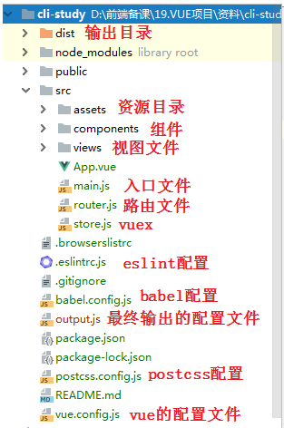
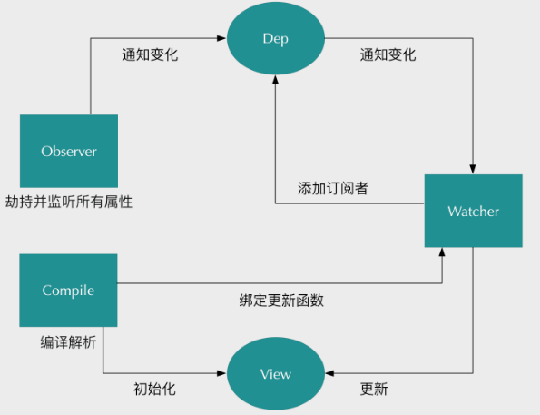
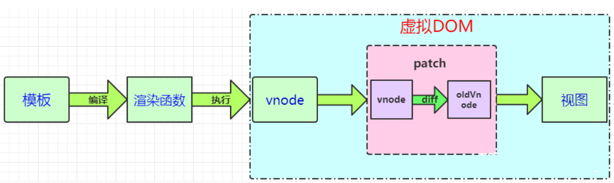
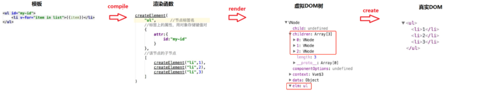
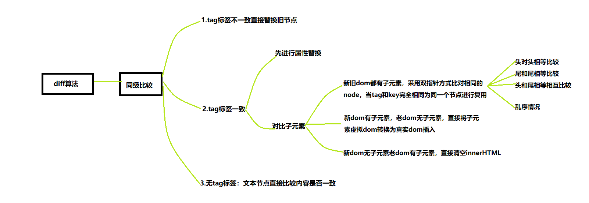
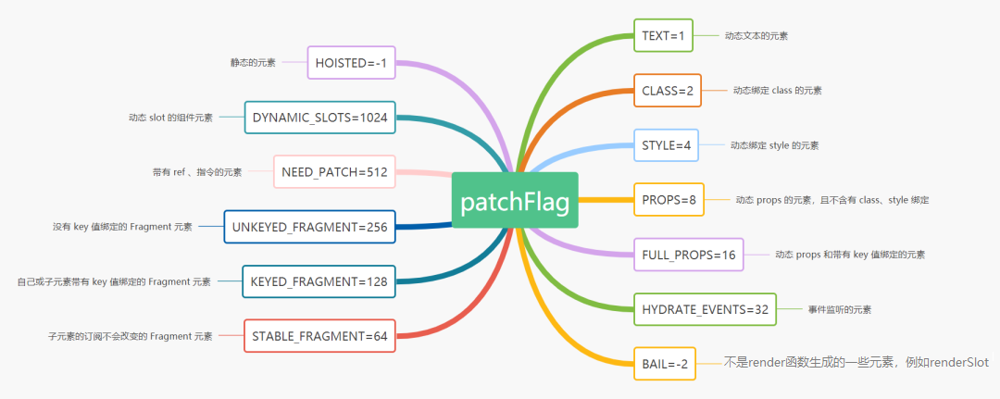
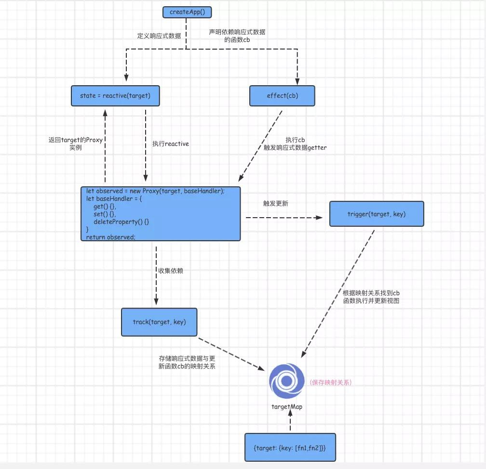

#### 1.vue组件传值几种方式
* 父组件通过prop向子组件传值

* 子组件通过this.$emit()触发父组组件传递过来的方法向父组件传值

* 兄弟组件之间不能直接传值，需要通过父组件来做间接传值，在这种情况下推荐使用vuex

* 中央事件总线   mitt


- provide和inject : 跨级组件通信


- `$refs`和`$parent`

具体例子请看[官方文档](https://cn.vuejs.org/v2/guide/components.html#%E9%80%9A%E8%BF%87-Prop-%E5%90%91%E5%AD%90%E7%BB%84%E4%BB%B6%E4%BC%A0%E9%80%92%E6%95%B0%E6%8D%AE)

#### 2.vue-router原理
说简单点，vue-router的原理就是监听URL地址变化，从而渲染不同的组件。

```javascript
vue-router的模式主要有hash模式和history模式。

 hash和history模式的异同：
 相同点：
   1.hash和history模式都可以作为前端的路由实现方案，他们都是在路由切换过程中不会刷新页面，不会向服务器发送请求(页面切换过程都是在浏览器本地通过js代码完成的)
 不同点：
   1.hash模式浏览器路径中是#,在刷新网页的时候，#号后面的信息不会提交到服务器
     history模式浏览器的路径是/ , /后面的信息会提交到服务器，在刷新页面的时候如果服务器没有对应的接口与之匹配，会报404错误(对应的为了解决这个问题，我们可以在服务器开启对应的配置)
   2.hash模式是通过hashChange方法来监听路由地址的变化，一旦路由地址改变之后，就会根据当前的路由地址从路由配置中查找对应的组件，然后把组件显示到页面。
     在使用hash模式切换路由的时候，内部会创建hashHistory对象，然后通过这个对象的push\replace等方法切换页面，从而实现浏览器历史记录的前进后退
     在使用history模式的时候，内部是通过history.pushState()和history.replaceState()等方法切换页面，从而实现浏览器历史记录的前进后退
   3.hash模式刷新页面的时候，#后面的信息不会提交到服务器；history模式刷新页面的时候，/路径部分会提交到服务器，如果服务器没有对应的资源匹配，会报404错误

```

#### 3.构建的 vue-cli 工程都到了哪些技术，它们的作用分别是什么？

```
1、vue.js：vue-cli工程的核心，主要特点是双向数据绑定和组件系统。
2、vue-router：vue官方推荐使用的路由框架。
3、vuex：专为 Vue.js 应用项目开发的状态管理器，主要用于维护vue组件间共用的一些 变量 和 方法。
4、axios（ 或者 fetch 、ajax ）：用于发起 GET 、或 POST 等 http请求，基于 Promise 设计。
5、vux  mint-UI  AntDesign  ElementUI等：为vue设计的UI组件库。
6、webpack：模块加载和vue-cli工程打包器。
7、AnimateCSS：动画库
```

#### 4.vue-cli 工程常用的 npm 命令有哪些？

```
npm run serve 
npm run build 
npm run lint    
npm run build --report  用于查看 vue-cli 生产环境部署资源文件大小
```

#### 5.请说出vue-cli工程中每个文件夹和文件的用处




#### 6.请你详细介绍一些 package.json 里面的配置

```
{
  "name": "cli-study",
  "version": "0.1.0",
  "private": true,
  "scripts": {
    "serve": "vue-cli-service serve",
    "build": "vue-cli-service build",
    "lint": "vue-cli-service lint"
  },
  "dependencies": {
    "vue": "^2.5.21",
    "vue-router": "^3.0.1",
    "vuex": "^3.0.1"
  },
  "devDependencies": {
    "@vue/cli-plugin-babel": "^3.3.0",
    "@vue/cli-plugin-eslint": "^3.3.0",
    "@vue/cli-service": "^3.3.0",
    "@vue/eslint-config-prettier": "^4.0.1",
    "babel-eslint": "^10.0.1",
    "eslint": "^5.8.0",
    "eslint-plugin-vue": "^5.0.0",
    "less": "^3.0.4",
    "less-loader": "^4.1.0",
    "lint-staged": "^8.1.0",
    "vue-template-compiler": "^2.5.21"
  },
  "gitHooks": {
    "pre-commit": "lint-staged"
  },
  "lint-staged": {
    "*.js": [
      "vue-cli-service lint",
      "git add"
    ],
    "*.vue": [
      "vue-cli-service lint",
      "git add"
    ]
  }
}
```

常用对象解析：

- scripts：npm run xxx 命令调用node执行的 .js 文件
- dependencies：生产环境依赖包的名称和版本号，即这些 依赖包 都会打包进 生产环境的JS文件里面
- devDependencies：开发环境依赖包的名称和版本号，即这些 依赖包 只用于 代码开发 的时候，不会打包进 生产环境js文件 里面   npm install xx --save-dev

#### 7.vue.js的核心

1、数据驱动，也叫数据绑定。

> Vue.js使用ES5的Object.defineProperty和存储器属性: getter和setter实现数据的监听(兼容IE9及以上版本)。核心是VM，即ViewModel，保证数据和视图的一致性。

2、组件系统。

.vue组件的核心选项:

> 1、模板（template）：模板声明了数据和最终展现给用户的DOM之间的映射关系。
> 2、初始数据（data）：一个组件的初始数据状态。对于可复用的组件来说，这通常是私有的状态。
> 3、接受的外部参数(props)：组件之间通过参数来进行数据的传递和共享。
> 4、方法（methods）：对数据的改动操作一般都在组件的方法内进行。
> 5、生命周期钩子函数（lifecycle hooks）：一个组件会触发多个生命周期钩子函数，最新2.0版本对于生命周期函数名称改动很大。
> 6、私有资源（directives、components）：Vue.js当中将用户自定义的指令、组件等统称为资源。一个组件可以声明自己的私有资源。私有资源只有该组件和它的子组件可以调用。

3、vuex。

> vuex是是vue中的状态管理方案，主要用于多个组件之间的数据共享。

#### 8.对于 Vue 是一套 构建用户界面 的 渐进式框架 的理解

渐进式代表的含义是：没有多做职责之外的事。vue.js只提供了 vue-cli 生态中最核心的 `组件系统` 和 `双向数据绑定`。像`vuex`、`vue-router`都属于围绕 `vue.js`开发的库，可以集成也可以不集成。

```
比如说，你要使用Angular，必须接受以下东西：
- 必须使用它的模块机制
- 必须使用它的依赖注入
- 必须使用它的特殊形式定义组件（这一点每个视图框架都有，难以避免）
所以Angular是带有比较强的排它性的，如果你的应用不是从头开始，而是要不断考虑是否跟其他东西集成，这些主张会带来一些困扰。


比如说，你要使用React，你必须理解：
- 函数式编程的理念
- 需要知道什么是副作用
- 什么是纯函数
- 如何隔离副作用
- 它的侵入性看似没有Angular那么强，主要因为它是软性侵入。


Vue与React、Angular的不同是，但它是渐进的：
- 你可以在原有大系统的上面，把一两个组件改用它实现，当jQuery用
- 也可以整个用它全家桶开发，当Angular用；
- 还可以只用它的视图，搭配你自己设计的整个下层应用。
- 你可以在底层数据逻辑的地方用oop(对象编程)，也可以函数式编程，都可以，它只是个轻量视图而已，只做了最核心的东西。
```

#### 9.请说出vue几种常用的指令

```
- v-if：根据表达式的值的真假条件渲染元素。在切换时元素及它的数据绑定 / 组件被销毁并重建。
- v-show：根据表达式之真假值，切换元素的 display CSS 属性。
- v-for：循环指令，基于一个数组或者对象渲染一个列表，vue 2.0以上必须需配合 key值 使用。
- v-bind：动态地绑定一个或多个特性，或一个组件 prop 到表达式。
- v-on：用于监听指定元素的DOM事件，比如点击事件。绑定事件监听器。
- v-model：实现表单输入和应用状态之间的双向绑定
- v-pre：跳过这个元素和它的子元素的编译过程。可以用来显示原始 Mustache 标签。跳过大量没有指令的节点会加快编译。
- v-once：只渲染元素和组件一次。随后的重新渲染，元素/组件及其所有的子节点将被视为静态内容并跳过。这可以用于优化更新性能。
- v-html: 显示html
- v-text: 文本内容，不识别html
- v-cloak 
```

#### 10.请问 v-if 和 v-show 有什么区别

```
共同点：
v-if 和 v-show 都是动态显示DOM元素。

区别：
1、编译过程： v-if 是 真正 的 条件渲染，因为它会确保在切换过程中条件块内的事件监听器和子组件适当地被销毁和重建。v-show 的元素始终会被渲染并保留在 DOM 中。v-show 只是简单地切换元素的 CSS 属性display。
2、编译条件： v-if 是惰性的：如果在初始渲染时条件为假，则什么也不做。直到条件第一次变为真时，才会开始渲染条件块。v-show不管初始条件是什么，元素总是会被渲染，并且只是简单地基于 CSS 进行切换。
3、性能消耗： v-if有更高的切换消耗。v-show有更高的初始渲染消耗。
4、应用场景： v-if适合运行时条件很少改变时使用。v-show适合频繁切换。
```

#### 11.vue常用的修饰符

```javascript
v-on 指令常用修饰符：

- .stop - 调用 event.stopPropagation()，禁止事件冒泡。
- .prevent - 调用 event.preventDefault()，阻止事件默认行为。
- .capture - 添加事件侦听器时使用 capture 模式。
- .self - 只当事件是从侦听器绑定的元素本身触发时才触发回调。
- .{keyCode | keyAlias} - 只当事件是从特定键触发时才触发回调。
- .native - 监听组件根元素的原生事件。
- .once - 只触发一次回调。
- .left - (2.2.0) 只当点击鼠标左键时触发。
- .right - (2.2.0) 只当点击鼠标右键时触发。
- .middle - (2.2.0) 只当点击鼠标中键时触发。


//注意： 如果是在自己封装的组件或者是使用一些第三方的UI库时，会发现一些事件并不起效果，这时就需要用.native修饰符了，如当我们使用element-ui中的el-input组件时的@keyup.enter事件：
<el-input
  v-model="inputName"
  placeholder="搜索你的文件"
  @keyup.enter.native="searchFile(params)"
  >
</el-input>
```

```
v-bind 指令常用修饰符：
- .prop   被用于绑定 DOM 属性 (property)。(差别在哪里？)
- .camel  (2.1.0+) 将 kebab-case 特性名转换为 camelCase. (从 2.1.0 开始支持)
- .sync (2.3.0+) 语法糖，会扩展成一个更新父组件绑定值的 v-on 侦听器。

v-model 指令常用修饰符：
- .lazy    取代 input 监听 change 事件
- .number  输入字符串转为数字
- .trim    输入首尾空格过滤
```

#### 12.v-on可以监听多个方法吗？

```
v-on可以监听多个方法，例如：
<input type="text" :value="name" @input="onInput" @focus="onFocus" @blur="onBlur" />

也可以给一个事件绑定多个方法，如以下代码：
<p @click="one(),two()">点击</p>
```

#### 13.vue中 key 值的作用

key值：用于 管理可复用的元素。因为`Vue` 会尽可能高效地渲染元素，通常会复用已有元素而不是从头开始渲染。这么做使 Vue 变得非常快，但是这样也不总是符合实际需求。

> 2.2.0+ 的版本里，当在组件中使用 v-for 时，key 现在是必须的，key的取值需要是number或者string，而且需要在同级唯一。

#### 14.vue事件中如何使用event对象

注意在事件中要使用 $ 符号

```
//html部分
<a href="javascript:void(0);" data-id="12" @click="showEvent($event)">event</a>

//js部分
showEvent(event){
    //获取自定义data-id
	console.log(event.target.dataset.id)
   //阻止事件冒泡
    event.stopPropagation(); 
    //阻止默认
    event.preventDefault()
}
```

#### 15.什么是$nextTick

`$nextTick` 下一次dom更新完毕之后执行

因为`Vue`的异步更新队列，`$nextTick`是用来知道什么时候`DOM`更新完成的。

#### 16.Vue 组件中 data 为什么必须是函数

```
//为什么data函数里面要return一个对象
<script>
    export default {
        data() {
            return {  // 返回一个唯一的对象，不要和其他组件共用一个对象进行返回
                menu: MENU.data,
                poi: POILIST.data
            }
        }
    }
</script>
```

因为一个组件是可以共享的，同一个组件类可以创建很多个组件对象，但每一个组件对象的data应该是私有的，所以每个组件都要return一个新的data对象，返回一个唯一的对象，不要和其他组件共用一个对象。

#### 17.v-for 与 v-if 的优先级

当它们处于同一节点，在vue2中`v-for`的优先级比`v-if`更高，在vue3中v-if比v-for的优先级高

```
在 vue2 中，v-for 优先级高于 v-if，我们可以这样实现：
<ul>
  <!-- vue2中，v-for优先级高于v-if -->
  <li v-for="item in todoList" v-if="!item.done" :class="{todo: !item.done}" :key="item.id">
    <span>{{item.task}}</span>
  </li>
</ul>

在 vue3 中，由于 v-if 优先级要高于 v-for，所以不能像 vue2 那样将 v-for 和 v-if 放在同一个元素上，我们在 li 外面套一层用来执行 for 循环：
<ul>
  <template v-for="item in list" :key="item.id">
    <li v-if="!item.done" :class="{todo: !item.done}">
      <span>{{item.task}}</span>
    </li>
  </template>
</ul>
```

#### 18.vue中子组件调用父组件的方法

主要步骤：

```
1、在父组件创建子组件实例的时候，通过v-on给子组件传递一个自定义事件。
2、在子组件 中 通过'$emit'触发 当前实例上的 自定义事件。
```

**示例：**

父组件：

```
<template>
	<div class="fatherPageWrap">
          <h1>这是父组件</h1>
          <!-- 引入子组件，v-on监听自定义事件 -->
          <emitChild v-on:emitMethods="fatherMethod"></emitChild>
	</div>
</template>

<script type="text/javascript">
    import emitChild from '@/page/children/emitChild.vue';
	export default{
		data () {
		    return {}
		},
		components : {
            emitChild
		},
		methods : {
		    fatherMethod(params){
                 alert(JSON.stringify(params));
            }
		}
	}
</script>
```

子组件：

```
<template>
	<div class="childPageWrap">
         <h1>这是子组件</h1>
	</div>
</template>

<script type="text/javascript">
	export default{
	    emits:['emitMethods'],
		data () {
		   return {}
		},
		mounted () {
           //通过 emit 触发
           this.$emit('emitMethods',{"name" : 123});
		}
	}
</script>
```

结果：子组件 会调用 父组件的`fatherMethod` 方法，该并且会`alert` 传递过去的参数：`{"name":123}`

#### 19.vue中 keep-alive 组件的作用

`keep-alive：`主要用于`保留组件状态`或`避免组件重新渲染`。

**属性：**

- `include:`字符串或正则表达式。只有匹配的组件会被缓存。
- `exclude：`字符串或正则表达式。任何匹配的组件都不会被缓存。

#### 20.vue中如何编写可复用的组件

组件由*状态*、事件和嵌套的片断组成。

状态 props，是组件当前的某些数据或属性，如 video 中的 src、width 和 height。

事件 events，是组件在特定时机触发一些操作的行为，如 video 在视频资源加载成果或失败时会触发对应的事件来执行处理。

片段 slots，指的是嵌套在组件标签中的内容，该内容会在某些条件下展现出来，如在浏览器不支持 video 标签时显示提示信息。

在编写组件的时候，要时刻考虑组件的复用性，良好的可复用组件应当定义一个清晰的公开接口。

- **props** 允许外部环境传递数据给组件
- **events** 允许组件触发外部环境的副作用
- **slots** 允许外部环境将额外的内容组合在组件中。

```
<my-video
  :playlist="playlist"
  width="320"
  height="240"
  @load="loadHandler"
  @error="errorHandler"
  @playnext="nextHandler"
  @playprev="prevHandler">
  <div slot="endpage"></div>
</my-video>
```

#### 21.什么是vue生命周期和生命周期钩子函数

`vue 的生命周期是：` vue 实例从创建到销毁，也就是从`开始创建`、`初始化数据`、`编译模板`、`挂载Dom→渲染`、`更新→渲染`、`卸载`等一系列过程。

在这个过程中也会`运行`一些叫做`生命周期钩子的函数`，这给了`用户`在不同阶段`添加自己的代码`的机会。

#### 22.vue生命周期钩子函数有哪些

| 生命周期钩子函数（11个）     | 类型                                                  | 详细                                                         |
| ---------------------------- | ----------------------------------------------------- | ------------------------------------------------------------ |
| beforeCreate                 | Function                                              | 在`实例初始化之后`，数据观测 (data observer) 和 event/watcher 事件配置之前被调用。 |
| created                      | Function                                              | 在`实例创建完成后`被立即调用。在这一步，实例已完成以下的配置：`数据观测 (data observer)`， `属性和方法的运算`，`watch/event 事件回调`。然而，挂载阶段还没开始，$el 属性目前不可见。 |
| beforeMount                  | Function                                              | 在`挂载开始之前`被调用：相关的 render 函数首次被调用。       |
| mounted                      | Function                                              | `el` 被新创建的 `vm.$el` 替换，并`挂载到实例上去之后`调用该钩子。如果 root 实例挂载了一个文档内元素，当 mounted 被调用时 vm.$el 也在文档内。 |
| beforeUpdate                 | Function                                              | `数据更新时调用`，发生在虚拟 DOM 打补丁之前。这里适合在更新之前访问现有的 DOM，比如手动移除已添加的事件监听器。**该钩子在服务器端渲染期间不被调用，因为只有初次渲染会在服务端进行。** |
| updated                      | Function                                              | 由于数据更改导致的`虚拟 DOM 重新渲染和打补丁`，在这`之后`会`调用`该钩子。 |
| activated                    | Function                                              | `keep-alive 组件激活时调用`。**该钩子在服务器端渲染期间不被调用。** |
| deactivated                  | Function                                              | `keep-alive 组件停用时调用`。**该钩子在服务器端渲染期间不被调用。** |
| beforeUnmount                | Function                                              | 实例销毁之前调用。在这一步，实例仍然完全可用。**该钩子在服务器端渲染期间不被调用。** |
| unmounted                    | Function                                              | Vue 实例销毁后调用。调用后，Vue 实例指示的所有东西都会解绑定，所有的事件监听器会被移除，所有的子实例也会被销毁。**该钩子在服务器端渲染期间不被调用。** |
| errorCaptured（2.5.0+ 新增） | (err: Error, vm: Component, info: string) => ?boolean | 当捕获一个来自子孙组件的错误时被调用。此钩子会收到三个参数：错误对象、发生错误的组件实例以及一个包含错误来源信息的字符串。此钩子可以返回 false 以阻止该错误继续向上传播。 |

**注意：**

```
1、mounted、updated不会承诺所有的子组件也都一起被挂载。如果你希望等到整个视图都渲染完毕，可以用vm.$nextTick替换掉mounted、updated：

updated: function () {
    this.$nextTick(function () {
        // Code that will run only after the
        // entire view has been re-rendered
    })
}

2、http请求建议在 created 生命周期内发出
```

**vue生命周期图示：**


#### 23.vue如何监听键盘事件中的按键

我们可以通过按键修饰符来监听键盘事件中的按键 。`Vue`允许为 `v-on`在监听键盘事件时添加`按键修饰符`：

```
<input v-on:keyup.enter="submit">

<!-- 缩写语法 -->
<input @keyup.enter="submit">
```

**全部的按键别名：**

```
- .enter
- .tab
- .delete (捕获“删除”和“退格”键)
- .esc
- .space
- .up
- .down
- .left
- .right
```

**系统修饰键：**

> 2.1.0 新增

```
可以用如下修饰符来实现仅在按下相应按键时才触发鼠标或键盘事件的监听器。
- .ctrl
- .alt
- .shift
- .meta

<!-- Alt + C -->
<input @keyup.alt.67="clear">

<!-- Ctrl + Click -->
<div @click.ctrl="doSomething">Do something</div>
```

> 2.5.0 新增

```
.exact修饰符允许你控制由精确的系统修饰符组合触发的事件。

<!-- 即使 Alt 或 Shift 被一同按下时也会触发 -->
<button @click.ctrl="onClick">A</button>

<!-- 有且只有 Ctrl 被按下的时候才触发 -->
<button @click.ctrl.exact="onCtrlClick">A</button>

<!-- 没有任何系统修饰符被按下的时候才触发 -->
<button @click.exact="onClick">A</button>
```

**鼠标按钮修饰符：**

> 2.2.0 新增

```
- .left
- .right
- .middle

这些修饰符会限制处理函数仅响应特定的鼠标按钮。
```

#### 24.vue更新数组时触发视图更新的方法

Vue 包含一组观察数组的变异方法，所以它们也将会触发视图更新。这些方法如下：

```
- push()
- pop()
- shift()
- unshift()
- splice()
- sort()
- reverse()

当我们调用数组的上面这些方法修改数组的时候，页面会更新

filter(), concat()和 slice() 。这些不会改变原始数组，但总是返回一个新数组，所以页面不会更新。
```

#### 25.如何解决非工程化项目，网速慢时初始化页面闪动问题？

	使用`v-cloak`指令，`v-cloak`不需要表达式，它会在`Vue`实例结束编译时从绑定的HTML元素上移除，经常和CSS的`display:none`配合使用。

```
<div id="app" v-cloak>
	{{message}}
</div>

<script>
var app = new Vue({
    el:"#app",
    data:{
        message:"这是一段文本"
    }
})
</script>


[v-cloak]{
    display:none;
}
```

在一般情况下，`v-cloak`是一个解决初始化慢导致页面闪动的最佳实践，对于简单的项目很实用。

#### 26.v-for产生的列表，如何实现active样式的切换？

通过设置当前 currentIndex 实现：

```
<template>
	<div class="toggleClassWrap">
	 <ul>
	    <!--li是否有clicked样式取决于当前的currentIndex等于多少-->
		<li @click="currentIndex = index" v-bind:class="{clicked: index === currentIndex}" v-for="(item, index) in desc" :key="index">
			<a href="javascript:;">{{item.ctrlValue}}</a>
		</li>
	</ul>
	</div>
</template>

<script type="text/javascript">
	export default{
		data () {
			return {
				desc:[
                    {
                        ctrlValue:"test1"
                    },
                    {
                        ctrlValue:"test2"
                    },
                    {
                        ctrlValue:"test3"
                    },
                    {
                        ctrlValue:"test4"
                    }
				],
				currentIndex:0
			}
		}
	}
</script>

<style type="text/css" lang="less">
.toggleClassWrap{
	.clicked{
		color:red;
	}
}
</style>
```

#### 27.vue-cli工作中如何自定义一个过滤器？

vue3移除了过滤器的用法，建议我们使用计算属性或者方法来替换，但是保留了全局过滤器的使用

```
// main.js
const app = createApp(App)

//app.config.globalProperties 其实就是 Vue.prototype
app.config.globalProperties.$filters = {
  currencyUSD(value) {
    return '$' + value
  }
}

<template>
  <h1>Bank Account Balance</h1>
  <p>{{ $filters.currencyUSD(accountBalance) }}</p>
</template>

```

#### 28.vue等单页面应用及其优缺点

```
单页Web应用（single page web application，SPA）：就是只有一个页面的应用。单页应用程序 (SPA) 是加载单个HTML 页面并在用户与应用程序交互时动态更新该页面的Web应用程序。浏览器一开始会加载必需的HTML、CSS和JavaScript，所有的操作都在这张页面上完成，都由JavaScript来控制。因此，对单页应用来说模块化的开发和设计显得相当重要。


单页Web应用的优点：
1、提供了更加吸引人的用户体验：具有桌面应用的即时性、网站的可移植性和可访问性。
2、单页应用的内容的改变不需要重新加载整个页面，web应用更具响应性和更令人着迷。
3、单页应用没有页面之间的切换，就不会出现“白屏现象”,也不会出现假死并有“闪烁”现象
4、单页应用相对服务器压力小，服务器只用出数据就可以，不用管展示逻辑和页面合成，吞吐能力会提高几倍。
5、良好的前后端分离。后端不再负责模板渲染、输出页面工作，后端API通用化，即同一套后端程序代码，不用修改就可以用于Web界面、手机、平板等多种客户端。


单页Web应用的缺点：
1、首屏加载慢
2、SEO问题，不利于百度，360等搜索引擎收录。
3、容易造成CSS命名冲突。
4、前进、后退、地址栏、书签等，都需要程序进行管理，页面的复杂度很高，需要一定的技能水平和开发成本高。
```

#### 29.什么是vue的计算属性？

计算属性：对于任何复杂的计算逻辑，当前属性值是根据其他属性计算出来的，都应当使用计算属性。

例子：

```
<script>
export default {
  data() {
    return {
      firstname: "",
      lastname: "",
    };
  },
  computed: {
    // 在computed中可以定义一些属性，这些属性叫做【计算属性】，计算属性的本质就是一个方法，只不过我们在使用这些计算属性的时候是把它们的名称直接当作属性来使用的，并不会把计算属性当作方法去调用

    // 注意1： 计算属性在引用的时候，一定不要加()去调用，直接把它当作普通属性去使用就好了；
    // 注意2： 在计算属性的function中所用到的任何data中的数据发送了变化，就会立即重新计算这个计算属性的值
    // 注意3： 计算属性的求值结果会被缓存起来，方便下次直接使用。
    fullname: function () {
      return this.firstname + "-" + this.lastname;
    },
  },
};
</script>
```

#### 30.vue父组件如何向子组件中传递数据

1.父组件中使用子组件的时候通过 v-bind 向子组件传递数据：

```
<!-- 动态赋予一个变量的值 -->
<blog-post v-bind:title="post.title"></blog-post>
```

2.子组件中声明props来接收父组件传递过来的数据：

```
export default {
  props : ["title"]
}

//或者
export default {
  props : {
  	title:{
    	type:string,
        default:""
    }
  }
}
```

#### 31.如何在组件中使用全局常量

可以将全局变量配置到 app.config.globalProperties 中。

#### 32.vue如何禁止弹窗后面的滚动条滚动

1.设置document的overflow为hidden

2.给document绑定touchmove事件，阻止默认事件

```
methods : {
   //禁止滚动
   stop(){
        var mo=function(e){e.preventDefault();};
        document.body.style.overflow='hidden';
        document.addEventListener("touchmove",mo,false);//禁止页面滑动
    },
    //取消滑动限制
    move(){
        var mo=function(e){e.preventDefault();};
        document.body.style.overflow='';//出现滚动条
        document.removeEventListener("touchmove",mo,false);
    }
}
```

#### 33.请说出计算属性(computed)的缓存和方法(method)调用的有什么区别？

```
1. 计算属性必须返回结果
2. 计算属性是基于它的依赖缓存的。一个计算属性所依赖的数据发生变化时，它才会重新取值。
3. 使用计算属性还是methods取决于是否需要缓存，当遍历大数组和做大量计算时，应当使用计算属性，除非你不希望得到缓存。
4. 计算属性是根据依赖自动执行的，methods需要事件调用。
```

#### 34.什么是vue.js中的自定义指令

Vue里面有许多内置的指令，比如`v-if`和`v-show`，这些丰富的指令能满足我们的绝大部分业务需求，不过在需要一些特殊功能时，我们仍然希望对`DOM`进行底层的操作，这时就要用到自定义指令。

```
app.directive('focus', {
    beforeMount: function (el) { 
        // 每当指令绑定到元素上的时候，会立即执行这个beforeMount函数，只执行一次
        // 注意： 在每个函数中，第一个参数永远是el，表示被绑定了指令的那个元素，这个el参数，是一个原生的JS对象
        // 在元素刚绑定了指令的时候还没有插入到DOM中去的时候调用focus方法没有作用。因为，一个元素只有插入DOM之后才能获取焦点
        // el.focus()
    },
    mounted: function (el) {  
        // 指定绑定的远古三插入到DOM中的时候执行【触发1次】
        el.focus()
    },
    updated : function (el) {  
        // 在包含组件的 VNode 及其子组件的 VNode 更新后调用
    }
})
```

#### 35.自定义指令的几个钩子函数

自定义指令就是实现Vue提供的钩子函数，在Vue3中钩子函数的生命周期和组件的生命周期类似：

```
- created - 元素创建后，但是属性和事件还没有生效时调用。
- beforeMount- 仅调用一次，当指令第一次绑定元素的时候。
- mounted- 仅调用一次，元素被插入父元素时调用.
- beforeUpdate: 在更新包含组件的 VNode 之前调用。
- updated - 在包含组件的 VNode 及其子组件的 VNode 更新后调用。
- beforeUnmount: 元素卸载前调用，仅调用一次
- unmounted -当指令卸载后调用，仅调用一次
```

#### 36.自定义指令钩子函数参数

> 在自定义指令钩子函数的参数中，除了 el 之外，其它参数都应该是只读的，切勿进行修改。

- 每一个钩子函数都有如下参数：
  - el: 指令绑定的元素，可以用来直接操作DOM
  - binding: 数据对象，包含以下属性
    - instance: 当前组件的实例，一般推荐指令和组件无关，如果有需要使用组件上下文ViewModel，可以从这里获取
    - value: 指令的值，即上面示例中的“yellow“
    - oldValue: 指令的前一个值，在beforeUpdate和Updated 中，可以和value是相同的内容。
    - arg: 传给指令的参数，例如v-on:click中的click。
    - modifiers: 包含修饰符的对象。例如v-on.stop:click 可以获取到一个{stop:true}的对象
  - vnode: Vue 编译生成的虚拟节点,
  - prevVNode: Update时的上一个虚拟节点

#### 37.vue-router如何响应 路由参数 的变化

> 问题：当使用路由参数时，例如从 `/content?id=1` 到 `content?id=2`，此时原来的组件实例会被复用。这也意味着组件的`生命周期钩子不会再被调用`，此时vue应该如何响应`路由参数` 的变化？

解决方案：

1.用 :key 来阻止“复用”

```
//在父组件中使用
<router-view :key="key"></router-view>

computed: {
	key() {
		return this.$route.name !== undefined? this.$route.name +new Date(): this.$route +new Date()
	}
}

//这种办法实质上是让每次路由跳转时重新构建该组件，我们在它的生命周期中写一个打印语句就能看出来。
```

2.复用组件时，想对路由参数的变化作出响应的话， 可以`watch (监测变化) $route 对象`：

```javascript
const User = {
  template: '...',
  watch: {
    '$route' (to, from) {
      // 对路由变化作出响应...
    }
  }
}
```

3.通过 `vue-router `的钩子函数 `beforeRouteEnter ` `beforeRouteUpdate`  `beforeRouteLeave`

```javascript
//localhost:3000/login/1   --->localhost:3000/login/2
beforeRouteEnter (to, from, next) {
   // 在渲染该组件的对应路由被 confirm 前调用
   // 不！能！获取组件实例 `this`
   // 因为当钩子执行前，组件实例还没被创建
},
beforeRouteUpdate (to, from, next) {
   // 在当前路由改变，但是该组件被复用时调用
   // 举例来说，对于一个带有动态参数的路径 /foo/:id，在 /foo/1 和 /foo/2 之间跳转的时候，
   // 由于会渲染同样的 Foo 组件，因此组件实例会被复用。而这个钩子就会在这个情况下被调用。
   // 可以访问组件实例 `this`
},
beforeRouteLeave (to, from, next) {
   // 导航离开该组件的对应路由时调用
   // 可以访问组件实例 `this`
}
```

#### 38.完整的 vue-router 导航解析流程

```
localhost:8000/#a  ---> localhost:8000/#b 
当由A路由 --> B路由的时候：
1、在A组件里调用离开守卫。          A组件中的  beforeRouteLeave 
2、调用全局的 beforeEach 守卫。    router.beforeEach
3、再执行B路由配置里调用 beforeEnter。
      routes: [
        {
          path: '/b',
          component: B,
          beforeEnter: (to, from, next) => {
          }
        }
      ]
4、再执行B组件的进入守卫。          B组件中 beforeRouteEnter。
5、调用全局的 beforeResole 守卫 (2.5+)。    router.beforeResolve
6、导航被确认。
7、调用全局的 afterEach 钩子。              router.afterEach
8、触发 DOM 更新。
```

#### 39.vue-router有哪几种导航钩子（ 导航守卫 ）？

```
1、全局守卫： router.beforeEach  router.beforeResolve  router.afterEach
    const router = new VueRouter({ ... });
    router.beforeEach((to, from, next) => {
        // do someting
    });
    //to:代表要进入的目标，它是一个路由对象
    //from:代表当前正要离开的路由，同样也是一个路由对象
    //next:这是一个必须需要调用的方法，而具体的执行效果则依赖 next 方法调用的参数

    //全局后置钩子，后置钩子并没有 next 函数，也不会改变导航本身
    router.afterEach((to, from) => {
        // do someting
    });

2、路由独享的守卫： beforeEnter
    cont router = new VueRouter({
        routes: [
            {
                path: '/file',
                component: File,
                beforeEnter: (to, from ,next) => {
                    // do someting
                }
            }
        ]
    });
    
3、组件内的守卫： beforeRouteEnter、beforeRouteUpdate (2.2 新增)、beforeRouteLeave
    const File = {
        template: `<div>This is file</div>`,
        beforeRouteEnter(to, from, next) {
            // do someting
            // 在渲染该组件的对应路由被 confirm 前调用
        },
        beforeRouteUpdate(to, from, next) {
            // do someting
            // 在当前路由改变，但是依然渲染该组件是调用
        },
        beforeRouteLeave(to, from ,next) {
            // do someting
            // 导航离开该组件的对应路由时被调用
        }
    }

```

#### 40.vue-router的几种实例方法以及参数传递

| 实例方法                                              | 说明                                                         |
| ----------------------------------------------------- | ------------------------------------------------------------ |
| this.$router.push(location, onComplete?, onAbort?)    | 这个方法会向 history 栈添加一个新的记录，所以，当用户点击浏览器后退按钮时，则回到之前的 URL。并且点击 `<router-link :to="...">`等同于调用 `router.push(...)`。 |
| this.$router.replace(location, onComplete?, onAbort?) | 这个方法不会向 history 添加新记录，而是跟它的方法名一样 —— 替换掉当前的 history 记录，所以，当用户点击浏览器后退按钮时，并不会回到之前的 URL。 |
| this.$router.go(n)                                    | 这个方法的参数是一个整数，意思是在 history 记录中向前或者后退多少步，类似 `window.history.go(n)`。 |

**参数传递方式：**vue-router提供了`动态路由参数`、`params`、`query`、`meta`四种页面间传递参数的方式。

```
// 字符串，不带参数
this.$router.push('home')

// 对象，不带参数
this.$router.push({ path: 'home' })

// params（推荐）：命名的路由，params 必须和 name 搭配使用
this.$router.push({ name:'user',params: { userId: 123 }})

// 这里的 params 不生效
this.$router.push({ path:'/user',params: { userId: 123 }})

// query：带查询参数，变成 /register?plan=private
this.$router.push({ path: 'register', query: { plan: 'private' }})

//meta方式：路由元信息
export default new Router({
    routes: [
        {
            path: '/user',
            name: 'user',
            component: user,
            meta:{
                title:'个人中心'
            }
        }
    ]
})

```

在组件中获取路由参数：

```
//通过 $route 对象获取，注意是route，不是$router
this.$route.params
this.$route.query
this.$route.meta
```

#### 41.$route 和 $router 的区别

`$route`是“路由信息对象”，包括path，params，hash，query，fullPath，matched，name等路由信息参数。

`$router`是“路由实例”对象包括了路由的跳转方法，钩子函数等。

#### 42.vue-router的动态路由匹配以及使用

动态路径匹配：即把某种模式匹配到的所有路由，全都映射到同个组件。使用动态路由参数来实现。

```
const User = {
  template: '<div>User</div>'
}

const router = new VueRouter({
  routes: [
    // 动态路径参数 以冒号开头
    { path: '/user/:id', component: User }
  ]
})

//  这样，像/user/foo和/user/bar都将映射到相同的路由。
```

```
//一个“路径参数”使用冒号 :标记。当匹配到一个路由时，参数值会被设置到 this.$route.params，可以在每个组件内使用。

const User = {
  template: '<div>User {{ $route.params.id }}</div>'
}

//也可以在路由配置的时候写上props:true把动态路由参数注入到组件的props中
```

#### 43.vue-router如何定义嵌套路由

嵌套路由  :  是路由的多层嵌套。

`第一步：`需要在一个被渲染的组件中嵌套 `<router-view>`组件用于呈现子路由。

```
const User = {
  template: `
    <div class="user">
      <h2>User</h2>
      <router-view></router-view>
    </div>
  `
}
```

`第二步：`在嵌套的出口中渲染组件，在`VueRouter` 的参数中使用`children`配置：

```
const router = createRouter({
  routes: [
    { 
      path: '/user/:id', 
      component: User,
      children: [
        {
          // 当 /user/:id/profile 匹配成功，
          // UserProfile 会被渲染在 User 的 <router-view> 中
          path: 'profile',
          component: UserProfile
        },
        {
          // 当 /user/:id/posts 匹配成功
          // UserPosts 会被渲染在 User 的 <router-view> 中
          path: 'posts',
          component: UserPosts
        }
      ]
    }
  ]
})
```

#### 44.`<router-link></router-link>`组件及其属性

`<router-link> 组件:`用于支持用户在具有路由功能的应用中 (点击)跳转导航。

可以通过`to 属性`指定目标地址，默认渲染成带有正确链接的 `<a> 标签，`可以通过配置 `tag 属性`生成别的标签.。

另外，当目标路由成功激活时，链接元素自动设置一个表示激活的 CSS 类名。

**常用属性：**

| 属性               | 类型                                   | 说明                                                         | 示例                                                         |
| ------------------ | -------------------------------------- | ------------------------------------------------------------ | ------------------------------------------------------------ |
| to                 | string \ Location                      | 表示目标路由的链接。当被点击后，内部会立刻把`to`的值传到`router.push()`，所以这个值可以是一个字符串或者是描述目标位置的对象。 | `<router-link to="home">Home</router-link>`                  |
| replace            | boolean（默认flase）                   | 设置`replace`属性的话，当点击时，会调用 `router.replace()`而不是 router.push()，于是导航后`不会留下 history 记录`。 | `<router-link :to="{ path: '/abc'}" replace></router-link>`  |
| append             | boolean（默认flase）                   | 设置`append`属性后，则在当前 (相对) 路径前添加基路径。例如，我们从 `/a`导航到一个相对路径 `b`，如果`没有配置 append`，则路径为`/b`，如果`配了`，则为`/a/b` | `<router-link :to="{ path: 'relative/path'}" append></router-link>` |
| tag                | string（默认 'a'）                     | 有时候想要 渲染成某种标签，例如 `<li>`于是我们使用`tag`prop 类指定何种标签，同样它还是`会监听点击`，触发导航。 | `<router-link to="/foo" tag="li">foo</router-link>`          |
| active-class       | string（默认 "router-link-active"）    | 设置 `链接激活时`使用的`CSS 类名`。默认值可以通过路由的构造选项`linkActiveClass`来全局配置。 |                                                              |
| exact              | boolean（默认 false）                  | "是否激活" 默认类名的依据是 `inclusive match (全包含匹配)`。 举个例子，如果当前的路径是 /a 开头的，那么 也会被设置 CSS 类名。 | `这个链接只会在地址为 / 的时候被激活： <router-link to="/" exact>` |
| event              | string \ Array （默认 'click'）        | 声明可以用来`触发导航的事件`。可以是一个`字符串`或是一个包含`字符串的数组`。 |                                                              |
| exact-active-class | string 默认 'router-link-exact-active' | 配置当链接被精确匹配的时候应该激活的 `class`。注意默认值也是可以通过路由构造函数选项`linkExactActiveClass`进行全局配置的。 |                                                              |

#### 45.vue-router实现动态加载路由组件（ 懒加载 ）

当打包构建应用时，Javascript 包会变得非常大，影响页面加载。如果我们能把不同路由对应的组件分割成不同的代码块，然后当路由被访问的时候才加载对应组件，这样就更加高效了。

结合 Vue 的异步组件和 Webpack 的代码分割功能，轻松实现路由组件的懒加载。

第一步：定义一个能够被 Webpack 自动代码分割的异步组件。

```
//在src/router/index.js里面引入异步引入组件
const index = () => import('../page/list/index.vue');
```

第二步：在路由配置中什么都不需要改变，只需要像往常一样使用 index。

```
const router = new VueRouter({
  routes: [
    { path: '/index', component: index,name:"index" }
  ]
})
```

第三步：在build/webpack.base.conf.js下的output属性，新增chunkFilename。

```
output: {
    path: config.build.assetsRoot,
    filename: '[name].js',
    //新增chunkFilename属性
    chunkFilename: '[name].js',
    publicPath: process.env.NODE_ENV === 'production'
      ? config.build.assetsPublicPath
      : config.dev.assetsPublicPath
  },
```

#### 46.什么是vuex？

```
Vuex 是一个专为 Vue.js 应用程序开发的状态管理器，采用 集中式存储 管理所有组件的状态。

vuex的原理其实非常简单，它为什么能实现所有的组件共享同一份数据？
因为vuex生成了一个store实例，并且把这个实例挂在了所有的组件上，所有的组件引用的都是同一个store实例。
store实例上有数据，有方法，方法改变的都是store实例上的数据。由于其他组件引用的是同样的实例，所以一个组件改变了store上的数据，导致另一个组件上的数据也会改变，就像是一个对象的引用。
```

#### 47.使用vuex的核心概念

```javascript
每一个 Vuex 应用的核心就是 store（仓库）。“store”基本上就是一个容器，它包含着你的应用中大部分的状态 (state)。

//vuex的核心概念和核心概念图：
1、state - Vuex store实例的根状态对象，用于定义共享的状态变量。
2、Action -动作，向store发出调用通知，执行本地或者远端的某一个操作（可以理解为store的methods）
3、Mutations -修改器，它只用于修改state中定义的状态变量。
4、getter -读取器，外部程序通过它获取变量的具体值，或者在取值前做一些计算（可以认为是store的计算属性）


//Vuex的应用场景：
Vuex主要用于：
 1、多层嵌套的组件之间进行状态传递
 2、兄弟组件间进行状态传递时（当然也可以使用中央事件总线BUS）
 3、多组件共享状态时
 
更为具体的场景：组件之间的状态、音乐播放、登录状态、加入购物车...
```


```javascript
//vuex的使用

#1.安装vuex
npm install vuex@next --save

#2.main.js
import { createStore } from "vuex";

// new Vuex.Store()实例，得到一个数据仓储对象
// 可以在组件中通过this.$store.state.xx 来访问store中的数据
var store = createStore({
    //state相当于组件中的data
    state: {
        count: 0
    },
    //如果要修改store中state的值，需要调用 mutations提供的方法，可以通过this.$store.commit('方法名')来调用
    mutations: {
        increment(state) {
            state.count++
        },
        //mutations函数参数列表中最多支持两个参数，其中参数1是state； 参数2是通过commit提交过来的参数；
        subtract(state, obj) {
            console.log(obj)
            state.count -= obj.step;
        }
    },
    getters: {
        //这里的getters只负责对外提供数据，不负责修改数据，如果想要修改 state 中的数据需要在mutations中修改
        optCount: function (state) {
            return '当前最新的count值是：' + state.count
        }
    }
})

// 总结：
// 1. state中的数据，不能直接修改，如果想要修改，必须通过 mutations
// 2. 如果组件想要直接 从 state 上获取数据： 需要 this.$store.state.***
// 3. 如果组件想要修改数据，必须使用 mutations 提供的方法，需要通过 this.$store.commit('方法的名称'， 唯一的一个参数)
// 4. store中state上的数据在对外提供的时候建议做一层包装，推荐使用 getters。调用的时候则用this.$store.getters.***

import { createApp } from "vue";
import App from "./App.vue";
import store from './store'

const app = createApp(App);
//挂载路由实例(use方法挂载插件)
app.use(store).mount("#app");

#3.index.html
<body>
    <div id="app"></div>
</body>

#4.App.vue
<template>
    <div>
        <h1>这是 App 组件</h1>
        <hr>
        <counter></counter>
        <hr>
        <amount></amount>
    </div>
</template>

<script>
    import counter from "./components/counter.vue";
    import amount from "./components/amount.vue";

    export default {
        data() {
            return {};
        },
        components: {
            counter,
            amount
        }
    };
</script>

#5.components/amount.vue
<template>
  <div>
    <h3>{{ $store.getters.optCount }}</h3>
  </div>
</template>

#6.components/counter.vue
<template>
  <div>
    <input type="button" value="绑定事件-减少" @click="sub">
    <input type="button" value="绑定事件-增加" @click="add">
    <br>
    <input type="text" v-model="$store.state.count">
  </div>
</template>

<script>
export default {
  data() {
    return {
    };
  },
  methods: {
    add() {
       this.$store.commit("increment");
    },
    sub() {
      this.$store.commit("subtract",{ step:3});
    }
  }
};
</script>

```

#### 48.如何在vuex中使用异步修改？

```javascript
//我们可以在vuex的action中实现对vuex的异步修改

const actions = {
    asyncInCrement({ commit }, n){
        return new Promise(resolve => {
            setTimeout(() => {
                commit(types.TEST_INCREMENT, n);
                resolve();
            },3000)
        })
    }
}
```

#### 49.Promise对象是什么？

```
Promise对象是ES6（ ECMAScript 2015 ）对于异步编程提供的一种解决方案，比传统的解决方案——回调函数和事件——更合理和更强大。
Promise本身不是异步的，只不过Promise中可以有异步任务，new Promise()的第一个函数参数是立马执行的。
```

```javascript
function func1(a){
	return new Promise((resolve,reject) => {
    	if(a > 10){
        	resolve(a)
        }else{
        	reject(b)
        }
    })
};

func1('11').then(res => {
	console.log('success');
}).catch(err => {
	console.log('error');
})


//Promise构造函数接受一个函数作为参数，该函数的两个参数分别resolve 和 reject。它们是两个函数，由 JavaScript 引擎提供。
1.resolve函数的作用是： 将Promise对象的状态从“未完成”变为“成功”（即从 pending 变为 fulfilled），在异步操作成功时调用，并将异步操作的结果，作为参数传递出去；

2.reject函数的作用是： 将Promise对象的状态从“未完成”变为“失败”（即从 pending 变为 rejected），在异步操作失败时调用，并将异步操作报出的错误，作为参数传递出去。

//Promise对象实例的方法，then 和 catch：
1  .then方法： 用于指定调用成功时的回调函数。
	then方法返回的是一个新的Promise实例（注意，不是原来那个Promise实例），因此可以采用链式写法，即then方法后面再调用另一个then方法。

2  .catch方法： 用于指定发生错误时的回调函数。
```

#### 50.axios、fetch与ajax有什么区别？

```javascript
//1.Ajax
Ajax指的是XMLHttpRequest（XHR）， 最早出现的发送后端请求技术，核心使用XMLHttpRequest对象，如果多个请求之间如果有先后关系的话，就会出现回调地狱。

JQuery ajax 是对原生XHR的封装，除此以外还增添了对JSONP的支持。经过多年的更新维护，真的已经是非常的方便了，优点无需多言

Ajax的缺点：
1.本身是针对MVC的编程,不符合现在前端MVVM的浪潮
2.基于原生的XHR开发，XHR本身的架构不清晰。
3.JQuery整个项目太大，单纯使用ajax却要引入整个JQuery非常的不合理（采取个性化打包的方案又不能享受CDN服务）
4.容易出现回调地狱的问题
5.不符合关注分离的原则


//2.axios
Vue2.0之后，尤雨溪推荐我们使用axios替换JQuery ajax。
axios 是一个基于Promise的请求库，用于浏览器和nodejs中，本质上浏览器的axios也是对原生XHR的封装，只不过它是Promise的实现版本，符合最新的ES规范，它本身具有以下特征：
1.从浏览器中创建 XMLHttpRequest
2.支持 Promise API
3.客户端支持防止CSRF
4.提供了一些并发请求的接口（重要，方便了很多的操作）
5.从node.js创建 http 请求
6.拦截请求和响应
7.转换请求和响应数据
8.取消请求
9.自动转换JSON数据


//3.fetch
fetch号称是AJAX的替代品，是在ES6出现的，使用了ES6中的promise对象。Fetch是基于promise设计的，Fetch的代码结构比起ajax简单多了，参数有点像jQuery ajax。但是一定记住fetch不是ajax的进一步封装，而是原生js，没有使用XMLHttpRequest对象。

fetch的优点：
1.符合关注分离，没有将输入、输出和用事件来跟踪的状态混杂在一个对象里
2.更好更方便的写法
3.基于标准 Promise 实现，支持 async/await
4.更加底层，提供的API丰富（request, response）
5.脱离了XHR，是ES6规范里新的实现方式
```

#### 51.axios有什么特点？

```
1、Axios 是一个基于 promise 的 HTTP 库，支持promise所有的API
2、它可以拦截请求和响应
3、它可以转换请求数据和响应数据，并对响应回来的内容自动转换成 JSON类型的数据
4、安全性更高，客户端支持防御 XSRF
5、在客户端和服务器均可使用
```

#### 52.vue组件的scoped属性的作用

```
当 <style> 标签有scoped 属性时，它的 CSS 只作用于当前组件中的元素
你可以在一个组件中同时使用有 scoped 和 非scoped 样式：


<style>
/* 全局样式 */
</style>

<style scoped>
/* 本地样式 */
</style>

//深度选择器
:deep()
```

#### 53.vue中集成的UI组件库

```
常用的UI组件库有：
vux： Vue.js 移动端 UI 组件库
Amaze ~ 妹子 UI
Element：饿了么组件库，适用于开发应用后台
mint-ui：移动端 UI 组件库
Ant-design : 阿里的UI组件库


1.安装第三方组件库  
2.引入组件库的包    Vue.use()
3.引入组件的css文件
4.使用
5.按需加载   安装babel插件   配置babelrc文件    用什么组件引入什么组件
```

#### 54.如何适配移动端？【 经典 】

**在css样式兼容性方面，我们可以使用autoprefixer插件**

```
postcss可以被理解为一个平台，可以让一些插件在上面跑。它提供了一个解析器，可以将CSS解析成抽象语法树。通过PostCSS这个平台，我们能够开发一些插件，来处理CSS。热门插件如autoprefixer。

vue-cli已经自动集成了postcss，所以我们可以在postcss.config.js这个配置文件中直接添加autoprefixer这个插件
```

**在屏幕大小适配方面，我们可以使用下面两种方案**

a) 使用flexible和 postcss-px2rem

	之前使用rem适配的思路：使用媒体查询，确定不同屏幕下html标签的font-size  (即1rem单位)，然后在写css样式的时候，就可以使用1rem , 2rem这样的单位来做适配了。
	
	但是这种适配的问题是需要手动把px单位换算成rem单位，比较麻烦。对应的，我们可以使用flexible和 postcss-px2rem来解决这个问题

```javascript
//1.安装flexible。 flexible主要是实现在各种不同的移动端界面实现一稿搞定所有的设备兼容自适应问题
npm install lib-flexible --save

//2.main.js引入flexible
import 'lib-flexible'

//此时运行程序会看到html中自动加上了font-size    font-size的默认值为viewport的十分之一
//在页面中引入flexible.js后，flexible会在<html>标签上增加一个data-dpr属性和font-size样式（如下图）。

//3.安装postcss-pxtorem
npm install postcss-pxtorem --save-dev

//4.修改postcss.config.js
module.exports = {
  plugins: {
    //autoprefixer 自动补全css前缀的东西
    'autoprefixer': {
      //兼容的机型
      browsers: ['Android >= 4.0', 'iOS >= 7']
    },
    'postcss-pxtorem': {
      rootValue: 37.5, //换算基数，一般和html的font-size一致
      propList: ['*']  //哪些css属性需要换算
    }
  }
};
```

b) 使用postcss-px-to-viewport

`vw` 与 `vh`单位，以`viewport`为基准，`1vw` 与 `1vh`分别为`window.innerWidth` 与 `window.innerHeight`的百分之一。

	vw/vh 单位其实出现比较早了，只是以前支持性不太好，现在随着浏览器的发展，大部分（92%以上）的浏览器已经支持了vw/vh

```javascript
npm i postcss-px-to-viewport -save -dev

//修改postcss.config.js
module.exports = {
  plugins: {
      autoprefixer: {
          //兼容的机型
      	  browsers: ['Android >= 4.0', 'iOS >= 7']
      },
    //px转换为vw单位的插件
    "postcss-px-to-viewport": {
      //1vw = 3.2
      viewportWidth: 320,
      //1vh = 5.68
      viewportHeight: 568,
      // px to vw无法整除时，保留几位小数
      unitPrecision: 5,
      // 转换成vw单位   
      viewportUnit: 'vw',
     //不转换的类名
      selectorBlackList: [],
      // 小于1px不转换
      minPixelValue: 1,
     //允许媒体查询中转换
      mediaQuery: false,
      //排除node_modules文件中第三方css文件
      exclude: /(\/|\\)(node_modules)(\/|\\)/  
    },
  }
};
```

#### 55.vue-cli工程中如何使用背景图？

> 第一种方法：通过 `import` 引入

```
首先，引入要使用的背景图片：
<script type="text/javascript">
    import  cover  from  "../assets/images/cover.png";
    export  default{
        ...
    }
</script>

然后，通过 v-bind:style 使用：
<div :style="{ backgroundImage:'url(' + cover + ')' }"></div>
```

> 第二种方法：通过 `require` 引入：

```
直接通过 v-bind 和 require 配合使用

<div :style="{ backgroundImage:'url(' + require('../assets/images/couver.png') + ')' }"></div>
```

如果在css文件中使用图片作为背景，可以直接 background:url(../../logg.png)

#### 56.vue中如何实现tab切换功能？

```
在 vue 中，实现 Tab 切换主要有三种方式：
1、使用 component 动态组件实现 Tab切换 [推荐移动端使用]
   <component :is="组件名字"></component>
2、使用 vue-router 路由配合<router-view></router-view>标签实现
3、使用第三方组件
4、还可以通过v-if和v-show来完成
```

#### 57.vue中如何利用`<keep-alive></keep-alive>`标签实现某个组件缓存功能？

实现某个组件的缓存功能，可用 keep-alive 标签与 vue-router的meta形式数据传递配合完成。

```html
<router-view v-slot="{ Component }">
    <keep-alive :include="cacheComponents">
        <component :is="Component" />
    </keep-alive>
</router-view>
```

```javascript
//第一步：在 app.vue 里面 template部分 使用 <keep-alive></keep-alive> 组件,然后使用cacheComponents来表示要缓存的组件

<router-view v-slot="{ Component }">
    <keep-alive :include="cacheComponents">
        <component :is="Component" />
    </keep-alive>
</router-view>

<script>
export default {
  data() {
    return {
      cacheComponents: []
    };
  },
  created() {
    //this.$router 获取路由对象   返回路由配置中需要缓存的组件数组信息
    console.log(this.$router)
    this.$router.options.routes.forEach(item => {
      if (item.meta && item.meta.cache) {
        this.cacheComponents.push(item.name);
      }
    });
  }
};
</script>

//第二步：在src/router.js中使用meta元数据指定要缓存的组件
import { createRouter, createWebHistory } from "vue-router";
import Login from "../views/Login.vue";
import Register from "../views/Register.vue";

const routes = [
  {
    path: "/login",
    name: "login",
    component: Login,
    meta: {
      cache: false,
    },
  },
  {
    path: "/register",
    name: "register",
    component: Register,
    meta: {
      cache: true,
    },
  },
  { path: "/", redirect: "/register" },
];

const router = createRouter({
  history: createWebHistory(),
  routes,
  linkActiveClass: "router-active",
});

export default router;
```

#### 58.vue中实现切换页面时为左滑出效果

左滑效果实现，需要使用 `<transition></transition>` 组件配合 css3 动画效果实现。

```javascript
<div id="app">
    <!-- 使用transiton来规定页面切换时候的样式-->
    <router-view v-slot="{ Component }">
        <transition name="slide-left">
            <component :is="Component" />
        </keep-alive>
    </router-view>
</div>
  
<style lang="less">
  /*左滑动效*/
   .slide-left-enter-active {
     animation: slideLeft 0.3s;
   }
  /*自定义动画*/
  @keyframes slideLeft {
    from {
      transform: translate3d(100%, 0, 0);/*横坐标,纵坐标,z坐标*/
      visibility: visible;
    }
    to {
      transform: translate3d(0, 0, 0);
    }
  }
</style>
```

#### 59.在vue-cli工程中如何实现无痕刷新？

无痕刷新:在不刷新浏览器的情况下,实现页面的刷新

```
一般常用的两种刷新方法：
window.location.reload()，原生 js 提供的方法；
this.$router.go(0)，vue 路由里面的一种方法；

这两种方法都可以达到页面刷新的目的，简单粗暴，但是用户体验不好，相当于按 F5 刷新页面，页面的重新载入，会有短暂的白屏。
```

vue开启无痕刷新

```javascript
原理：先在全局组件注册一个方法，用该方法控制router-view的显示与否，然后在子组件调用全局方法。

//第一步：在app.vue里面设置
    <template>
        <div id="app">
             <!--通过切换isRouterAlive的值来控制页面的显示与否-->
             <router-view v-if="isRouterAlive"></router-view>
        </div>
    </template>
    
    <script>
    export  default {
		//给子组件暴露一个方法：这里将当前组件中的reload方法暴露给子组件
        provide(){
            return{
                reload:this.reload
            }
        },
        data(){
            return {
                isRouterAlive:true
            }
        },
        methods:{
            //reload方法中先把isRouterAlive该为false，让router-view不显示
            //然后在$nextTick方法里面重新把isRouterAlive该为true，让router-view重新显示
            //$nextTick表示下一次dom更新完毕之后，在更新dom的时候我们让router-view隐藏，更新dom完毕我们让router-view显示，此时就做到了无痕刷新
            reload(){
                this.isRouterAlive = false;
                this.$nextTick(function(){
                    this.isRouterAlive = true;
                })
            }
        }
    }
    </script>
    

//第二步：在.vue组件中使用全局方法(先用inject注册全局方法，然后即可通过this调用)
    <script>
    export  default{
        inject:['reload'],
        mounted(){
            this.reload();
        }
    }
    </script>
```

#### 60.vue开发命令 `npm run dev` 输入后的执行过程【 拓展 】

1. npm run dev 是执行配置在package.json中的脚本，比如：

```javascript
"scripts": {
    "dev": "webpack-dev-server --inline --progress --config webpack.conf.js",
    "start": "npm run dev",
    "lint": "eslint --ext .js,.vue src",
    "build": "node build/build.js"
  },
  
npm run dev 执行的就是webpack-dev-server --inline ....命令,通过webpack-dev-server开启一个本地调试服务器。
```

2. 在webpack.conf.js文件中找到App的入口文件  ./src/main.js

   ```
   entry: {
      app: './src/main.js'
   },
   ```

3. main.js用到了页面元素#app、用到了路由和根组件App，并根据这些信息创建一个vue实例

```
new Vue({
     el: '#app',
     router,
     components: { App },
     template: '<App/>'
})
```

4. webpack-dev-server会将main.js中的代码以及所有引用打包成一个bundle.js，然后配置到内存中
5. webpack.conf.js中配置的HtmlWebpackPlugin会将index.html文件配置到内存，并且将内存中的bundle.js注入到内存中的index.html中

```
new HtmlWebpackPlugin({
      filename: 'index.html',
      template: 'index.html',
      inject: true
}),
```

6. 根据webpack.config.js中所配置的devServer的信息，会决定是否自动打开浏览器呈现网页

```
devServer: { 
    open: true, // 自动打开浏览器
    port: 3000, // 设置启动时候的运行端口
    contentBase: 'src', // 指定托管的根目录
    hot: true // 启用热更新 的 第1步
},
```

#### 61.vue打包命令是什么？

vue-cli 生成 生产环境部署资源 的 npm命令：

```
npm run build 
```

用于查看 vue-cli 生产环境部署资源文件大小的 npm命令：

```
npm run build --report
```

#### 62.vue-cli 打包后会生成哪些文件？

```
dist
  --index.html       单页面文件
  --app.[hash].css   将组件中的css编译合并成一个app.[hash].css的文件
  --app.[hash].js    包含了所有components中的js代码
  --vendor.[hash].js   包含了生产环境所有引用的node_modules中的代码
  --mainfest.[hash].js 包含了webpack运行环境及模块化所需的js代码
  --0.[hash].js        是vue-router使用了按需加载生产的js文件
  
这样拆分的好处是：每块组件修改重新编译后不影响其他未修改的js文件的hash值，这样能够最大限度地使用缓存，减少HTTP的请求数。
```

#### 63.vue如何优化首屏加载速度？

> 问题描述：
>
> 在Vue项目中，引入到工程中的所有js、css文件，编译时都会被打包进vendor.js，浏览器在加载该文件之后才能开始显示首屏。若是引入的库众多，那么vendor.js文件体积将会相当的大，影响首屏的体验。

```
几种常用的优化方法：

1. 路由的按需加载
2. 将打包生成后 index.html页面 里面的JS文件引入方式放在 body 的最后
3. 用cdn缓存代替npm安装包，将引用的外部js、css文件剥离开来，不编译到vendor.js中
4. UI组件库的按需加载
5. 项目部署上线之后，开启服务器的Gzip压缩，使服务器尽可能返回更小的资源
6. 使用更高级的SSR服务端渲染框架，比如nuxt来做首屏加载优化
```

#### 64.什么是mvvm

```
MVVM最早由微软提出来，它借鉴了桌面应用程序的MVC思想，在前端页面中，把Model用纯JavaScript对象表示，View负责显示，两者做到了最大限度的分离，把Model和View关联起来的就是ViewModel。

ViewModel负责把Model的数据同步到View显示出来，还负责把View的修改同步回Model

View 和 Model 之间的同步工作完全是自动的，无需人为干涉（由viewModel完成）

因此开发者只需关注业务逻辑，不需要手动操作DOM, 不需要关注数据状态的同步问题，复杂的数据状态维护完全由 MVVM 来统一管理
```

#### 65.MVVM模式的优点以及与MVC模式的区别

**MVVM模式的优点：**

```
1、低耦合：MVVM模式中，数据是独立于UI的，ViewModel只负责处理和提供数据，UI想怎么处理数据都由UI自己决定，ViewModel不涉及任何和UI相关的事，即使控件改变（input换成p）,ViewModel几乎不需要更改任何代码，专注自己的数据处理就可以了

2.自动同步数据:ViewModel通过双向数据绑定把View层和Model层连接了起来，View和Model这两者可以自动同步。程序员不需要手动操作DOM, 不需要关注数据状态的同步问题，MVVM 统一管理了复杂的数据状态维护

3、可重用性：你可以把一些视图逻辑放在一个ViewModel里面，让很多view重用这段视图逻辑。

4、独立开发：开发人员可以专注于业务逻辑和数据的开发（ViewModel），设计人员可以专注于页面设计。

5、可测试：ViewModel里面是数据和业务逻辑，View中关注的是UI，这样的做测试是很方便的，完全没有彼此的依赖，不管是UI的单元测试还是业务逻辑的单元测试，都是低耦合的
```

**MVVM 和 MVC 的区别：**

```
mvc 和 mvvm 其实区别并不大。都是一种设计思想，主要区别如下：
1.mvc 中 Controller演变成 mvvm 中的 viewModel
2.mvvm 通过数据来驱动视图层的显示而不是节点操作。
3.mvc中Mmodel和View是可以直接打交道的，造成Model层和View层之间的耦合度高。而mvvm中Model和View不直接交互，而是通过中间桥梁ViewModel来同步
4.mvvm主要解决了:mvc中大量的DOM 操作使页面渲染性能降低，加载速度变慢，影响用户体验。
```

#### 66.常见的实现数据劫持的做法有哪些

实现数据劫持的做法有大致如下几种：

> 1.代理对象（proxy）
> 2.Object.defineProperty()

------

1、代理对象

通过代理对象来访问目标对象，可以实现数据的劫持。

在代理的设计模式中，有目标对象、代理对象和事件处理程序，通过代理对象来访问目标对象，可以实现对目标对象的访问权限控制以及数据的劫持工作

```javascript
//创建一个事件处理器
const handler = {
    get: function(obj, prop){
        console.log('A value has been accessed');
        return obj[prop];
    },

    set: function(obj, prop, value){
        obj[prop] = value;
        console.log(`${prop}is being set to${value}`);
    }
}

//目标对象
const initialObj = {
    id: 1,
    name: 'Foo Bar'
}

//代理对象
const proxiedObj = new Proxy(initialObj, handler);

//给代理对象赋值，会调用handler这个事件处理程序，然后调用事件处理程序中的set方法间接访问目标对象，给目标对象赋值
proxiedObj.age = 24
```

------

2、`Object.defineProperty()`:

------

vue.js 则是采用`Object.defineProperty()`来实现数据的劫持的，通过`Object.defineProperty()`来劫持各个属性的`setter`，`getter`，在数据变动时立马能侦听到从而调用setter和getter做对应的处理。

#### 67.Object.defineProperty()方法的作用是什么？

数据劫持

```javascript
Object.defineProperty() 方法会直接在一个对象上定义一个新属性，或者修改一个对象的现有属性， 并返回这个对象。

//语法：
Object.defineProperty(obj, prop, descriptor)

//参数说明：
obj：必需。目标对象 
prop：必需。需定义或修改的属性的名字
descriptor：必需。目标属性所拥有的特性

//返回值：
传入函数的对象。即第一个参数obj
```

#### 68.Vue项目中常用到的加载器：

```
- vue-loader -- 用于加载与编译 *.vue 文件，提取出其中的逻辑代码 script、样式代码 style、以及 HTML 模版 template，再分别把它们交给对应的 Loader 去处理。
- vue-style-loader -- 用于加载 *.vue 文件中的样式
- style-loader -- 用于将样式直接插入到页面的<style>内
- css-loader -- 用于加载 *.css 样式表文件;
- less-loader -- 用于编译与加载 *.less 文件（需要依赖less库）
- babel-loader -- 用于将 ES6 编译成为浏览器兼容的ES5
- file-loader -- 用于直接加载文件
- url-loader -- 用于加载 URL 指定的文件，多用于字体与图片的加载
- json-loader -- 用于加载 *.json 文件作为 JS 实例。


// webpack.config.js
module:{
    rules:[
        {
            test:'*.less',
            use:['css-loader','style-loader','less-loader']   //从后向前执行
        }
    ]
}
```

#### 69.跨域问题的解决方案

```
在前端开发中，当我们使用ajax向服务器发送请求的时候，当协议、域名、和端口号有任何一个不一致的时候就会产生跨域问题。

跨域问题有很多中解决方案：我所用过的有：

1.jsonp 他的本质是使用script标签去发送请求，然后服务器返回一段js脚本以供客户端执行

2.cors 他需要在服务器端配置跨域访问的响应头。
      问题：一旦开启cors之后，所有的人都可以直接访问资源。
      开启cors之后，会存在cookie的问题，因为在跨域的时候，默认客户端不会向服务器发送cookie信息。要解决这个问题，我们需要在服务器配置两个信息：res.header('Access-Control-Allow-Origin', 'http://localhost:3000'); res.header('Access-Control-Allow-Credentials', true)。除此之外我们还要显示的在客户端发送请求的声明携带cookie ：  credentials: "include

3.在前端的工程化项目(webpack)中,我们可以通过配置devserver的proxy来解决跨域访问的问题。他的原理是在本地开启一个服务器向数据服务器发送请求，因为服务器和服务器之间是没有跨域

4.但是因为webpack的devserver只在开发环境下有效，当项目发布上线之后仍然会有跨域问题，为了解决项目上线的跨域问题，我们配置服务器的反向代理（ngix）

5.除此之外，我还知道当项目打包成apk之后就不存在跨域问题了，所以如果项目要打包成apk，我们需要在项目中的所有请求中写全路径(此时我们可以配置axios.default.baseURL来解决)
```

#### 70.Vue的双向数据绑定的原理

```javascript
//1.由页面->数据的变化：通过给页面元素添加对应的事件监听来实现的
<input v-model="value" oninput="()=>this.handleInput($event)">
function handleInput(e){
    this.value = e.target.value
}

//2.1 在vue options api中 数据->页面的变化：通过数据劫持（Object.defineProperty） + 发布订阅模式来实现的
具体流程：
A.Compile解析器会将页面上的插值表达式/指定翻译成对应Watcher以添加到订阅器维护的列表中
B.通过Object.defineProperty (Proxy)劫持数据的变化，一旦数据源发生变化会触发对应的set方法
C.在set方法中，通知订阅器(Dep)对象中维护的所有订阅者(Watcher)列表更新
D.每一个Watch会去更新对应的页面

//2.2 在vue composition api中，数据->页面的变化是通过响应式系统来实现的，其内部是通过proxy来实现响应式 ，在proxy的get函数中，收集依赖，并存储响应式数据与更新函数 cb 的映射关系；在proxy的set中，触发响应式数据对应的更新函数cb
// 在vue composition api中数据->页面的变化  具体参照85题


//3.关于发布订阅模式
发布订阅模式又叫观察者模式，他定义了一种一对多的关系，让多个观察者对象同时监听某一个主体对象的变化，当这个主题对象的状态发生变化的时候就会通知所有的观察者对象，是的他们能够自动更新自己。
```



#### 71.函数的节流阀和去抖

lodsh

```javascript
//1.函数去抖
	答：函数调用n秒后才会执行，如果函数在n秒内被调用的话则函数不执行，重新计算执行时间。函数去抖主要避免快速多次执行函数（操作DOM，加载资源等等）给内存带来大量的消耗从而一定程度上降低性能问题。
    
    函数去抖的应用场景：
    1.监控键盘keypress事件，每当内容变化的时候就向服务器发送请求
    2.在页面滚动的时候监控页面的滚动事件，会频繁执行scroll事件
    3.监控页面的resize事件，拉动窗口改变大小的时候，resize事件被频繁的执行
    
    上面三种场景中都会频繁触发指定事件，比如第一种情况，每当输入框内容变化之后就向服务器发送请求，可能会导致一秒钟向服务器请求很多次，这显然是不合理的，我们可以使用函数去抖来优化。

       <input type="text" oninput="textInput()">
       
       //模拟发送请求的方法
        function ajax() {
            console.log("发送请求")
        }
        //文本框输入内容的时候频繁的处罚func方法
        var func = debounce(ajax,1000)
        function textInput() {
            func();
        }
    
        //函数去抖方法的封装
        //debounce: 当调用动作n毫秒后，才会执行该动作，若在这n毫秒内又调用此动作则将重新计算执行时间。
        function debounce(method, delay) {
            var timer = null;
            return function () {
                var context = this
                var args = arguments;
                clearTimeout(timer);
                timer = setTimeout(function () {
                    method.apply(context, args);
                }, delay);
            }
        }
```

```javascript
//2.函数节流（throttle）：函数预先设定一个执行周期(或者节流阀)，当调用动作的时刻大于等于执行周期则执行该动作，然后进入下一个新周期。

function throttle(method,duration){
        var  begin = new Date();
        return function(){
            var context = this
            var args=arguments
            var current=new Date();
            if(current-begin>=duration){
                 method.apply(context,args);
                 begin = current;
            }
        }
}
function resizehandler(){
    console.log(++n);
}
window.onresize=throttle(resizehandler,500);

函数节流的应用场景：
1.上拉下拉刷新，每拉动一次彻底完毕之后才可以下一次拉动
2.图片轮播动画，每一张图片动画完成之后才开始下一个图片的动画
```

#### 72.vue中引入组件、注册组件、使用组件的步骤

```javascript
1.引入组件
  import App from '@/components/App.vue'

2.注册组件
  注册全局组件 :  app.component("组价名字",{template:"<div>页面模板</div>"})
  注册私有组件 :  在当前组件/vue对象 使用components属性来声明私有组件
  
3.使用组件 
  当我们通过 import App from '@/components/App.vue' 这种方式引入组件之后，我们就可以在页面中使用组建了。
  <App></App>
  使用组件的时候，我们还可以通过属性给子组件传递数据,比如<App msg="123"></App>
  在子组件中可以通过props来接收数据。
  同样子组件也可以给父组件传递数据,....
```

#### 73.**单页和多页应用的优缺点**

1.什么是单页面？

```
单页面应用(SPA),通俗一点说就是指只有一个主页面的应用，浏览器一开始要加载所有必须的html,js,css.
优点：用户体验好
　　    前后端分离
　　　  页面效果会比较炫酷（比如切换页面内容时的专场动画）
缺点：不利于seo
　　　　导航不可用，如果一定要导航需要自行实现前进，后退。
　　　　初次加载时耗时多
　　　　页面负责度提高很多
```

2.什么是多页面？

```
多页面(MPA),就是只一个应用中有多个页面，页面跳转时是整页刷新
优点：有利于seo
　　　开发成本较低
缺点：网站的后期维护难度较大
　　　页面之间的跳转用时较长，用户体验较差。
　　　代码重复度大
```

#### 74.webpack Plugin 和 Loader 的区别

- Loader：

  用于对模块源码的转换，loader 描述了 webpack 如何处理非 javascript 模块，并且在 buld 中引入这些依赖。loader 可以将文件从不同的语言（如 TypeScript）转换为 JavaScript，或者将内联图像转换为 data URL。比如说：CSS-Loader，Style-Loader 等。

- Plugin

  目的在于解决 loader 无法实现的其他事,它直接作用于 webpack，扩展了它的功能。在 webpack 运行的生命周期中会广播出许多事件，plugin 可以监听这些事件，在合适的时机通过 webpack 提供的 API 改变输出结果。插件的范围包括，从打包优化和压缩，一直到重新定义环境中的变量。插件接口功能极其强大，可以用来处理各种各样的任务。

> webpack 相关知识可以看鲨鱼哥这篇文章 [前端进阶高薪必看-Webpack 篇](https://juejin.cn/post/6844904150988226574) 说的很通俗易懂 基本应对简单的面试足够了

#### 75. Vue diff 原理



- Vue.js通过编译将template 模板转换成渲染函数(render ) ，执行渲染函数就可以得到一个虚拟节点树
- VNode 虚拟节点：它可以代表一个真实的 dom 节点。通过 createElement 方法能将 VNode 渲染成 dom 节点。简单地说，vnode可以理解成节点描述对象，它描述了应该怎样去创建真实的DOM节点。
- patch(也叫做patching算法)：虚拟DOM最核心的部分，它可以将vnode渲染成真实的DOM，这个过程是对比新旧虚拟节点之间有哪些不同，然后根据对比结果找出需要更新的的节点进行更新。这点我们从单词含义就可以看出， patch本身就有补丁、修补的意思，其实际作用是在现有DOM上进行修改来实现更新视图的目的。Vue的Virtual DOM Patching算法是基于Snabbdom的实现，并在些基础上作了很多的调整和改进。




##### a) Vue2.x diff算法原理

传统diff算法通过循环递归对节点进行依次对比效率低下，算法复杂度达到O(N^3)，主要原因在于其追求完全比对和最小修改，而React、Vue则是放弃了完全比对及最小修改，才实现从O(N^3) => O(N)。

Vue2 diff过程整体遵循**深度优先、同层比较**的策略。 当数据发生改变时，会调用Dep.notify通知所有Watcher，调用patch给真实的DOM打补丁，更新相应的视图。 

https://www.jianshu.com/p/bf9a8b4773ee



##### b) Vue3.0 diff

vue2.x中的虚拟dom是进行**「全量的对比」**，在运行时会对所有节点生成一个虚拟节点树，当页面数据发生变更好，会遍历判断virtual dom所有节点（包括一些不会变化的节点）有没有发生变化；虽然说diff算法确实减少了多DOM节点的直接操作，但是这个**「减少是有成本的」**，如果是复杂的大型项目，必然存在很复杂的父子关系的VNode,**「而Vue2.x的diff算法，会不断地递归调用 patchVNode，不断堆叠而成的几毫秒，最终就会造成 VNode 更新缓慢」**。

在Vue3.0中，在这个模版编译时，编译器会在动态标签末尾加上 /* Text*/ PatchFlag。**「也就是在生成VNode的时候，同时打上标记，在这个基础上再进行核心的diff算法」**并且 PatchFlag 会标识动态的属性类型有哪些，比如这里 的TEXT 表示只有节点中的文字是动态的。而patchFlag的类型也很多。这里直接引用一张图片。



其中大致可以分为两类：

- 当 patchFlag 的值「大于」 0 时，代表所对应的元素在 patchVNode 时或 render 时是可以被优化生成或更新的。
- 当 patchFlag 的值「小于」 0 时，代表所对应的元素在 patchVNode 时，是需要被 full diff，即进行递归遍历 VNode tree 的比较更新过程。

总结：**「Vue3.0对于不参与更新的元素，做静态标记并提示，只会被创建一次，在渲染时直接复用。」**

#### 76 vue-router 中路由方法 pushState 和 replaceState 能否触发 popSate 事件

答案是：**不能**

pushState 和 replaceState

HTML5 新接口，可以改变网址(存在跨域限制)而不刷新页面，这个强大的特性后来用到了单页面应用如：vue-router，react-router-dom 中。

注意:仅改变网址,网页不会真的跳转,也不会获取到新的内容,本质上网页还停留在原页面

```
window.history.pushState(state, title, targetURL);
@状态对象：传给目标路由的信息,可为空
@页面标题：目前所有浏览器都不支持,填空字符串即可
@可选url：目标url，不会检查url是否存在，且不能跨域。如不传该项,即给当前url添加data

window.history.replaceState(state, title, targetURL);
@类似于pushState,但是会直接替换掉当前url,而不会在history中留下记录
复制代码

```

popstate 事件会在点击后退、前进按钮(或调用 history.back()、history.forward()、history.go()方法)时触发

> **注意:用 history.pushState()或者 history.replaceState()不会触发 popstate 事件**

#### 77 tree shaking 是什么，原理是什么

Tree shaking 是一种通过**清除多余代码方式**来优化项目打包体积的技术，专业术语叫 Dead code elimination

tree shaking 的**原理**是什么?

```
ES6 Module引入进行静态分析，故而编译的时候正确判断到底加载了那些模块

静态分析程序流，判断那些模块和变量未被使用或者引用，进而删除对应代码
```

#### 78 扩展：common.js 和 es6 中模块引入的区别？

CommonJS 是一种模块规范，最初被应用于 Nodejs，成为 Nodejs 的模块规范。运行在浏览器端的 JavaScript 由于也缺少类似的规范，在 ES6 出来之前，前端也实现了一套相同的模块规范 (例如: AMD)，用来对前端模块进行管理。自 ES6 起，引入了一套新的 ES6 Module 规范，在语言标准的层面上实现了模块功能，而且实现得相当简单，有望成为浏览器和服务器通用的模块解决方案。但目前浏览器对 ES6 Module 兼容还不太好，我们平时在 Webpack 中使用的 export 和 import，会经过 Babel 转换为 CommonJS 规范。在使用上的差别主要有：

1、CommonJS 模块输出的是一个值的拷贝，ES6 模块输出的是值的引用。

2、CommonJS 模块是运行时加载，ES6 模块是编译时输出接口（静态编译）。

3、CommonJs 是单个值导出，ES6 Module 可以导出多个

4、CommonJs 是动态语法可以写在判断里，ES6 Module 静态语法只能写在顶层

5、CommonJs 的 this 是当前模块，ES6 Module 的 this 是 undefined

#### 79 babel 是什么，原理了解吗

Babel 是一个 JavaScript 编译器。他把最新版的 javascript 编译成当下可以执行的版本，简言之，利用 babel 就可以让我们在当前的项目中随意的使用这些新最新的 es6，甚至 es7 的语法。

Babel 的三个主要处理步骤分别是： 解析（parse），转换（transform），生成（generate）。

- 解析将代码解析成抽象语法树（AST），每个 js 引擎（比如 Chrome 浏览器中的 V8 引擎）都有自己的 AST 解析器，而 Babel 是通过 Babylon 实现的。在解析过程中有两个阶段：词法分析和语法分析，词法分析阶段把字符串形式的代码转换为令牌（tokens）流，令牌类似于 AST 中节点；而语法分析阶段则会把一个令牌流转换成 AST 的形式，同时这个阶段会把令牌中的信息转换成 AST 的表述结构。
- 转换在这个阶段，Babel 接受得到 AST 并通过 babel-traverse 对其进行深度优先遍历，在此过程中对节点进行添加、更新及移除操作。这部分也是 Babel 插件介入工作的部分。
- 生成将经过转换的 AST 通过 babel-generator 再转换成 js 代码，过程就是深度优先遍历整个 AST，然后构建可以表示转换后代码的字符串。

还想深入了解的可以看 [实践系列\]Babel 原理](https://juejin.cn/post/6844903760603398151)

#### 80 vue3与vue2有哪些不同

大的改动：

- proxy代替Object.definPrototety响应式系统
- ts代替flow类型检查
- 重写vdom，优化编译性能
- 支持tree shaking
- 增加了composition api(setup)，让代码更易于维护

小的改动:

- 异步组件需要 defineAsyncComponent 方法来创建
- v-model 用法
- v-if优先级高于v-for
- destroyed 生命周期选项被重命名为 unmounted
- beforeDestroy 生命周期选项被重命名为 beforeUnmount
- render函数默认参数createElement移除改为全局引入
- 组件事件现在需要在 emits 选项中声明

新特性：

- 组合式 API
- Teleport
- framents（组件支持多个根节点）
- createRenderer（跨平台的自定义渲染器）

#### 81 vue3在哪些方面提升了性能

##### a) 响应式系统提升

> Vue2的Object.defineProperty的几个缺点：
>
> - 初始化时需要遍历对象所有key，层级多的情况下，性能有一定影响
> - 动态新增、删除对象属性无法拦截，只能用set/delete api代替
> - 不支持新的Map、Set等数据结构
> - 无法监控到数组下标的变化(监听的性能代价太大)
>
> 所以在vue3中用了proxy全面代替Object.defineProperty的响应式系统，总结proxy的优势：
>
> - 可以监听整个对象而非属性
> - 可以监听多达13中操作方法，包括动态新增的属性和删除属性，不限于 `apply`、`ownKeys`、`deleteProperty`、`has` 等等是 `Object.defineProperty` 不具备的
> - 可以监听数组的索引和 length 等属性
> - 懒执行，不需要初始化的时候递归遍历所有属性，只有访问某个属性的时候，才会递归处理下一级的属性
> - `Proxy` 返回的是一个新对象,我们可以只操作新的对象达到目的,而 `Object.defineProperty` 只能遍历对象属性直接修改；
> - 浏览器新标准，性能更好，并且有持续优化的可能

##### b) 编译优化（虚拟dom优化）

优化编译和重写虚拟dom，让首次渲染和更新dom性能有更大的提升

> - 静态标记（PatchFlag）
>
>   在对更新的节点进行对比的时候，只会去对比带有静态标记的节点
>
>   _createVNode("div", null, _toDisplayString(_ctx.message), 1 /* TEXT */)。只有`_createVNode`这个函数带有第四个参数的才是非静态节点，也就是需要后续diff的节点
>
>
> - 静态提升
>
>   静态提升的意思就是把函数里的某些变量放到外面来，这样再次执行这个函数的时候就不会重新声明。vue3在编译阶段做了这个优化
>
>
> - 事件缓存
>
>   默认情况下事件被认为是动态变量，所以每次更新视图的时候都会追踪它的变化。但是正常情况下，我们的 @click 事件在视图渲染前和渲染后，都是同一个事件，基本上不需要去追踪它的变化，所以 Vue 3.0 对此作出了相应的优化叫事件监听缓存
>
>
> - template不需要唯一跟节点
>
>   template中不需要唯一根节点，可以直接放文本或者同级标签

##### c) 源码体积的优化

> vue3通过重构全局api和内部api，支持了tree shaking，任何一个函数，如ref、reavtived、computed等，仅仅在用到的时候才打包，没用到的模块都被摇掉，打包的整体体积变小

https://www.cnblogs.com/han-1034683568/p/14094539.html

#### 82.介绍下composition api

Composition API是vue3最重要的特性之一，为的是更好的`逻辑复用和代码组织`，解决options api在大型项目中，options api不好拆分和重用的问题。

Composition api声明在`setup`函数内，setup是在创建组件之前执行，这也意味着这时候组件实例尚未被创建，因此在 setup 选项中没有 this。

setup接受`props`和`context`两个参数，props是父组件传递的参数，并且原本就是响应式的，context则是一个普通的对象，包含`attrs`、`slots` 、`emit`三个属性。setup的返回值可以在模板和其他选项中访问到，也可以返回渲染函数。

vue2是将data选项的数据进行处理后成为响应式数据，而在vue3中要通过`reactive`和`ref`函数来进行数据定义后才是响应式数据。这样做的一个好处就是模板绑定的数据不一定是需要响应式的，vue3通过用户自行决定需要响应式的数据来处理，而vue2中要在模板中使用变量只能通过在data里声明，这样就造成了一定的性能浪费。

因为setup是在组件创建之前执行，需要访问组件实例或者 生命周期则要通过引入vue提供的函数，`getCurrentInstance`、`onMounted`等等，这就是函数式编程的方式，也更利于代码逻辑的拆分，再也不需要mixin来混入各种选项了。

#### 83.vue3的hook与react的hook有什么不同

vue3的hook是借鉴了react的hook思想，vue3中自定义hook的写法与react看起来很类似，但实际使用是有些许不同，而内部实现原理更是完全不一样。

首先说下react hook的两个限制：

> 1. `只在最顶层使用 Hook`，`不要在循环，条件或嵌套函数中调用 Hook`
> 2. `只在 React 函数中调用 Hook`，`不要在普通的 JavaScript 函数中调用 Hook`

这在react官网也有专门介绍。

只能在最顶层使用Hook，这是因为react的hook是依靠调用的顺序来确认state对应的hook，每次重新渲染都会再调用hook，所以需要确保hook的调用顺序是不会变的。

再说下vue与react使用的不同之处：

> 1. setup只执行一遍，而react每次渲染都会重新执行hook
> 2. Hook需要更新值时Vue可以直接赋值，而react则需要调用hook的赋值函数
> 3. 调用顺序无要求，也可以放在条件语句里

实现原理的不同：

vue中的hook是`响应式对象`，在render的时候读取到就会被`依赖收集`。

react中的hook本质是一个函数，每次重新渲染都需要再次调用，在声明的时候按照调用顺序通过{ value1, setValue1} -> { value2, setValue2 }的`链表`结构存储，所以需要严格限制 Hook 的执行顺序和禁止条件调用。

#### 84.compositon API和Options API有什么区别

options API: 包含一个描述组件的选项(data methods props等)对象 的options，开发项目的时候，同一个功能逻辑的代码被拆分到不同选项，可以使用mixin重用公共代码，但会存在来源不清晰、命名冲突等问题。

composition API: vue3新增的一组api，是函数式的api，可以更灵活的组织组件的逻辑，解决了options API不好拆分和代码重用的问题。

#### 85.vue3响应式系统的实现原理



我们来梳理一下流程：

1、通过`state = reactive(target)`来定义响应式数据（这里基于`Proxy`实现）

2、通过 `effect`声明依赖响应式数据的函数`cb` ( 例如视图渲染函数`render`函数)，并执行`cb`函数，执行过程中，会触发响应式数据 `getter`

3、在响应式数据 `getter`中进行 `track`依赖收集：存储响应式数据与更新函数 cb 的映射关系，存储于`targetMap`

4、当变更响应式数据时，触发`trigger`，根据`targetMap`找到关联的`cb`并执行

https://segmentfault.com/a/1190000023380448

#### 86.为什么Vue3推荐使用函数风格

composition是**函数式**编程，其带来的好处就是：

**1** 首先同样的业务不需要再在data和method中饱受分离之苦，同一个业务块的代码可以写在一起块，提高代码的可读性和可维护性。

**2** 其次由于是**函数**传参和返参方便多了，可以更好的重用逻辑代码。我们可以使用函数把相同的业务抽离，然后给函数传递不同的参数以实现不同的页面和功能，

3.composition API在代码复用方面，比原有的Mixins或Slot方式都更加灵活

#### 87.你在Vue3项目中用Typescript了吗？（他们项目在用这个架构熟悉ts可以优先考虑）

用过，JavaScript语言本身也有广受诟病的缺陷——弱类型。大型项目的协作开发中，强调的就是严格和标准化，对数据结构和类型应该有着严格的限定，这样才能保证程序越做越大之后的健壮性。

vue3结合typescript能够让本来运行时才能发现的错误提前到了编译时，尽可能的避免程序运行的时候产生的意想不到的错误。

在vue3中使用ts，我们要安装volar插件，他是vue3的配套插件，让我们在写代码时有更多的错误提示和类型警告。