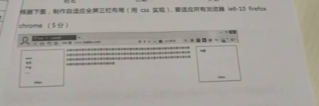

### 1.解释下面这段代码的输出：

```javascript
console.log("datagrand1");
setTimeOut(()=>{
    console.log("datagrand2")
});
const p1 = new Promise(resolve=>{
    console.log("datagrand3");
    resolve();
});
p1.then(()=>{
    console.log("datagrand4");
});
console.log("datagrand5");
const p2 = new Promise(resolve=>{
    console.log("datagrand6");
    resolve();
});
p2.then(()=>{
    console.log("datagrand7");
});

打印顺序是：1,3,5,6,4,7,2

宏队列：script（全局任务）, setTimeout, setInterval, setImmediate, I/O, UI rendering.
微队列：process.nextTick, Promise.then, Object.observer, MutationObserver.
```


### 2.实现一个twoSum函数：传入源数组和目标数字，返回原数组中两个相加起来的数字的索引

	例：twoSum([2,7,11,15]，9)   //[0,1]   因为2+7=9

```javascript
var twoSum = function(nums, target) {
    var map = new Map();
    for(var i = 0; i < nums.length; i++){
        var complement = target -nums[i];
        if(map.has(complement)){
        	return [map.get(complement),i]
        }
    	map.set(nums[i],i)
    }
};
```


### 3.读代码

```javascript
var print = function(){console.log(1)}
function Printer(brand){
    this.brand = brand;
    print = function(){console.log(2)};
    return this;
}
Printer.print = function(){console.log(3)};
Printer.prototype.print = function(){console.log(4)};
function print(){console.log(5)};


Printer.print();						//3
print();								//1
Printer().print();						//2
new Printer.print();					//3
new new Printer().print();				//4
请写出以上代码的输出结果          //改变函数体的prototype相当于改变该构造函数的所有对象公共的属性和方法
//但是并不改变构造函数内部的属性和方法
```


### 4.读代码

```javascript
setTimeout(()=>{              //宏任务队列和微任务队列,先会从上往下执行一次，script 
                            //promise立即执行，但是promise的.then入微任务队列，setTimeout入宏任务队列
    console.log(1);      //
})
const fn = ()=>(new Promise((resolve,reject)=>{
    console.log(2);
    let promise = new Promise((resolve,reject)=>{
        console.log(3);
        setTimeout(()=>{
            console.log(4);
            resolve(5);
        },0)
        resolve(6);
    });
    resolve(7);
    promise.then((arg)=>{
        console.log(arg)
    });
}));
fn().then((arg)=>{
    console.log(arg);
});
console.log(8);
请写出以上代码的输出结果

输出结果是：2,3,8,6,7,1,4
```


### 5.以下不属于js数组方法的是：（D）

A. reverse()		B. concat()		C.sort()		D.length()

reserve()：将数组反转，返回一个数组(原数组是改变的)

concat()：追加数组内容(不改变原数组，返回新数组)

sort()：数组排序


### 6.以下不属于CSS Sprites的优点的是：（B）

A. 减少网页的HTTP请求	

B. 减少后期维护成本		

C. 减少加载图片体积	

D. 减少图片命名困扰

```javascript
CSS Sprites概念
CSSSprites在国内很多人叫css精灵，是一种网页图片应用处理方式。它允许你将一个页面涉及到的所有零星图片都包含到一张大图中去，这样一来，当访问该页面时，载入的图片就不会像以前那样一幅一幅地慢慢显示出来了。对于当前网络流行的速度而言，不高于200KB的单张图片的所需载入时间基本是差不多的，所以无需顾忌这个问题。

加速的关键，不是降低质量，而是减少个数。传统切图讲究精细，图片规格越小越好，重量越小越好，其实规格大小无所谓，计算机统一都按byte计算。客户端每显示一张图片都会向服务器发送请求。所以，图片越多请求次数越多，造成延迟的可能性也就越大。

CSS Sprites技术不新鲜，早在2005年 CSS Zengarden 的园主 Dave Shea 就在 ALA 发表对该技术的 详细阐述 。原先只在CSS玩家之间作为一种网页制作方法流传，后来出来个 14 Rules for Faster-Loading Web Sites , 技术人员之间竞相传阅，其中第一条规则Make Fewer HTTP Requests就提到CSS Sprites。于是这个小妖精就火了起来，甚至出现了在线生成工具，势不可挡也。近来国内很多blog都提到CSS Sprites，最著名的例子莫过于http://www.google.co.kr/ 下方的那几个动画。最新发布的YUI中，也是使用到CSS Sprites，几乎都有的CSS装饰图都被一个 40×2000的图 包办。社交大站Facebook最近也使用了一个 22×1150的图片 承担了所有icon.一时间，CSS Sprites无处不在。

原理
我们知道，自CSS革命以降，HTML倾向于语义化，在一般情况下不再在标记里写装饰性的内容而是把呈现的任务交给了CSS。GUI是缤纷多彩的，少不了各种漂亮的图来装点。新时代的生产方式是，在HTML布满各种各样的钩子（hook），然后交由CSS来处理。在需要用到图片的时候，现阶段是通过CSS属性background-image组合background-repeat, background-position等来实现（题外话：为何我提现阶段，因为未来浏览器若支持content则又新增另外的实现方法）。我们的主角是，你一定猜到了，就是background-position。通过调整background-position的数值，背景图片就能以不同的面貌出现在你眼前。其实图片整体面貌没有变，由于图片位置的改变，你看到只该看到的而已。就好比手表上的日期，你今天看到是21，明天看到是22，是因为它的position往上跳了一格。所以你也大概了解到，CSS Sprites一般只能使用到固定大小的盒子（box）里，这样才能够遮挡住不应该看到的部分。

css sprites 适用范围：
1，需要通过降低http请求数完成网页加速。
2，网页中含有大量小图标。或者，某些图标通用性很强。
3，网页中有需要预载的图片。主要是a与a:hover背景图这种关系的。如果a与a:hover的背景图分别加载，那么，就会出现用户鼠标移到某个按钮上，按钮的背景突然消失再出来，产生“闪烁”，如果按钮文字色与大背景相同或相近，就更囧了，有可能让人产生按钮“消失”了的错觉。

 
需要满足的条件
在网页设计中，通过这项技术拼合在一起的图片最好有一项规律。定宽或者定高。最好是宽高都能定下来。需要平铺的图片，显然不适合sprite。定宽情况下，则可平行排列若干小图片。定高，则纵向排列小图片。若背景既不定宽，也不定高情况下强行使用css sprites技术，则容易产生“不应该出现的图片出现在页面上”的状态。若是“强行定高”，也将非常不利于日后的维护。
```


### 7.以下场景会引起浏览器回流(reflow)的是：（A\B）

A. 减小font-size	

B. 改变浏览器窗口大小		

C. 改变background-color	

D. 调用scrollTo()函数

```javascript
  文档初次加载时，HTML解析器会解析元素构建DOM树，CSS解析器将样式解析为样式结构体，之后通过DOM树和样式结构体构建渲染树，渲染树具有样式属性。然后遍历渲染树的每个渲染器将器布局到页面，最后浏览器将器绘制到页面。

重绘：当元素的外观或外观可见性（visibility）发生变化时会触发重绘

回流：render树中的部分或全部因为元素的规模尺寸、布局、隐藏等改变，需要重新计算render树。
    回流时，浏览器会使渲染树中受影响的部分失效，然后重新构造这部分的render树。完成回流之后浏览器会重新布局、绘制受影响的部分到屏幕中，该过程就是重绘。所以回流必定会引起重绘，但重绘不一定引起回流
    每个页面至少需要一次回流，就是页面第一次加载时。回流变化涉及到部分页面（或整个页面）的布局。一个元素的回流导致其所有子元素以及DOM中紧随其后的祖先元素和其子元素都发生回流。

是什么导致回流呢？
    （1） 调整窗口大小----发生resize事件时
    （2） 元素位置改变
    （3） 元素尺寸改变——边距、填充、边框、高度和宽度
    （4） 内容改变——比如文本字体或图片大小改变而引起的宽度和高度改变
    （5） 页面渲染初始化
    （6） 添加或删除可见的DOM元素

聪明的浏览器
     很多浏览器都会优化repaint和reflow操作，浏览器会维护1个队列，把所有会引起回流、重绘的操作放入这个队列，等队列中的操作到了一定的数量或者到了一定的时间间隔，浏览器就会把flush队列，进行一个批处理。这样就会让多次的回流、重绘变成一次回流重绘。 虽然有了浏览器的优化，但有时候我们写的一些代码可能会强制浏览器提前flush队列，比如设置width，offsetTop，scrollTop,clientTop精确值时，这样浏览器的优化可能就起不到作用了。

避免回流和重绘方法
     减少回流、重绘其实就是需要减少对render tree的操作，并减少对一些style信息的请求，尽量利用好浏览器的优化策略
   （1） 避免操作DOM，创建一个documentFragment或div，在它上面应用所有DOM操作，最后再把它添加到window.document。也可以在一个display:none的元素上进行操作，最终把它显示出来。因为display:none上的DOM操作不会引发回流和重绘。
   （2） 让要操作的元素进行"离线处理"，处理完后一起更新，这里所谓的"离线处理"即让元素不存在于render tree中。如读取offsetLeft等属性。
   （3） 尽可能在DOM树的末端改变class ，尽可能在DOM树的里面改变class，可以限制回流的范围，使其影响尽可能少的节点。
   （4） 避免设置多层内联样式，因为每一个都会造成回流，样式合并在一个外部类，这样当该元素的class属性被操作时，只会产生一个reflow。
   （5） 将需要多次回流的元素position属性设为absolute或fixed，这样该元素就会脱离文档流，它的变化不会影响其他元素变化。比如动画效果应用到position属性为absolute或fixed的元素上。
    （6） 牺牲平滑度换取速度，动画元素每次移动3像素可能在非常快的机器上看起来平滑度低了，但它不会导致CPU在较慢的机器和移动设备中抖动
    （7） 避免使用table布局，在布局完全建立之前，table需要很多关口，table是可以影响之前已经进入的DOM元素的显示的元素。即使一些小的变化和会导致table中所有其他节点回流。
   （8） 避免使用css的JavaScript表达式，该规则较过时，但是个好主意。因为每次都需要重新计算文档，或部分文档、回流。
```


### 8.以下措施能防御CSRF攻击的是：（A\B\C\D）

A. 增加网页验证码

B. 验证HTTP Referer	

C. 验证自定义HTTP头属性	

D. 验证自定义token请求参数

```javascript
CSRF，跨站请求伪造，简单来说是盗用用户的身份，以用户的身份发送恶意请求，比如以用户的身份进行银行转账等。

原理：用户登录信任网站A，并生成本地cookie，在没有登出A的情况下，访问了危险网站B，B网站中要求访问第三方站点，发出request请求，浏览器带着A产生的cookie访问。

防御措施：
a.在请求地址中添加token并验证
在请求中放入攻击者不能伪造的信息，并且该信息不在cookie中，开发者可以在http请求中以参数的形式加入一个随机产生的token，并且在服务器建立一个拦截器来验证这个token。如果请求中没有token或者token中内容不正确的话，表示可能是攻击者发动的攻击。

b.验证HTTP Referer字段
http头中有一个referer，记录http请求的来源地址，访问一个安全受限的页面的请求必须来自同一个网站。当用户要提交一个请求时，请求的referer值需是提交按钮（触发请求）所在的页面的URL。

c.在http头中自定义属性并验证
通过XHR这个类，一次性给所有该类请求加上csrftoken这个http头属性，并且把token值放入其中。

d.验证码
每次用户提交都在表单上填写一个图片上的随机字符串作为验证码。
```


### 9.写出下面函数调用的输出信息

```javascript
var name = "global";
var object = {
    name:"local",
    getName:function(){
        return function(){
            	return this.name;
            }
        }
    }
}
console.log(object.getName()());

//输出的结果为 global

首先定义了一个全局变量 name = 'global'；随后在 object 对象里又重新给 name 赋值为 'local'，但是此时 name 为局部变量，object 对象还有一个方法 getName，这个方法返回一个闭包。
object.getName()() 这一表达式其实可以分解为两步:
var first = object.getName()，调用 getName方法，那么就相当于：
var first = function() {
    return this.name;
};
var second = first()，调用第一步返回的闭包，相当于：
var second = function() {
    return this.name;
}();
而此时是在全局作用域中调用 first 函数，所以里面的 this 对象等于 window，那么返回的就是'global'
```


### 10.请封装一个简单日期类库，实现其中一个功能：根据参数格式（“YY-MM-DD”等）输出对应格式的日期字符串，并写出使用实例。

```javascript
Date.prototype.format = function(fmt) { 
     var o = { 
        "M+" : this.getMonth()+1,                 //月份 
        "d+" : this.getDate(),                    //日 
        "h+" : this.getHours(),                   //小时 
        "m+" : this.getMinutes(),                 //分 
        "s+" : this.getSeconds(),                 //秒 
        "q+" : Math.floor((this.getMonth()+3)/3), //季度 
        "S"  : this.getMilliseconds()             //毫秒 
    }; 
    if(/(y+)/.test(fmt)) {
            fmt=fmt.replace(RegExp.$1, (this.getFullYear()+"").substr(4 - RegExp.$1.length)); 
    }
     for(var k in o) {
        if(new RegExp("("+ k +")").test(fmt)){
             fmt = fmt.replace(RegExp.$1, (RegExp.$1.length==1) ? (o[k]) : (("00"+ o[k]).substr((""+ o[k]).length)));
         }
     }
    return fmt; 
}    

var time1 = new Date().format("yyyy-MM-dd hh:mm:ss");
console.log(time1);
```


### 11.以下代码输出什么？

```javascript
const first=()=>(new Promise((resolve,reject)=>{   //promise套promise，只要不是resolve搭配then的回调
    console.log(3);                                //或者reject搭配catch的回调，都会立即执行
    let p=new Promise((resolve,reject)=>{
        console.log(7);
        setTimeout(()=>{
            console.log(5);
            resolve(6);
        },0)
        resolve(1);
    });
    resolve(2);
    p.then((arg)=>{
        console.log(arg);
    });
}));
first().then((arg)=>{
	console.log(arg);
});
console.log(4);

输出的结果为 3 7 4 1 2 5
```


### 12.写出输出结果

```javascript
const promise = new Promise((resolve,reject)=>{
	console.log(1);
	resolve();
	console.log(2);
});
promise.then(()=>{
	console.log(3);
});
console.log(4);

输出结果为 1 2 4 3
```


### 13.解释下面这段代码的输出

```javascript
const a = "123";
const b = 123;

console.log(a===b); //false 判断值和类型是否一致
console.log(a==b); //true 判断值是否一致
console.log(1<2<3); //true
console.log(3>2>1); //false
```


### 14.解释下面这段代码的输出

```javascript
for(var i=0;i<5;i++){
	(function(){
        setTimeout(function(){
        	console.log(i); 
		},i*1000);
	})(i);
}
//虽然自调用函数入参了i，但是自调用函数本身没有声明参数，所以i不能作为自调用函数的参数使用，所以打印结果是5次5


//但是如果上面一题修改如下：此时打印0,1,2,3,4
//引入自调用函数有了参数i，此时形成闭包，延长了参数i的作用域链
for(var i=0;i<5;i++){
	(function(i){
        setTimeout(function(){
        	console.log(i); 
		},i*1000);
	})(i);
}
```

### 15.写下下列http响应状态码的含义

<https://www.cnblogs.com/dekui/p/7801289.html>

```javascript
200		（成功）    服务器已成功处理了请求。 通常，这表示服务器提供了请求的网页。
30x 	（重定向）   表示要完成请求，需要进一步操作。 通常，这些状态代码用来重定向。
400		（错误请求） 服务器不理解请求的语法。
401		（未授权）   请求要求身份验证。 对于需要登录的网页，服务器可能返回此响应。
403		（禁止）     服务器拒绝请求。
404		（未找到）   服务器找不到请求的网页。
500		（服务器内部错误）  服务器遇到错误，无法完成请求。
503		（服务不可用） 服务器目前无法使用（由于超载或停机维护）。 通常，这只是暂时状态。


1.http状态返回代码 1xx（临时响应）：表示临时响应并需要请求者继续执行操作的状态代码。
2.http状态返回代码 2xx （成功）：表示成功处理了请求的状态代码。
3.http状态返回代码 3xx （重定向）：表示要完成请求，需要进一步操作。 通常，这些状态代码用来重定向。
4.http状态返回代码 4xx（请求错误）：这些状态代码表示请求可能出错，妨碍了服务器的处理。
5.http状态返回代码 5xx（服务器错误）：这些状态代码表示服务器在尝试处理请求时发生内部错误。 这些错误可能是服务器本身的错误，而不是请求出错。

```


### 16.列出你你所了解到的web攻击技术，并简述他们的含义

```javascript
1.XSS（Cross-Site Scripting，跨站脚本攻击）：指通过存在安全漏洞的Web网站注册用户的浏览器内运行非法 的HTML标签或者JavaScript进行的一种攻击。
2.SQL注入攻击
3.CSRF（Cross-Site Request Forgeries,跨站点请求伪造）：指攻击者通过设置好的陷阱，强制对已完成的认	证用户进行非预期的个人信息或设定信息等某些状态更新
```


### 17.页面上有个空的无序列表节点，用`<ul></ul>`表示，要往列表中插入3个`<li>`，每个列表项的内容是列表项的插入顺序，取值1，2，3。当每个`<li>`被单击的时候alert里面的内容

```javascript
<!DOCTYPE html>
<html lang="en">
<head>
	<meta charset="UTF-8">
	<title>Document</title>
</head>
<body>
	<div>  
        <ul id="list">  
            <li>1</li>  
            <li>2</li>  
            <li>3</li>  
        </ul>  
	</div>

</body>
<script>	
    var ul = document.getElementById('list');
    ul.onclick = function(e){
        var ele = e.currentTarget;
        console.log(ele.innerHTML)
    }
   </script>
</html>
```

### 18.请写出下面程序的执行结果

```javascript
console.log(1);
settimeout(function(){
	console.log(2);
},0);
console.log(3);

答案：1，3，2
```

### 19.请写一段js代码将下面url？后面的字符串解析成对象

```
“http://127.0.0.1:8800/index.html?func=add&valuel=7&valuel2=8”
```

```javascript
<script>
	//自动获取地址栏链接带？以及后面的字符串
	var url = window.location.search;
	//定义一个空对象
	var obj = {};
	//如果字符串里面存在?
	if(url.indexOf("?") != -1){
		//从url的索引1开始提取字符串
		var str = url.substring(1);
		//如果存在&符号，则再以&符号进行分割
		var arr = str.split("&");
		//遍历数组
		for(var i=0; i<arr.length; i++){
			//obj对象的属性名 = 属性值，unescape为解码字符串
			obj[arr[i].split("=")[0]] = unescape(arr[i].split("=")[1]);
		}
	}
	console.log(obj);
</script>

```


### 20.为下面name="crtl-a"的元素设置背景色并为它设置初始值为“dome" 

```javascript
<form name="form">
    <input name="crtl-a" type="text">
</form>

$("input[name='crtl-a']").css("background","颜色").val("dome");
```


### 21.请问在javascript程序中，alert（underfined==null）的输出结果是？

```
alert（underfined==null)    true
alert（underfined===null）  false
```

### 22.下面javascript代码的显示结果是？ // hi

```
var x = new Boolean(false);
//x是一个对象  对象总是true
if(x){
   alert('hi');
}

//y是一个值类型，y就是false
var y = Boolean(0);
if(y){
   alert('hello')
}
```

### 23.分析下面这两行javascript代码的作用？

```
01  <A href='javascript:history.back()'></A>
02  <A href='javascript:history.forward()'></A>
```

代码第一行作用相当于后退按钮

代码第二行的作用是前往下一个浏览页面(如果存在)


### 24.关于http协议，下列说法错误的是（c）

A.http是无状态协议                                B.http是应用层协议

c.http是基于二进制的协议`(文本协议)`    D.http状态码200表示成功

### 25.在html页面上包含如下所示的层对象，则javascript语document.getElementById('info').innerHTML  的值是？  

```javascript
<div id='info' style='display:block'><p>请填写</p></div>

答案：
<p>请填写</p>
```

### 26.将abcd四个元素次序进栈（中间可能有出栈操作，例如a进栈后出栈，b再进栈），则可能的出栈系列是（b）

A. c a d b                           B. b d c a               C. c d a b                D.  d a b c

### 27.请写出jquery Ajax 简单调用方法

```
$.get
$.post
$.load
jquery支持promise
```

```javascript
$(function(){
    //请求参数
    var list = {};
    //
    $.ajax({
        //请求方式
        type : "POST",
        //请求的媒体类型
        contentType: "application/json;charset=UTF-8",
        //请求地址
        url : "http://127.0.0.1/admin/list/",
        //数据，json字符串
        data : JSON.stringify(list),
        //请求成功
        success : function(result) {
            console.log(result);
        },
        //请求失败，包含具体的错误信息
        error : function(e){
            console.log(e.status);
            console.log(e.responseText);
        }
    });
});
```


### 28.以下代码输出的结果是

```javascript
let a = null;  //object
let b = '';    //string
let c = [];    //object
let d = {};    //object
let e = 1;     //number
let f = true;  //boolean
let g = a=>a+1;//function
```

### 29.以下代码的输出结果是

```javascript
let target = {
    a:1,
    b:1
};
let source1 = {
    b:2,
    c:2
};
let source2 = {
    c:3
};
Object.assign(target,source1,source2);
console.log(JSON.stringify(target));

答案：{"a":1,"b":2,"c":3}   //后面的对象属性值会覆盖之前的
```


### 30.以下代码的功能是

```javascript
function foo(ms){
    return new Promise((resolve)=>{
        setTimeout(resolve,ms);
    });
}

async function print(message,ms){
    await foo(ms);
    console.log(message);
}

print('hello world',10);


答案：延迟10ms输出hello world
```


### 31.以下代码输出的结果是___。

```javascript
let arr = [0,1,2,3,4,5,6];
let newArr = arr.filter( (v) => v%2 === 0)   // [0,2,4,6]
				.map( (v) => Math.pow(v,2) ) // [0,4,16,36]

console.log(newArr.toString()); // 0,4,16,36

//  filter() 根据条件过滤数组
```

### 32.以下代码输出的结果是___。

```javascript
var arr = [];
for(var i=0; i<10; i++){
    arr[i] = function(){
        console.log(i);
    }
}
//console.log(window.i)
arr[6]();  //10    因为有var，所以变成了i变成了全局变量
```

解析：错误理解：认为存在块级作用域。

在for循环的头部声明带有var 关键字的变量会为该变量创建一个单个绑定（存储空间）。也就是说`console.log(i)`的`i`都指向都一个存储空间

解决办法：

1. 使用`ES6`块级作用域，使用`let`声明一个具有块级作用域的变量，即每一个循环迭代创建一个新的绑定

   ```javascript
   var arr = [];
   for (let i = 0; i < 10; i++) {
       arr[i] = function () {
           console.log(i);
       }
   }
   arr[6]();   //6
   ```

2. 使用闭包

   ```javascript
   var arr = [];
   for(var i=0; i<10; i++){
       arr[i] = (function(x){
           return function(){
               return console.log(x);
           }
       })(i)
   }
   arr[6](); //6
   ```

### 33.写一个`JS`函数，从一个`key=>value`的数组，得到一个`value=>key`的数组

```javascript
var arr = [
    { "0": "第零", "10": "第一零" },
    { "1": "第一", "11": "第一一" },
    { "2": "第二", "12": "第一二" },
    { "3": "第三", "13": "第一三" },
    { "4": "第四", "14": "第一四" },
    { "5": "第五", "15": "第一五" },
    { "6": "第六", "16": "第一六" },
    { "7": "第七", "17": "第一七" },
    { "8": "第八", "18": "第一八" },
    { "9": "第九", "19": "第一九" }
];

let invertKeyValues = obj =>
Object.keys(obj).reduce((curItem, key) => {
    curItem[obj[key]] = key;
    return curItem;
}, {});
//当前元素
const newArr = arr.map(item => invertKeyValues(item));
console.log(newArr);
```

### 34.写出伪代码: 用`js`一条一条自动删除一个表格中的位置数量的数据。要求：

1、删除动作要发送请求给后台，根据后台返回结果判断是否成功

2、上一条删除成功才可以删除下一条，表格中的数据条数未知

```javascript
//申明一个发送删除请求的函数函数
delete(i){
    return axios.post(`/delete/${i}`)；
}

async autoDelete(){
    //获取表格有效数据的行数
    let length = $('tbody').children().length;

    //for(let i = length-1; i>0; i--){
    for(let i = 0; i<length; i++){
        // 用await代替.then的调用，可以有阻塞的效果
        // await 会一直等待delete的返回结果
        let result = await delete(i);
        if(result.ok){
            $('tbody').children('tr').eq(i).remove();
        }else{
            i--;
            continue;
        }
    }
}

autoDelete()
```

### 35.编程题，请写出以下输出结果

```javascript
1.function Foo(){
		getName = function(){alert(1);};
		return this;
	}
Foo.getName = function(){alert(2);};
Foo.prototype.getName = function(){alert(3);}
var getName = function(){alert(4);}
function getName(){alert(5);}

//请写出以下输出结果：

Foo.getName(); //2
//Javascript中的Function本身就是Function和Object的结合，所以function既是函数，也是对象。在这里Foo就是执行了他对象上的一个function而已。

getName(); //4           不仅输出，而且调用
Foo().getName(); //1
getName(); //1
(new Foo()).getName(); //3
```

### 36.下面代码打印出了什么？考察了什么知识点？

```javascript
for(var i = 0;i<5;i++){
    setTimeout(function(){
        console.log(i);
    },i*1000)
}


答：打印了5次5，间隔一秒。
//在for循环的头部声明带有var 关键字的变量会为该变量创建一个单个绑定（存储空间）。也就是说console.log(i)的i都指向都一个存储空间。
//setTimeout是异步执行的，1000毫秒后向任务队列里添加一个任务，只有主线上的全部执行完才会执行任务队列里的任务，所以当主线程for循环执行完之后 i 的值为5，这个时候再去任务队列中执行任务，i全部为5；
```

### 37.下面程序的输出结果

```javascript
function add(n){
	n=n+3;
}
z=add(x)
console.log(x,y,z)
//答案：都是undefined
```

### 38.下面程序的输出结果

```javascript
function bar(){
	return foo;
	foo =10;
	function foo(){}
	var foo=11;
}
alert(typeof bar())
//答案：function

//相当于
//function bar(){
//	function foo(){
//      var foo;
//       foo=11;
//  }
//  return foo;
//	foo =10;
//}
//alert(typeof bar())

//return的是这个函数function foo(){
//             var foo;
//             foo=11;
//        }
//1.变量提升只会提升变量名的声明，而不会提升变量的赋值初始化。
//2.函数提升的优先级大于变量提升的优先级。
```

### 39.数组去重

Methods 1: 思路：定义一个新数组，并存放原数组的第一个元素，然后将元素组一一和新数组的元素对比，若不同则存放在新数组中。

```javascript
function unique(arr) {
    let newArr = [arr[0]];
    for (let i = 1; i < arr.length; i++) {
        let repeat = false;
        for (let j = 0; j < newArr.length; j++) {
            if (arr[i] === newArr[j]) {
                repeat = true;
                break;
            }else{

            }
        }
        if (!repeat) {
            newArr.push(arr[i]);
        }
    }
    return newArr;
}

console.log(unique([1, 1, 2, 3, 5, 3, 1, 5, 6, 7, 4]));
// 结果是[1, 2, 3, 5, 6, 7, 4]

```

Methods 2: 思路：先将原数组排序，在与相邻的进行比较，如果不同则存入新数组。

```javascript
function unique2(arr) {
    var formArr = arr.sort()
    var newArr=[formArr[0]]
    for (let i = 1; i < formArr.length; i++) {
        if (formArr[i]!==formArr[i-1]) {
            newArr.push(formArr[i])
        }
    }
    return newArr
}
console.log(unique2([1, 1, 2, 3, 5, 3, 1, 5, 6, 7, 4]));
// 结果是[1, 2, 3,  4,5, 6, 7]

```

 Methods 3: 利用对象属性存在的特性，如果没有该属性则存入新数组。

```javascript
function unique3(arr) {
    var obj={}
    var newArr=[]
    for (let i = 0; i < arr.length; i++) {
        if (!obj[arr[i]]) {
            obj[arr[i]] = 1
            newArr.push(arr[i])
        }   
    }
    return newArr
}
console.log(unique3([1, 1, 2, 3, 5, 3, 1, 5, 6, 7, 4]));
// 结果是[1, 2, 3, 5, 6, 7, 4]

```

Methods 4: 利用数组的indexOf下标属性来查询。

```javascript
function unique4(arr) {
    var newArr = []
    for (var i = 0; i < arr.length; i++) {
        if (newArr.indexOf(arr[i])=== -1) {
            newArr.push(arr[i])
        }
    }
    return newArr
}
console.log(unique4([1, 1, 2, 3, 5, 3, 1, 5, 6, 7, 4]));
// 结果是[1, 2, 3, 5, 6, 7, 4]

```

Methods 5: 利用数组原型对象上的includes方法。

```javascript
function unique5(arr) {
    var newArr = []
    for (var i = 0; i < arr.length; i++) {
        if (!newArr.includes(arr[i])) {
            newArr.push(arr[i])
        }
    }
    return newArr
}
console.log(unique5([1, 1, 2, 3, 5, 3, 1, 5, 6, 7, 4]));
// 结果是[1, 2, 3, 5, 6, 7, 4]

```

Methods 6: 利用数组原型对象上的 filter 和 includes方法。

```javascript
function unique6(arr) {
    var newArr = []
    newArr = arr.filter(function (item) {
        return newArr.includes(item) ? '' : newArr.push(item)
    })
    return newArr
}
console.log(unique6([1, 1, 2, 3, 5, 3, 1, 5, 6, 7, 4]));
// 结果是[1, 2, 3, 5, 6, 7, 4]

```

Methods 7: 利用数组原型对象上的 forEach 和 includes方法。

```javascript
function unique7(arr) {
    var newArr = []
    array.forEach(item => {
        return newArr.includes(item) ? '' : newArr.push(item)
    });
    return newArr
}
console.log(unique7([1, 1, 2, 3, 5, 3, 1, 5, 6, 7, 4]));
// 结果是[1, 2, 3, 5, 6, 7, 4]

```

Methods 8: 利用数组原型对象上的 splice 方法。

```javascript
function unique8(arr) {
    var i,j,len = arr.length;
    for (i = 0; i < len; i++) {
        for (j = i + 1; j < len; j++) {
            if (arr[i] == arr[j]) {
                arr.splice(j, 1);
                len--;
                j--;
            }
        }
    }
    return arr;
}
console.log(unique8([1, 1, 2, 3, 5, 3, 1, 5, 6, 7, 4]));

```

Methods 9: 利用数组原型对象上的 lastIndexOf 方法。

```javascript
function unique9(arr) {
    var res = [];
    for (var i = 0; i < arr.length; i++) {
        res.lastIndexOf(arr[i]) !== -1 ? '' : res.push(arr[i]);
    }
    return res;
}
console.log(unique9([1, 1, 2, 3, 5, 3, 1, 5, 6, 7, 4]));
// 结果是[1, 2, 3, 5, 6, 7, 4]

```

Methods 10: 利用 ES6的set 方法。

```javascript
function unique10(arr) {
    //Set数据结构，它类似于数组，其成员的值都是唯一的
    return Array.from(new Set(arr)); // 利用Array.from将Set结构转换成数组
}
console.log(unique10([1, 1, 2, 3, 5, 3, 1, 5, 6, 7, 4]));
// 结果是[1, 2, 3, 5, 6, 7, 4]
```

### 40.下面程序的输出结果

```javascript
var x=3;
var foo={
	x:2,
	baz:{
		x:1,
		bar:function(){
            return this.x;
		}
	}
}
var go = foo.baz.bar;
alert(go());//答案:3
alert(foo.baz.bar())//答案:1
//go = foo.baz.bar; go()此时this指向的是widow. window.x的值是3；foo.baz.bar()此时this指向的是baz，baz.x的值是1.
```

### 41.下面程序的输出结果

```javascript
[1,2]+[2,1]
//答案:1,22,1
//+运算符会自动将两个数组转换成字符串，然后相加。
//"1","2"+"2","1"
```

### 42.判断是否为回文？

```javascript
//答案：
function palindRome(str){
	var len = str.length;
	var str1 = "";
	for(var i=len-1; i>=0;i--){
		str1+=str[i];
	}
	console.log(str1 == str)
}
palindRome("abcba");//true
palindRome("abcbac");//false

```

### 43.下面程序的输出结果

```javascript
console.log([]==![])
//答案：true
//1.[]单独用在==表达式中时，会隐含转型为""（空字符串）
//2.一个不是null或者undefined的对象（包括[]）用在布尔表达式中，会被作为true处理。因此![]的结果是false。
//3.所以[]==![]等价于""==false，而空字符串在布尔表达式中作为false处理。因此最终结果是true。
```

### 44.下面程序的输出结果

```javascript
var name ='world';
(function(){
    if(typeof name ==='undefined'){
        var name ='jack';  //变量提升
        console.log('hi'+name)
    }else{
        console.log('hello'_name)
    }
})()
//答案：'hi jack'
```

### 45.下面程序的输出结果

```javascript
var data=[];
for(var k=0;k<4;k++){
    data[k]=function(){
        console.log(k)
    }
}
data[2]()
//答案：4
//data[2]指的是	function(){
//					console.log(k)
//				}            //打印循环到最后的遍历项k
```

### 46.不使用第三个变量交换两个数的值

```javascript
//答案：
//第一种
var a = 1,
b = 2;
a = a + b; // a = 3, b = 2
b = a - b; // a = 3, b = 1
a = a - b; // a = 2, b = 1
//第二种
//ES6解构赋值
let a = 1,
    b = 2;
[a, b] = [b, a];
```

### 47.下面程序的输出结果

```javascript
var test = (function(a){
	this.a=a;
	return function(b){
		return this.a+b;
	}
}(function(a,b){
	return a;
}(1,2)));

console.log(test(4))；
//答案：5

//var test =(function(a){
//	this.a=a;// this.a=1
//	return function(b){
//		return this.a+b;
//	}
//}(1))

//var test = function(b){
//	return 1+b;
//}

```

### 48.下面程序f能取到a，b吗？

```javascript
//声明Ｆ是一个函数
var F = function(){};
//给Object的原型对象新增a，这个a是一个function
Object.prototype.a=function(){};
//给Function的原型对象新增一个b，这个b是一个function
Function.prototype.b=function(){};
//创建一个F函数的对象
var f = new F();

f 能取到a，b 吗？


//任何一个函数都是new Function()出来的对象，所以F的原型链如下
F.__proto__ == Function.prototype
Function.prototype.__proto__ == Object.prototype

console.log(F.a);  //取到
console.log(F.b);  //取到


//因为f是new F()出来的，所以f的原形链如下：
f.__proto__ == F.prototype;  
F.prototype.__proto__ == Object.prototype;
console.log(f.a);  //取到
console.log(f.b);  //取不到  因为b在Function.prototype中，不在F.prototype中，所以取不到b


console.log(f);
console.log(f.prototype);
console.log(f.__proto__);
console.log(f.__proto__.__proto__);
console.log(F);
console.log(F.prototype);
console.log(F.__proto__);
console.log(F.__proto__.__proto__);
console.log(f.a);
console.log(f.b);
console.log(Function.prototype);
console.log(Function.__proto__);
console.log(Object.prototype);
console.log(Object.__proto__)
console.log(F.prototype===f.__proto__);


//Function、Object——Js自带的函数对象。
//new的过程拆分成以下三步：
//1、 var f={}; 也就是说，初始化一个对象p。
//2、 f.__proto__=F.prototype;
//3、 F.call(f);也就是说构造p，也可以称之为初始化p。

//console.log(f.__proto__===F.prototype);  // 返回值为true，证明第2点
//console.log(F.__proto__===Function.prototype);  // 返回值为true
//console.log(F.prototype.__proto__===Object.prototype);  // 返回值为true
//重点部分：console.log(f.__proto__.__proto__===Object.prototype);  // 返回值为true

//那么__proto__是什么？我们在这里简单地说下。每个对象都会在其内部初始化一个属性，就是__proto__，当我们访问一个对象的属性 时，如果这个对象内部不存在这个属性，那么他就会去__proto__里找这个属性，这个__proto__又会有自己的__proto__，于是就这样 一直找下去，也就是我们平时所说的原型链的概念。

//首先var F = function(){}; 可以得出 f.__proto__=F.prototype。

//那么当我们调用 f.a 或者 f.b 时，首先 f 中没有 a 或者 b 这个属性， 于是，他就需要到他的__proto__中去找，也就是F.prototype，由于F.prototype中也没有 a 或者 b ；那就去 f.__proto__.__proto__找，也就是Object.prototype中去找，于是就找到了a这个属性。
```


### 49.写出打印结果并解释原因

```javascript
console.log(0.1+0.2);        //打印结果:0.300000000000004
console.log(0.1+0.2 == 0.3); //打印结果:false

原因:小数的运算结果不精确
```

### 50.使用异或判断整数

```javascript
异或(^):两一样时为false或0 反之为true；
例:  a   b     a^b
     1   1    0(false)
     1   0    1(true)
     0   1    1(true)
     0   0    0(false)
解:  (a%1)^0 (结果为0，a就是整数，反之就不是)    //最后值有两种，0或其他，0为false即两者相等
```

### 51.写出打印结果

```javascript
(function(){
	console.log(1);
	setTimeout(function(){console.log(2)},1000);
	setTimeout(function(){console.log(3)},0);
	console.log(4);
})
结果:  1  4  3  2
```

### 52.填空题

```javascript
1、目前常用的WEB标准静态页面语言是___HTML_____。
2、改变元素的外边距用___margin_____，改变元素的内填充用____padding____。
3、在Table中，TR是__表格行___，TD是__表格单元___。
4、如果给一行两列的表格（table）定义高度样式，在____table____标签中定义最合理，最能减少代码的臃肿。
5、对ul li的样式设成无，应该是用什么属性__list-style:none__。
6、在新窗口打开链接的方法是___<a target = "_blank" href="#">AAA</a>___。
7、Color:#666666;可缩写为__#666__。
8、以下div背景什么颜色？__#00FF00___。
	.a{background-color:#FF0000;}
	.b{background-color:#00FF00;}
	<div class="b a"></div>
9、如下两div元素的垂直距离是多少?__20px___。  margin是大的margin笼括小的margin
	<div style:"margin-bottom:20px"></div>
	<div style:"margin-top:10px"></div>
10、合理的页面布局中常听过结构与表现分离，那么结构是__内容__，表现是__css样式__。
```

### 53.使用一个JSON对象，描述下面这句话：

```javascript
小明22岁，来自杭州，爱好看电影和旅游，小明有两个姐姐，一个叫小红，25岁，是一名经理，另一个叫小兰，23岁，是一名数学老师。
var person = '[{
	"name":"小明",
	"age":"22",
	"form":"杭州",
	"interest":["看电影","旅游"],
	"sister":[{
		"name":"小红",
		"age":"25",
		"job":"经理"
		},
		{
		"name":"小兰",
		"age":"23",
		"job":"数学老师"
		}
     ]
}]';
```

### 54.用css给如下按钮设置背景图片bg.jpg，并隐藏按钮上的文字

```javascript
<input type="button" value="提交">
解:
<input type="button" value="提交" style="text-indent:-999em;background:url('bg.jpg')">
```

### 55.编写代码让f1继承f2的所有成员

```javascript
function f2() {
	this.a2=3;
	this.b2=4;
}
function f1() {
	this.a1=1;
	this.b1=2;
}
解: f1.prototype = new f2();
```

### 56.http协议控制前端缓存的4种办法

```javascript
1.Cache-Control
response.setHeader('Cache-Control','public,max-age=360')
//服务器在响应时，回传max-age参数，表示缓存时间：xx秒，那么客户端在下次请求时，根据上次回传的max-age值,
//首先判断缓存的相对时间，如果还未超过时间，则不发起请求，直接从Cache中读取。反之，则重新请求。

2.Expires
response.setHeader('Expires','Mon Jan 01 2018 08:00:00 GMT') //必须用格林威治时间格式
//服务器在响应时，回传格林威治时间，表示在次时间内的请求直接从Cache中读取
//那么客户端在下次请求时，根据上次回传的时间，比对客户端本地时间，
//如果本地时间未超过回传时间，则不发起请求，直接从Cache中读取。反之，则重新请求。
//缺陷:由于返回的时间比对的是客户端本地时间，如果本地时钟修改，则会导致缓存出现异常

3.Last-Modified
response.setHeader('Last-Modified','Fri,22 Jul 2016 08:00:00 GMT')
//服务器在响应时，同样回传格林威治时间，不同的是，它表示的是服务器最新一次对页面修改的时间
//那么客户端在下次请求时，会通过If-Modified-Since: Last-Modified-value带上之前回传回来的时间
//如果客户端传来的最后修改时间与服务器上的依然一致，则直接回送304 和响应报头即可。
//如果没有匹配上，说明服务器已对页面做了修改，则重新相应新的页面并回传新的Last-Modified
//缺陷:
a、只要资源修改，无论内容是否发生实质性的变化，都会将该资源返回客户端。例如周期性重写，这种情况下该资源包含的数据实际上一样的。
b、以时刻作为标识，无法识别一秒内进行多次修改的情况。
c、某些服务器不能精确的得到文件的最后修改时间。

4.ETag
response.setHeader('ETag','3f'd729c07839068ebb6f7f4374981d9f') //一般可用MD5
//服务器在响应时，回传一个唯一标志符（比如md5），服务器在把页面响应给客户端的时候，会在实体首部加上“ETag: 唯一标识符”一起返回给客户端
//客服端会保留ETag字段，在下次请求时，通过在请求中添加if-none-match:ETag-value 给服务器，与服务器的ETag字段进行匹配，如果匹配上，则直接回送304 和响应报头即可。反之，则重新发送资源数据并回传新的ETag字段  
```

### 57.div+css写太极图，伪元素

```javascript
   <style>
        * {
            margin: 0;
            padding: 0;
            border: 0;
        }

        body {
            background: grey;
        }

        div {
            margin: 100px auto 0;
            width: 0;
            height: 200px;
            border-left: 100px solid #fff;
            border-right: 100px solid #000;
            border-radius: 50%;
        }

        div:before {
            content: "";
            display: block;
            width: 100px;
            height: 100px;
            border: 40px solid #000;
            background: #fff;
            margin-left: -50px;
            border-radius: 50%;
            box-sizing: border-box;
        }

        div:after {
            content: "";
            display: block;
            width: 100px;
            height: 100px;
            border: 40px solid #fff;
            background: #000;
            margin-left: -50px;
            border-radius: 50%;
            box-sizing: border-box;
        }
    </style>
    
<body>
    <div></div>
</body>
```

### 58.编写一个布局,页面宽度自适应,最小宽度300px,左边定宽35%,右边定宽65%.

```javascript
<style>
.container{
       height: 600px;
       width: 300px;
       min-width: 300px;
      }
      
.left{
        width: 35%;
        height: 100%;
        background: #ff0;
        float: left;

      }
      
.right{
        overflow:hidden;
        width: 65%;
        height: 100%;
        background: #0f0;
      }
</style>
</head>
<body>
<div class="container">
       <div class="left"></div>
       <div class="right"></div>
</div>
</body>
</html>
```

### 59.编写一个方法求一个字节的长度，假设: 一个英文字符占用一个字节,一个中文字符占用两个字节

```javascript
function GetBytes(str) {
    var len=str.length;
    var bytes=len;
    for(var i=0;i<len;i++){
        /*charCodeAt()判断ascii码是否大于255*/
        if(str.charCodeAt(i)>255)   
            bytes++;
    }
    return bytes;
}
alert(GetBytes('中国,as'))
```

### 60.写出打印结果

```javascript
let obj = {};
let arr = [];

console.log(typeof obj === "object")  //true
console.log(typeof arr === "object")   //true
console.log(typeof null === "object")  //true
```

### 61.写出打印结果

```javascript
(()=>{
    console.log(1);
    setTimeout(()=>{
        console.log(2)
    },1000);

    //因为js是无阻塞架构,所有代码需要排队执行，而设置定时器后，即使时
    //间为0，也会在整个代码块执行后再执行
    setTimeout(()=>{
        console.log(3)
    },0);
    console.log(4)
})();

//1，4，3，2
```

### 62.用css实现下面途中的功能


```html
<div class="box1">
    <div class="box2">
        <h3>分类VIP</h3>
    </div>
    <div class="innerbox1"></div>
    <div class="innerbox2"></div>
    <div class="box3">
        <h3>组合套餐4折起</h3>
    </div>
</div>
```

```css
*{
    text-align: center;
    line-height: 100%;
    padding: 0;
    margin: 0;
    line-height: 100px;
}
.box1{
    width: 600px;
    height: 100px;
    position: relative;
}
.box2{
    width: 50%;
    height: 100%;
    background-color: aqua;
    border-top-right-radius: 20px;
    position: absolute;
    top: 0;
    left: 0;
    z-index: 100;
}
.box3{
    width: 50%;
    height: 100%;
    background-color: black;
    color: white;
    border-bottom-left-radius: 20px;
    z-index: 100;
    position: absolute;
    top: 0;
    right: 0;
}
.innerbox1{
    height: 20px;
    width: 20px;
    position: absolute;
    left: 50%;
    bottom: 0;
    background:aqua;
}
.innerbox2{
    height: 20px;
    width: 20px;
    position: absolute;
    background: black;
    right: 50%;
    top: 0;
}
```

```js
var box2 = document.querySelector(".box2");
var box3 = document.querySelector(".box3");
var innerbox1 = document.querySelector(".innerbox1");
var innerbox2 = document.querySelector(".innerbox2");

box3.onclick = () => {
    box3.style.backgroundColor = "aqua";
    box3.style.color = "black";
    innerbox2.style.backgroundColor = "aqua";
    box2.style.backgroundColor = "black";
    box2.style.color = "white";
    innerbox1.style.backgroundColor = "black";
}

box2.onclick = () => {
    box3.style.backgroundColor = "black";
    box3.style.color = "white";
    innerbox2.style.backgroundColor = "black";
    box2.style.backgroundColor = "aqua";
    box2.style.color = "black";
    innerbox1.style.backgroundColor = "aqua";
}
```


### 63.列举几种深拷贝的方法

1.JSON方法实现

```javascript
//tmp和result是相互独立的，没有任何联系，有各自的存储空间。
let deepClone = function (obj) {
    let _tmp = JSON.stringify(obj);//将对象转换为json字符串形式
    let result = JSON.parse(tmp);//将转换而来的字符串转换为原生js对象
    return result;
};

let obj1 = {
    weiqiujaun: {
        age: 20,
        class: 1502
    },
    liuxiaotian: {
        age: 21,
        class: 1501
    }
};

let test = deepClone(obj1);
console.log(test);
```

2.用for…in实现遍历和复制

```javascript
function deepClone(obj) {
    let result = typeof  obj.splice === "function" ? [] : {};
    if (obj && typeof obj === 'object') {
        for (let key in obj) {
            if (obj[key] && typeof obj[key] === 'object') {
                result[key] = deepClone(obj[key]);//如果对象的属性值为object的时候，递归调用deepClone,即在吧某个值对象复制一份到新的对象的对应值中。
            } else {
                result[key] = obj[key];//如果对象的属性值不为object的时候，直接复制参数对象的每一个键值到新的对象对应的键值对中。
            }

        }
        return result;
    }
    return obj;

}

let testArray = ["a", "b", "c", "d"];
let testRes = deepClone(testArray);
console.log(testRes);
console.log(typeof testRes[1]);

let testObj = {
    name: "weiqiujuan",
    sex: "girl",
    age: 22,
    favorite: "play",
    family: {brother: "son", mother: "haha", father: "heihei"}
};
let testRes2 = deepClone(testObj);
testRes2.family.brother = "weibo";
console.log(testRes2);
```

3.利用数组的Array.prototype.forEach进copy

```javascript
let deepClone = function (obj) {
    let copy = Object.create(Object.getPrototypeOf(obj));
    let propNames = Object.getOwnPropertyNames(obj);
    propNames.forEach(function (items) {
        let item = Object.getOwnPropertyDescriptor(obj, items);
        Object.defineProperty(copy, items, item);

    });
    return copy;

};

let testObj = {
    name: "weiqiujuan",
    sex: "girl",
    age: 22,
    favorite: "play",
    family: {brother: "wei", mother: "haha", father: "heihei"}
}
let testRes2 = deepClone(testObj);

console.log(testRes2 )

var arr = [999,88,777,409,7862,1045,3987,4679,56]
```

### 64.用css3实现呼吸灯闪烁效果

```css
/*resize*/
body,div,dl,dt,dd,ul,ol,li,h1,h2,h3,h4,h5,h6,form,input,textarea,p,th,td,menu {
    margin:0;
    padding:0;
}
body {
    font-size:12px;
    -webkit-text-size-adjust:none;
    font-family:Arial,Helvetica,sans-serif;
}
img {
    border:none;
}
ol,ul {
    list-style:none;
}
em {
    font-style:normal;
}
a {
    text-decoration:none;
}
.clearfix {
    #zoom:1;
}
.clearfix:after {
    content:' ';
    display:block;
    height:0;
    clear:both;
    color:#fff;
}
body {
    background:#333;
}
.breathe-btn {
    position:relative;
    width:100px;
    height:10px;
    margin:40px auto;
    line-height:40px;
    border:1px solid #2b92d4;
    border-radius:5px;
    color:#fff;
    font-size:20px;
    text-align:center;
    cursor:pointer;
    box-shadow:0 1px 2px rgba(0,0,0,.3);
    overflow:hidden;
    background-image:-webkit-gradient(linear,left top,left bottom,from(#6cc3fe),to(#21a1d0));
    -webkit-animation-timing-function:ease-in-out;
    -webkit-animation-name:breathe;
    -webkit-animation-duration:2700ms;
    -webkit-animation-iteration-count:infinite;
    -webkit-animation-direction:alternate;
}
@-webkit-keyframes breathe {
    0% {
        opacity:.2;
        box-shadow:0 1px 2px rgba(255,255,255,0.1);
    }
    100% {
        opacity:1;
        border:1px solid rgba(59,235,235,1);
        box-shadow:0 1px 30px rgba(59,255,255,1);
    }
}
    
     
<div class="breathe-btn"></div>
```

### 65.下面这个JS程序的输出是什么？

```javascript
function Foo(){	
    var i=0;
    return function(){
        console.log(i++);
    }
}
var f1=Foo();
    f2=Foo();

f1();//0
f1();//1
f2();//0
//闭包，第一次return函数，i++先输出i再++
```

### 66.请给出这段代码的运行结果

```javascript
var bb=1;
function aa(bb){
	bb=2;
	alert(bb);
}
//函数作用域选取变量值有就近原则
aa(bb);//2
alert(bb);//1
```

### 67.有一个高度自适应的div  里面有2个div,一个高度100px,希望另一个填满剩下的高度？

```java
//1.使用flex布局
<head>
    <meta charset="gb2312">
    <title>Title</title>
    <style>
        .box {
            width:200px;
            height:300px;
            background:red;
            display:flex;
            display: -webkit-flex;
            flex-direction:column;
            -webkit-flex-direction:row;}
        
        .a {height:100px;background:green;}
        .b {background:blue;flex:1}   /*flex:1占据剩余高度*/
    </style>
</head>
<body>
     <div class="box">
         <div class="a">

         </div>
         <div class="b">

         </div>
     </div>
</body>


//2.使用定位+top+bottom实现
//a占100px，b占剩余
<head>
    <meta charset="gb2312">
    <title>Title</title>
    <style>
        body { height: 100%; padding: 0; margin: 0; }
        .box { height: 400px; position: relative; }
        .a { height: 100px; background: #ff0000; }
        .b { background: #00ff00; width: 100%; position: absolute; top: 100px ; left: 0 ; bottom: 0;}
    </style>
</head>
<body>
     <div class="box">
         <div class="a"></div>
         <div class="b"></div>
     </div>
</body>
```

### 68.我们发现为页面中图像加入超链接后，默认情况下都带有一道黑框，有什么方法去除它呢？

```javascript
//给img添加border="0"来解决

<a href="http://www.baidu.com">
    
</a>
```

### 69.我们想要将表格中加入的图像充满整个单元格，使用那种方式可以做到？

```
A.size="100"
B.size="100%"
C.width="100"
D.width="100%"  //对
```

### 70.以下代码中，X,Y,P分别是多少？

```javascript
let obj={P:['Hello',{Y:'World'}]};
let {P,P:[{X,Y}]}=obj;      //对象解构赋值
```

```javascript
答：
X:undefined;  //解构取别名不是一一对位的话别名就会全部报undefined，就算对位成功，对象的key必须保持一致，就算是深层次的对象
Y:undefined;      //即对位一致，名称一致
P:['Hello',{Y:'World'}]
```

### 71.以下的运行结果是？

```javascript
function runAsync1(){
	var p=new Promise(function(resolve,reject){
	setTimeout(function(){
		resolve('数据1')；
		return '数据2'
		},1000);
	});
	return p;
};

function runAsyn2(){
	var p=new Promise(function(resolve,reject){
	setTimeout(function(){
		resolve('数据3')；
		return '数据4'
		},2000);
	});
	return p;
};

Promise.all([runAsync1(),runAsync2()])
.then(function(results){
	console.log(results);
})
.catch(function(reason){
	console.log(reason);
})
```

答：输出：['数据1'，‘数据3’]；

解析：Promise是一个构造函数，有all、reject、resolve的方法，原型上有then、catch等方法。

Promise的all方法提供了**并行执行异步**操作的能力，并且在所有异步操作执行完后才执行回调。runAsync1(),runAsync2()两个函数是并行执行的，等到它们都执行完后才会进到then里面。

### 72.使用jQuery的选择器获取select元素的选中的option元素？

```javascript
<select>
    <option value="1" selected="selected">a</option>
    <option value="2">b</option>
    <option value="3">c</option>
</select>

$("select option:selected")
```

### 73.写一段代码，实现页面端通过ajax调用服务器端请求，并将反馈信息输出到页面。

```
服务器端请求链接为：http://localhost/dsf/doPost

请求内容为：data:100

请求方式为:post
```

```html
<buttom id="bid">xxx</buttom>
<div id='tt'></div>
```


```javascript
<script type="text/javascript">
  $('#bid').click(function(){
    $.ajax({
    url:'http://localhost/dsf/doPost',//地址
    dataType:'json',//数据类型
    type:'post',//类型
    data:'100'
    timeout:2000,//超时
    //请求成功
    success:function(data,status){
     $("#tt").html("<h1>"+data+"</h1>")
     console.log(data)
    },
    //失败/超时
    error:function(XMLHttpRequest,textStatus,errorThrown){
         if(textStatus==='timeout'){
          alert('請求超時');
          setTimeout(function(){
           alert('重新请求');
          },2000);
         }
        }
     })
  })
</script>  
```

### 74.如何判断单链表里面有循环？

```
方法1：单链表判断是否存在循环，即判断是否有两个指针指向同一位置，即判断海量指针中是否有相同数据。然后对所有指针选择插入排序或者快速排序。

方法2：设置两个指针互相追逐。一个指针每次前进一步，第二个指针每次前进两步，如果有相遇，则说明有环。

https://www.cnblogs.com/EganZhang/p/6594830.html
```

### 75.下面的代码将输出什么到控制台，为什么？

```javascript
(function(){
  var a = b = 3;  //在函数里的a和b都有定义，但b是全局，而a只是函数作用域
})();
console.log("a defined? " + (typeof a !== 'undefined'));
console.log("b defined? " + (typeof b !== 'undefined'));
```

```javascript
由于 a 和 b 都定义在函数的封闭范围内，并且都始于 var关键字，大多数JavaScript开发人员期望 typeof a 和 typeof b 在上面的例子中都是undefined。

然而，事实并非如此。这里的问题是，大多数开发人员将语句 var a = b = 3; 错误地理解为是以下声明的简写：
var b = 3;
var a = b;

但事实上，var a = b = 3; 实际是以下声明的简写：   //a是undefined，b是number
b = 3;
var a = b;    

因此（如果你不使用严格模式的话），该代码段的输出是：
a defined? false
b defined? true

但是， b 如何才能被定义在封闭函数的范围之外呢？是的，既然语句 var a = b = 3; 是语句 b = 3; 和 var a = b;的简写， b 最终成为了一个全局变量（因为它没有前缀 var 关键字），因此仍然在范围内甚至封闭函数之外。
//不用var声明就是全局变量，但是var有全局作用域和函数作用域两种
```

### 76.下面的代码将输出什么到控制台，为什么？

```javascript
var myObject = {
    foo: "bar",
    func: function() {
        var self = this;
        console.log("outer func:  this.foo = " + this.foo);
        console.log("outer func:  self.foo = " + self.foo);
        (function() {
            console.log("inner func:  this.foo = " + this.foo);
            console.log("inner func:  self.foo = " + self.foo);
        }());
    }
};

myObject.func();

上面的代码将输出以下内容到控制台：
outer func:  this.foo = bar
outer func:  self.foo = bar
inner func:  this.foo = undefined
inner func:  self.foo = bar

分析:
在外部函数中， this 和self 两者都指向了 myObject，因此两者都可以正确地引用和访问 foo。
在内部函数中， this 不再指向 myObject。其结果是，this.foo 没有在内部函数中被定义，相反，指向到本地的变量self 保持在范围内，并且可以访问。 （在ECMA 5之前，在内部函数中的this 将指向全局的 window 对象；反之，因为作为ECMA 5，内部函数中的功能this 是未定义的。）  
```

### 77.考虑以下两个函数。它们会返回相同的东西吗？为什么相同或为什么不相同？

```javascript
function foo1()
{
  return {
      bar: "hello"
  };
}

function foo2()
{
  return
  {
      bar: "hello"
  };
}
console.log(foo1());
console.log(foo2());

//Object {bar: "hello"}
//undefined

原因与这样一个事实有关，即分号在JavaScript中是一个可选项（尽管省略它们通常是非常糟糕的形式）。其结果就是，当碰到 foo2()中包含 return语句的代码行（代码行上没有其他任何代码），分号会立即自动插入到返回语句之后。

也不会抛出错误，因为代码的其余部分是完全有效的，即使它没有得到调用或做任何事情（相当于它就是是一个未使用的代码块，定义了等同于字符串 "hello"的属性 bar）。

这种行为也支持放置左括号于JavaScript代码行的末尾，而不是新代码行开头的约定。正如这里所示，这不仅仅只是JavaScript中的一个风格偏好
```

### 78.	讨论写函数 isInteger(x) 的可能方法，用于确定x是否是整数。

```javascript
在ECMAScript规格说明中，整数只概念上存在：即，数字值总是存储为浮点值。

考虑到这一点，最简单又最干净的ECMAScript6之前的解决方法（同时也非常稳健地返回 false ，即使一个非数字的值，如字符串或 null ，被传递给函数）如下：
方法1:function isInteger(x) { return (x^0) === x; }
方法2:function isInteger(x) { return Math.round(x) === x; }
方法3:function isInteger(x) { return parseInt(x, 10) === x; }

虽然这个以 parseInt函数为基础的方法在 x 取许多值时都能工作良好，但一旦 x 取值相当大的时候，就会无法正常工作。问题在于 parseInt() 在解析数字之前强制其第一个参数到字符串。因此，一旦数目变得足够大，它的字符串就会表达为指数形式（例如， 1e+21）。因此，parseInt() 函数就会去解析 1e+21，但当到达 e字符串的时候，就会停止解析，因此只会返回值 1。注意：

> String(1000000000000000000000)
'1e+21'
> parseInt(1000000000000000000000, 10)
1
> parseInt(1000000000000000000000, 10) === 1000000000000000000000
false
```

### 79.写一个简单的函数（少于80个字符），要求返回一个布尔值指明字符串是否为回文结构。

```javascript
下面这个函数在 str 是回文结构的时候返回true，否则，返回false。

function isPalindrome(str) {
    str = str.replace(/\W/g, '').toLowerCase();
    return (str == str.split('').reverse().join(''));
}
例如:
console.log(isPalindrome("level"));                   // logs 'true'
console.log(isPalindrome("levels"));                  // logs 'false'
console.log(isPalindrome("A car, a man, a maraca"));  // logs 'true'
```

### 80.两个div A是父div 大小200X200  B 是子div,包含10张200X200的图片，要求父div只显示一张图片

```css
.A{
	width:200px;
	height:200px;
	overflow:hidden;
}
.A>.B{
	width:2000px;
	height:200px;
}
.A>.B img{
	float:left;
	width:200px;
	height:200px;
}
```

### 81.实现一个函数，查找某个dom节点下面的包含某个class的所有dom节点，不允许使用原生js提供的getElementsByClassName和querySelectorAll的dom查找函数

```javascript
function queryClassName(node, name) {
            var starts = '(^|[ \n\r\t\f])',
                ends = '([ \n\r\t\f]|$)';
            var array = [],
                regex = new RegExp(starts + name + ends),
                elements = node.getElementsByTagName("*"),
                length = elements.length,
                i = 0,
                element;

            while (i < length) {
                element = elements[i];
                if (regex.test(element.className)) {
                    array.push(element);
                }
                i += 1;
            }
            return array;
        }

var body = document.getElementsByTagName('body');
console.log(queryClassName(body[0],'class3'));
```

### 82.题目如下

```javascript
var User={
	count：1,
	getCount: function() {
		return this.count;
	}
};
console.log(User.getCount());
var func = User.getCount;
console.log(func());

问两处console输出什么? 为什么 ?
1
undefined

答：
console.log(User.getCount());打印的就是User这个对象的count,所以是1
而 var func = User.getCount; func只是User对象的getCount函数，并不包含count,所以他的this指向的是getCount这个函数，而不是User这个对象，getCount这个函数并没有count这个值，所以是undefined

```

### 83.修改如下代码

```javascript
function person(name,age){
	this.name =name;
	this.age = age;
}
var p = new person('张三',15);
var p1 = person('张三',15);
console.log(p.name);
console.log(p1.name);
分别输出是?如何修改为安全模式？

答：
张三
Uncaught TypeError: Cannot read property 'name' of undefined
var p = new person('张三',15);是new 了一个新的对象；

修改为安全模式：
function person(name,age){
    if(this instanceof person){
        this.name =name;
        this.age = age;
    }
    else{
        return new person(name,age);
    }
}
```

### 86.请分别写出下列运算的值

```javascript
(1) +!'1'                   //0  
(2) 8|7                     //15  二进制进行计算
(3) 10>>1                   //5   十除以二的一次方
(4) 1==='1'                 //false  
(5) [1,2,3]+4               //1,2,34 
(6)  'a'+ +'b'              //aNaN  因为+'b' 是NaN
```

### 87.下列代码alert的值分别是什么？

```javascript
var a = 100;
function test(){
    alert(a);
    a = 10;
    alert(a);
}
test();
alert(a);

答：100；10 ；10

```

### 88.编程题：获取2018-4-26格式的日期？

```javascript
function formatDate(dt){
    if(!dt){
    dt=new Date();
    }
    var year=dt.getFullYear( );
    var month=dt.getMonth( )+1;
    var day=dt.getDate( );
    if(month<10){
        month='0'+month;
    }
    if(day<10){
        day='0'+day;
    }
    return year+'-'+month+'-'+day;
}
var dt=new Date() 
console.log(formatDate(dt))

```

### 89.让你设计一个web站点，假如只有你一个人设计实现，前端后端具体你要怎么做？

```
需求文档（需求明确）
技术选型(前端的技术选型 html+css+js / vue     后端的技术选型 node java python php)
后端数据设计
前端界面设计
前端静态页面实现
服务器接口的实现
前端动态逻辑（与后端数据接口）实现
整体实现
还有细节实现等
```

### 90.写出打印结果

```javascript
(function(){
    //b是隐式全局变量
    //a是局部变量
    var a = b = 3;    
})();
console.log("a define?"+(type a!=="undefine"));
console.log("b define?"+(type b!=="undefine"));

答：
//将输入换成下面
console.log(b); //3
console,log(typeof a); //undefined
//原因
拆解一下自执行函数中的变量赋值：
b = 3;
var a = b;
所以 b 成了全局变量，而 a 是自执行函数的一个局部变量。
```

### 91.写出打印结果

```javascript
var myObject = {
    foo:"bar",
    func:function(){
        var self = this;
        console.log("outer func: this.foo = " + this.foo);
        console.log("outer func: self.foo = " + self.foo);
        (function(){
          console.log("inner func: this.foo = " + this.foo);
          console.log("inner func: self.foo = " + self.foo);      
        }())
    }   
};
myObject.func()

答：
outer func: this.foo=bar
outer func: self.foo=bar
inner func: this.foo=undefined
inner func: self.foo=bar
//解析
前两个比较简单，myObject调用的func，所以this指向即为本身，所以第一和第二都指向自身的foo。
在自调用函数中，表面上是函数自己调用，实际上是window调用了它，所以自调用函数中的this指向window，而window中并没有foo变量，所以第三个是undefine。第四个中的self自身不含此变量，会向上层寻找，所以输出bar

```

### **92.如何把一个字符串中的全部单词转入一个数组？**

//正则表达式

```js
var string="abcdedef";
var obj = string.replace(/(.)(?=[^$])/g,"$1,").split(","); //字符串转化为数组
//(.)(?=[^$])  表示任意字符后面必须接一个空
```

//split

```js
var obj2 = string.split(""); //字符串转化为数组
```

### **93.请写一段脚本逆序遍历一个指定大表格中的全部单元格**

1.页面布局

```
 <body onload="show()">
       <table border="1" width="60%" id="mytable">
           <tr>
               <td id="td1">第一行第一列</td>
               <td id="td2">第一行第二列</td>
           </tr>
            <tr>
               <td>第二行第一列</td>
               <td>第二行第二列</td>
               <td>第二行第三列</td>
           </tr>
           <tr>
               <td>第三行第一列</td>
               <td>第三行第二列</td>
           </tr>
       </table>
  </body>
```

2.js代码

```javascript
<script type="text/javascript">
    function show(){
        //用标记id的td元素 获取值方法 
        var td1 = document.getElementById("td1").innerHTML;
        //用获取table(通过其id ) 获取指定的行，列 
        //var mytable = document.getElementById("mytable").rows[1].cells[2].innerHTML;
        //遍历 table表格 
        var s3 = document.getElementsByTagName("table")[0]; //获取第一个表格 
        for(var i=0;i<s3.rows.length;i++){
            for(var j=0;j<s3.rows[i].cells.length;j++){
                console.log(s3.rows[i].cells[j].innerHTML);
            }
        }
    }
</script>
```

### **94.用`css`样式描述一个浮动层：100*150`px`，位置（200,250）边框1像素红色实线，背景蓝色，文字黄色。**

```css
div{
    width: 100px;
    height: 150px;
 	float: left;
    top: 200px;
    left: 250px;
    border: 1px solid red;
    background: blue;
    color: yellow;
}

```

### **95.请输出下面两种情况下的函数输出**

```javascript
var x = 1;

(1) if(0<100<0){a();}else{b();};  //      1    2
(2) if(0<100<(0+4)){a();}else{b()};  // undefined   3

function a(){alert(x);var x = 2;x++;alert(x)};
function b(){alert(x);x++;alert(x);};
```

### **96.请写一个简单的幻灯片效果页面（最好通过纯`css`实现）**

```javascript
<html>
<head>
    <title></title>
    <style type="text/css">
        .myDiv {
            width: 600px;
            height: 400px;
            margin: 20px auto;
            background-size: over;
            background-position: center;
            -webkit-animation-name: 'loop';
            -webkit-animation-duration: 20s;
            -webkit-animation-iteration-count: infinite;
        }
        @-webkit-keyframes "loop"{
            0% {background: url(1.jpg) no-repeat;}
            25% {background: url(2.jpg) no-repeat;}
            50% {background: url(3.jpg) no-repeat;}
            75% {background: url(4.jpg) no-repeat;}
            100% {background: url(5.jpg) no-repeat;}
        }
    </style>
</head>
<body>
    <div class="myDiv"></div>
</body>
</html>

```

### **97.求y和z的值是多少？**

```js
<script type ="text/javascript">
    var x = 1;
    var y = 0;
    var z = 0;
    function add(n){n=n+1;}  //如果函数没有return，默认返回undefined
    y = add(x);//undefined
    function add(n){n=n+3;}
    z = add(x);//unfinded
</script>
```

### 98.写一段脚本把一个字符串逆转。**

方法1：

```javascript
var str = "abcdef"; 
console.log( str.split("").reverse().join("") );
```

方法2：

```javascript
var str="abcdef" 
var i=str.length; 
i=i-1; 
for (var x = i; x >=0; x--) { 
    console.log(str.charAt(x)); 
}
```

### 99.执行下面的代码打印出来的结果是：**

```js
<script type="text/javascript">
	var arr = [1,"name",true,[-1,0,1]];
	arr[5] = function(){alter("element")}
	alert(arr.length)  //6
</script>
```

### **100.执行下面的代码打印出来的结果是：**

```js
<script type="text/javascript">
	alert(true + 1) //2
	alert("3"+0)	//30
	alert(5+"12")	//512
	alert(undefined + 11)//NaN
</script>
```

### 101.执行下面代码打印结果是什么？

```javascript
function n() {
    var arr = [];
    for (var i = 0; i < 10; i++) {
        arr[i] = function () {
            return i;
        }
    }
    return arr;
}
console.log(n()[2]())//10
```

### 102.执行下面代码打印结果是什么？

```javascript
	Function.prototype.a = 'a';
    Object.prototype.b = 'b';
    function Client() { };
    var c = new Client();
    console.log(c.a);
    console.log(c.b)
	//Client().__proto__=Function.prototype
	//Function.prototype.__proto__==Object.prototype
	
    //因为c是new Client()出来的，所以c的原形链如下：
    c.__proto__ == Client().prototype;  
    Client().prototype.__proto__ == Object.prototype;
    console.log(f.a);  //取不到 undefined 因为a在Function.prototype中，不在Client().prototype中，所以取不到a
    console.log(f.b);  //取到  b

```

### 103.下面代码打印的结果是什么？

```javascript
var str = '';
var a;
if (a == undefined) {
    str += '1';
} else {
    str += '2';
}
if (typeof (a) == undefined) {//typeof()返回的类型值是字符串
    str += '3';
}
else {
    str += '4';
}
if (typeof (a) == 'undefined') {
    str += '5';
}
else {
    str += '6';
}
alert(str)//145

```

### 104.下面代码打印的结果是什么？

```javascript
var a = 1;
function foo() {
    var a = 1;
    var b = 1;
    alert(b);
    c = 4
}
alert(a)//1
foo()	//1
alert(c)//4

```

### 105.手写一个promise？

```javascript
// ①自动执行函数，②三个状态，③then
class Promise {
  constructor (fn) {
    // 三个状态
    this.state = 'pending'
    this.value = undefined
    this.reason = undefined
    let resolve = value => {
      if (this.state === 'pending') {
        this.state = 'fulfilled'
        this.value = value
      }
    }
    let reject = value => {
      if (this.state === 'pending') {
        this.state = 'rejected'
        this.reason = value
      }
    }
    // 自动执行函数
    try {
      fn(resolve, reject)
    } catch (e) {
      reject(e)
    }
  }
  // then
  then(onFulfilled, onRejected) {
    switch (this.state) {
      case 'fulfilled':
        onFulfilled()
        break
      case 'rejected':
        onRejected()
        break
      default:
    }
  }
}
```

### 106.RESTful

REST 指的是一组架构约束条件和原则。满足这些约束条件和原则的应用程序或设计就是 RESTful。

- GET<br>
  get方法在Rest中主要用于获取资源，能够发送参数，不过有限制，且参数都会以?开头的形 式附加在URL尾部。
  规范的get方法处理器应该是幂等的，也就是说对一个资源不论发送多少次get请求都不会更改数据或造成破坏。
- POST<br>
  post方法在Rest请求中主要用于添加资源，参数信息存放在请求报文的消息体中相对安全，且可发送较大信息
- PUT<br>
  put方法在Rest中主要用于更新资源，因为大多数浏览器不支持put和delete，会自动将put和delete请求转化为get和post. 因此为了使用put和delete方法,
  需要以post发送请求，在表单中使用隐藏域发送真正的请求。
  put方法的参数是同post一样是存放在消息中的，同样具有安全性，可发送较大信息。
  put方法是幂等的，对同一URL资源做出的同一数据的任意次put请求其对数据的改变都是一致的。
- DELETE<br>
  Delete在Rest请求中主要用于删除资源，因为大多数浏览器不支持put和delete，会自动将put和delete请求转化为get和post。
  因此为了使用put和delete方法,需要以post发送请求，在表单中使用隐藏域发送真正的请求。
  Delete方法的参数同post一样存放在消息体中,具有安全性，可发送较大信息 Delete方法是幂等的，不论对同一个资源进行多少次delete请求都不会破坏数据

https://blog.csdn.net/jnshu_it/article/details/80203696

### 107.Accept和Content-Type

Accept 请求头用来告知客户端可以处理的内容类型，这种内容类型用MIME类型来表示。
服务器使用 Content-Type 应答头通知客户端它的选择。

```
Accept: text/html
Accept: image/*
Accept: text/html, application/xhtml+xml, application/xml;q=0.9, */*;q=0.8

1.Accept属于请求头， Content-Type属于实体头。 <br>
Http报头分为通用报头，请求报头，响应报头和实体报头。 <br>
请求方的http报头结构：通用报头|请求报头|实体报头 <br>
响应方的http报头结构：通用报头|响应报头|实体报头<br>

2.Accept代表发送端（客户端）希望接受的数据类型。 <br>
比如：Accept：text/xml; <br>
代表客户端希望接受的数据类型是xml类型<br>

Content-Type代表发送端（客户端|服务器）发送的实体数据的数据类型。 <br>
比如：Content-Type：text/html; <br>
代表发送端发送的数据格式是html。<br>

二者合起来， <br>
Accept:text/xml； <br>
Content-Type:text/html <br>
即代表希望接受的数据类型是xml格式，本次请求发送的数据的数据格式是html。<br>
```

### 108.状态码

| 状态码 | 类别                             | 描述                   |
| ------ | -------------------------------- | ---------------------- |
| 1xx    | Informational（信息状态码）      | 接受请求正在处理       |
| 2xx    | Success（成功状态码）            | 请求正常处理完毕       |
| 3xx    | Redirection（重定向状态码）      | 需要附加操作已完成请求 |
| 4xx    | Client Error（客户端错误状态码） | 服务器无法处理请求     |
| 5xx    | Server Error（服务器错误状态码） | 服务器处理请求出错     |

166、HTTP 状态消息 200 302 304 403 404 500 分别表示什么
200：请求已成功，请求所希望的响应头或数据体将随此响应返回。
302：请求的资源临时从不同的 URI 响应请求。由于这样的重定向是临时的，客户端应当
继续向原有地址发送以后的请求。只有在 Cache-Control 或 Expires 中进行了指定的情况下，
这个响应才是可缓存的
304：如果客户端发送了一个带条件的 GET 请求且该请求已被允许，而文档的内容（自上
次访问以来或者根据请求的条件）并没有改变，则服务器应当返回这个状态码。304 响应禁
止包含消息体，因此始终以消息头后的第一个空行结尾。
403：服务器已经理解请求，但是拒绝执行它。
404：请求失败，请求所希望得到的资源未被在服务器上发现。
500：服务器遇到了一个未曾预料的状况，导致了它无法完成对请求的处理。一般来说，这
个问题都会在服务器端的源代码出现错误时出现。

### 109.如何处理不让别人盗用你的图片，访问你的服务器资源

- http header, 对refer做判断看来源是不是自己的网站，如果不是就拒绝
- 通过session校验，如果不通过特定服务生成cookie和session就不能请求得到资源

[](#HTTP)

### 110.HTTP 协 议 中 ， header 信 息 里 面 ， 怎 么 控 制 页 面 失 效 时 间

（last-modified,cache-control,Expires 分别代表什么）


### 111. 简单描述一下你做过的项目研发流程？

1>约定规范(目录结构、命名规范、代码书写规范)

2>由我们组长（公司有的叫组长有的叫leader）给我们搭建前端工程gulp(最起码把browsersync模块能说出来，用它创建一个局域网server并实现监控文件有变化就自动刷新功能)（另外搭建前端工程的时候就会把我们会用到的库或者插件放进去）、拆分不同的前端模块给我们开发

3>正式开发（我们通过git工具来进行）

4>代码review（由我们组长来帮我们做）

5>交付给后端开发工程师，需要帮他们联调的话到时再帮他们联调


### 112.看你简历上面写的你会nodejs还有gulp，能给我描述下你都用这俩东西做过什么东西么？

nodejs可以做一些服务器端的应用，比如我们可以用它搭建一个webserver（基于express框架可以实现）。我本人呢nodejs搭建webserver这块主要也是从网上看到一些文档自学的，谈不上精通。

 

我们公司的话主要用gulp来实现我们前端自动化。比如以前我们公司做webapp的项目有这样的需求，我们会用sass这个预编译器，我们写css3属性的时候我们经常还会用autoprefixer这个插件，我们发布上线的时候还需要把css文件进行压缩，如果没有一个很好的工具能帮我们管理并自动实现上面的操作的话，还是挺麻烦的。现在我们就可以用gulp来实现这些操作的自动化

 

### 113. 你有跟后端合作的经验是吧，你们都怎么协作的呀？

第一种回答：（smarty啥都描述不出来，ajax交互这块特别特别差的学生，但这限定了你能就业的公司，因为大部分公司还是希望他招的人是很全面的人才，所以这个不推荐）

我们公司前端代码做完之后，直接就把前端代码的话交给后端了，页面绑定数据和ajax这块基本上都是后端开发工程师来完成的。除非他们碰到一些复杂点的js特别难写或者有些js的话需要处理样式这块的话会来让我们弄。

第二种回答：（适合大部分同学，前提你得理清楚）

我们公司的话，后端用的php语言，平时的话我们也会套一些smarty模板，只要我们前后端约定一下数据格式，然后我按照smarty模板的一些语法把数据解析成最终的HTML。

另外我们公司ajax这块的话一般都由我们前端来做，而且后端做的ajax这块我们通常也会去看下，尤其是ajax调用成功还需要js操作css样式这块的情况。Ajax接口这块的话，我们会事先约定下数据格式，我们公司的接口一般都是json格式的，而且我们有个文档是专门描述这个接口（里面通常会描述下返回结果是对象还是数组，对应里面的每一项又都是啥），我们前端只需要把json格式的数据结合上html渲染到我们也没对应的位置即可。我们拿到数据的话，现在一般很少直接用js拼接html了，一般会借助js模板引擎（handlerbars）来做这方面工作。

 

### 114.平常碰到问题一般都是怎么解决的呢？

百度、看一些博客（csdn、博客园cnblogs）、去论坛提问（比如知乎  stackovewflow   ）、开发者问答社区（segmentfault）、会加一些qq技术交流群。翻墙去Stack Overflow论坛查找答案

 

看前端大牛的博客

玉伯 kissy框架（PC端淘宝、天猫）,sea.js（前端模块加载器）

司徒正美 avalon（前端MVC框架）

阮一峰（翻译了很多国外文档）

张鑫旭（写了大量的博客，用生活化的例子来解释难点）

大漠穷秋（angular1，angular2慕课网视频教程）

徐飞（技术栈）

朴灵

寸志


### 115.专业宽度方面：最近在学习哪些新技术呀，以后准备往哪方面发展？

我最近在学习react。。。

我最近在学习sea.js。。。

我最近在学require.js。。。

我最近正在恶补node.js。。。


vue  weex    nuxt

react  reactNative  next

anglar  ionic


技术方向：高级前端开发工程师、全栈工程师（前端+后端nodejs）、前端架构师

管理方向：前端leader(前端主管、前端经理)、项目经理、CTO

### 116.你都做过什么项目呢？让他具体聊某一个项目中运用的技术

注意：用心找自己做的项目中自己感觉最拿出来手的（复杂度最高，用的技术最多的项目），描述的时候尽可能往里面添加一些技术名词

布局我们用html5+css3

我们会用reset.css重置浏览器的默认样式

JS框架的话我们选用的是jQuery(也可能是Zepto)

我们用版本控制工具git来协同开发

我们会基于gulp搭建的前端自动化工程来开发（里面包含有我们的项目结构、我们需要引用的第三方库等一些信息，我们还实现了sass编译、CSS3加前缀等的自动化）

我们的项目中还用到了表单验证validate插件、图片懒加载Lazyload插件

### 117.为啥要离开上家单位呀（或者从前从事的不是计算机相关，为啥改行了）？

1.千万别说这行工资高之类的

2.要说，自己对这个很感兴趣，大学的时候加入的有这个社团，跟着学长学了这个东西，越学越感兴趣，于是利用大学课余时间自学了前端的知识（也可以把这个东西说成自己亲戚）

3.我们这边的话会有加班的情况，不知道你能接受不？

可以，个人愿意与公司一块成长的，而且也有了解这行会有加班，会配合公司把项目用心完成的。

### 118.有没有什么问题要问我？

1.别问加班和啥时候调工资之类的

2.社保、公积金交么（千万别说基数是多少）

3.问公司做的项目主要是哪方面呢，我擅长的技术（具体技术）不知道公司需不需要

注意：如果去的是国企，国企很强调奉献，尽量往这方面靠

 

面试公司前最好搜索下公司是干什么的，能把他们产品说上来点就更好了（上市公司、国企尤其得这样）

 

### 119.Angular的数据绑定采用什么机制？详述原理。

脏检查机制。

双向数据绑定是 AngularJS 的核心机制之一。当 view 中有任何数据变化时，会更新到 model ，当 model 中数据有变化时，view 也会同步更新，显然，这需要一个监控。

原理就是，Angular 在 scope 模型上设置了一个 监听队列，用来监听数据变化并更新 view 。每次绑定一个东西到 view 上时 AngularJS 就会往 $watch 队列里插入一条$watch ，用来检测它监视的 model 里是否有变化的东西。当浏览器接收到可以被 angular context 处理的事件时， $digest 循环就会触发，遍历所有的 $watch ，最后更新 dom。


### 120.如果已经开发完一个web应用用于手机端访问，请问需要在哪方面优化页面？

按需加载

静态资源压缩

巧用图标字体

保证首屏相应速度

动画能用css3实现的尽量用css3实现

移动端事件优化（fastclick）


### 121.Ascii、GBK、UTF、Unicode

- Ascii（1个字节1个字符）
- GBK是国内的编码标准（汉字2个字节）
- Unicode是国际编码标准（统一2个字节表示一个字符）
- UTF是Unicode实现的另一个标准

> unicode同样也不完美，这里就有两个的问题，一个是，如何才能区别unicode和ascii？<br>
> 由于”半角”英文符号只需要用到低8位，所以其高8位永远是0，因此这种大气的方案在保存英文文本时会多浪费一倍的空间<br>
> unicode在很长一段时间内无法推广，直到互联网的出现，为解决unicode如何在网络上传输的问题，于是面向传输的众多 UTF（UCS Transfer Format）标准出现了，顾名思义，UTF-8就是每次8个位传输数据，而UTF-16就是每次16个位。UTF-8就是在互联网上使用最广的一种unicode的实现方式，这是为传输而设计的编码，并使编码无国界，这样就可以显示全世界上所有文化的字符了。UTF-8最大的一个特点，就是它是一种变长的编码方式。它可以使用1~4个字节表示一个符号，根据不同的符号而变化字节长度，当字符在ASCII码的范围时，就用一个字节表示，保留了ASCII字符一个字节的编码做为它的一部分，注意的是unicode一个中文字符占2个字节，而UTF-8一个中文字符占3个字节）。从unicode到utf-8并不是直接的对应，而是要过一些算法和规则来转换。

https://www.zhihu.com/question/23374078/answer/69732605


### 122.Node.js特点：

①是一个javascript运行环境或者平台(可以解释执行js代码)，不是编程语言也不是js框架
②依赖于Chrome V8引擎进行代码解释
③基于事件驱动
④异步式I/O(非阻塞I/O)
⑤单进程、单线程、基于事件回调
⑥轻量、可伸缩，适用于实时数据交互应用


### 123.Node.js使用场景：

```
Node.js适用场景：
1. 用户表单收集
2. 考试系统
3. 聊天室
4. 图文直播
5. 提供JSON的API（为前台Angular Vue使用）
6. 命令行工具  npm  git  hexo

Node.js不适合的场景：
1.计算密集型应用(计算密集需要花费大量的CPU资源)
2.单用户多任务的程序  比如360安全卫士
3.逻辑十分复杂的事务  
4.unicode与国际化
```

### 124.你说你热爱前端，那么应该 WEB 行业的发展很关注吧？ 说说最近最流行的一些东西吧？

Node.js、Mongodb、npm、MVVM、react、angularjs、vue、nuxt、browserify、webpack、postCSS、gulp、grunt

### 125.使用css制作自适应三栏布局，要适应所有浏览器



```css
/*第一种方案：使用浮动布局*/
<style>
.left {
    float: left;
    width: 200px;
    background: red;
}

.center {
    background: yellow;
    height: 300px;
    overflow: hidden;
    /*BFC区域不会和浮动的盒子重叠*/
}

.right {
    float: right;
    width: 200px;
    background: blue;
}
</style>
```

```css
/*第二种方案：使用定位*/
<style>
.content {
    height: 200px;
    position: relative;
}

.left {
    left: 0;
    width: 200px;
    background: red;
    position: absolute;
}

.center {
    left: 200px;
    right: 200px;
    background: yellow;
    position: absolute;
}

.right {
    right: 0;
    width: 200px;
    background: blue;
    position: absolute;
}
</style>
```


### 126.使用css完成下面效果，div1宽1000px居中，div1内部的div2主内容宽1000px，背景颜色全屏


```css
<div class="div1">
    <div class="div2">
    	<div class="content">内容</div>
    </div>
</div>
    
    
<style>
.div1{
    width: 1000px;
    height: 200px;
    border: 1px solid black;
    margin: 30px auto;
}

.div1 .div2{
    width: 100%;
    height: 100px;
    position: absolute;
    left: 0px;
    right: 0px;
    background-color: yellow;
}

.div1 .div2 .content{
    width: 1000px;
    height: 100%;
    margin: 0 auto;
}

</style>
```


### 127 手写 bind

```
//bind实现要复杂一点  因为他考虑的情况比较多 还要涉及到参数合并(类似函数柯里化)
Function.prototype.myBind = function (context, ...args) {
  if (!context || context === null) {
    context = window;
  }
  // 创造唯一的key值  作为我们构造的context内部方法名
  let fn = Symbol();
  context[fn] = this;
  let _this = this;
  //  bind情况要复杂一点
  const result = function (...innerArgs) {
    // 第一种情况 :若是将 bind 绑定之后的函数当作构造函数，通过 new 操作符使用，则不绑定传入的 this，而是将 this 指向实例化出来的对象
    // 此时由于new操作符作用  this指向result实例对象  而result又继承自传入的_this 根据原型链知识可得出以下结论
    // this.__proto__ === result.prototype   //this instanceof result =>true
    // this.__proto__.__proto__ === result.prototype.__proto__ === _this.prototype; //this instanceof _this =>true
    if (this instanceof _this === true) {
      // 此时this指向指向result的实例  这时候不需要改变this指向
      this[fn] = _this;
      this[fn](...[...args, ...innerArgs]); //这里使用es6的方法让bind支持参数合并
      delete this[fn];
    } else {
      // 如果只是作为普通函数调用  那就很简单了 直接改变this指向为传入的context
      context[fn](...[...args, ...innerArgs]);
      delete context[fn];
    }
  };
  // 如果绑定的是构造函数 那么需要继承构造函数原型属性和方法
  // 实现继承的方式: 使用Object.create
  result.prototype = Object.create(this.prototype);
  return result;
};

//用法如下

// function Person(name, age) {
//   console.log(name); //'我是参数传进来的name'
//   console.log(age); //'我是参数传进来的age'
//   console.log(this); //构造函数this指向实例对象
// }
// // 构造函数原型的方法
// Person.prototype.say = function() {
//   console.log(123);
// }
// let obj = {
//   objName: '我是obj传进来的name',
//   objAge: '我是obj传进来的age'
// }
// // 普通函数
// function normalFun(name, age) {
//   console.log(name);   //'我是参数传进来的name'
//   console.log(age);   //'我是参数传进来的age'
//   console.log(this); //普通函数this指向绑定bind的第一个参数 也就是例子中的obj
//   console.log(this.objName); //'我是obj传进来的name'
//   console.log(this.objAge); //'我是obj传进来的age'
// }

// 先测试作为构造函数调用
// let bindFun = Person.myBind(obj, '我是参数传进来的name')
// let a = new bindFun('我是参数传进来的age')
// a.say() //123

// 再测试作为普通函数调用
// let bindFun = normalFun.myBind(obj, '我是参数传进来的name')
//  bindFun('我是参数传进来的age')
复制代码
```

### 128 手写 promise.all 和 race（京东）

```
  //静态方法
  static all(promiseArr) {
    let result = [];
    //声明一个计数器 每一个promise返回就加一
    let count = 0;
    return new Mypromise((resolve, reject) => {
      for (let i = 0; i < promiseArr.length; i++) {
      //这里用 Promise.resolve包装一下 防止不是Promise类型传进来
        Promise.resolve(promiseArr[i]).then(
          (res) => {
            //这里不能直接push数组  因为要控制顺序一一对应(感谢评论区指正)
            result[i] = res;
            count++;
            //只有全部的promise执行成功之后才resolve出去
            if (count === promiseArr.length) {
              resolve(result);
            }
          },
          (err) => {
            reject(err);
          }
        );
      }
    });
  }
  //静态方法
  static race(promiseArr) {
    return new Mypromise((resolve, reject) => {
      for (let i = 0; i < promiseArr.length; i++) {
        Promise.resolve(promiseArr[i]).then(
          (res) => {
            //promise数组只要有任何一个promise 状态变更  就可以返回
            resolve(res);
          },
          (err) => {
            reject(err);
          }
        );
      }
    });
  }
}
复制代码
```

### 129 手写-实现一个寄生组合继承

```
function Parent(name) {
  this.name = name;
  this.say = () => {
    console.log(111);
  };
}
Parent.prototype.play = () => {
  console.log(222);
};
function Children(name) {
  Parent.call(this);
  this.name = name;
}
Children.prototype = Object.create(Parent.prototype);
Children.prototype.constructor = Children;
// let child = new Children("111");
// // console.log(child.name);
// // child.say();
// // child.play();
复制代码
```

### 130 手写-new 操作符

```
function myNew(fn, ...args) {
  let obj = Object.create(fn.prototype);
  let res = fn.call(obj, ...args);
  if (res && (typeof res === "object" || typeof res === "function")) {
    return res;
  }
  return obj;
}
用法如下：
// // function Person(name, age) {
// //   this.name = name;
// //   this.age = age;
// // }
// // Person.prototype.say = function() {
// //   console.log(this.age);
// // };
// // let p1 = myNew(Person, "lihua", 18);
// // console.log(p1.name);
// // console.log(p1);
// // p1.say();

复制代码
```

### 131 手写-setTimeout 模拟实现 setInterval（阿里）

```
function mySetInterval(fn, time = 1000) {
  let timer = null,
    isClear = false;
  function interval() {
    if (isClear) {
      isClear = false;
      clearTimeout(timer);
      return;
    }
    fn();
    timer = setTimeout(interval, time);
  }
  timer = setTimeout(interval, time);
  return () => {
    isClear = true;
  };
}

// let a = mySettimeout(() => {
//   console.log(111);
// }, 1000)
// let cancel = mySettimeout(() => {
//   console.log(222)
// }, 1000)
// cancel()
复制代码
```

### 132 手写-发布订阅模式（字节）

```
class EventEmitter {
  constructor() {
    this.events = {};
  }
  // 实现订阅
  on(type, callBack) {
    if (!this.events[type]) {
      this.events[type] = [callBack];
    } else {
      this.events[type].push(callBack);
    }
  }
  // 删除订阅
  off(type, callBack) {
    if (!this.events[type]) return;
    this.events[type] = this.events[type].filter((item) => {
      return item !== callBack;
    });
  }
  // 只执行一次订阅事件
  once(type, callBack) {
    function fn() {
      callBack();
      this.off(type, fn);
    }
    this.on(type, fn);
  }
  // 触发事件
  emit(type, ...rest) {
    this.events[type] &&
      this.events[type].forEach((fn) => fn.apply(this, rest));
  }
}
// 使用如下
// const event = new EventEmitter();

// const handle = (...rest) => {
//   console.log(rest);
// };

// event.on("click", handle);

// event.emit("click", 1, 2, 3, 4);

// event.off("click", handle);

// event.emit("click", 1, 2);

// event.once("dbClick", () => {
//   console.log(123456);
// });
// event.emit("dbClick");
// event.emit("dbClick");
复制代码
```

### 133 手写-防抖节流（京东）

```
// 防抖
function debounce(fn, delay = 300) {
  //默认300毫秒
  let timer;
  return function () {
    const args = arguments;
    if (timer) {
      clearTimeout(timer);
    }
    timer = setTimeout(() => {
      fn.apply(this, args); // 改变this指向为调用debounce所指的对象
    }, delay);
  };
}

window.addEventListener(
  "scroll",
  debounce(() => {
    console.log(111);
  }, 1000)
);

// 节流
// 设置一个标志
function throttle(fn, delay) {
  let flag = true;
  return () => {
    if (!flag) return;
    flag = false;
    timer = setTimeout(() => {
      fn();
      flag = true;
    }, delay);
  };
}

window.addEventListener(
  "scroll",
  throttle(() => {
    console.log(111);
  }, 1000)
);
复制代码
```

### 134 手写-将虚拟 Dom 转化为真实 Dom（类似的递归题-必考）

```
{
  tag: 'DIV',
  attrs:{
  id:'app'
  },
  children: [
    {
      tag: 'SPAN',
      children: [
        { tag: 'A', children: [] }
      ]
    },
    {
      tag: 'SPAN',
      children: [
        { tag: 'A', children: [] },
        { tag: 'A', children: [] }
      ]
    }
  ]
}
把上诉虚拟Dom转化成下方真实Dom
<div id="app">
  <span>
    <a></a>
  </span>
  <span>
    <a></a>
    <a></a>
  </span>
</div>
复制代码
```

**答案**

```
// 真正的渲染函数
function _render(vnode) {
  // 如果是数字类型转化为字符串
  if (typeof vnode === "number") {
    vnode = String(vnode);
  }
  // 字符串类型直接就是文本节点
  if (typeof vnode === "string") {
    return document.createTextNode(vnode);
  }
  // 普通DOM
  const dom = document.createElement(vnode.tag);
  if (vnode.attrs) {
    // 遍历属性
    Object.keys(vnode.attrs).forEach((key) => {
      const value = vnode.attrs[key];
      dom.setAttribute(key, value);
    });
  }
  // 子数组进行递归操作 这一步是关键
  vnode.children.forEach((child) => dom.appendChild(_render(child)));
  return dom;
}

复制代码
```

### 135 手写-实现一个对象的 flatten 方法（阿里）

题目描述

```
const obj = {
 a: {
        b: 1,
        c: 2,
        d: {e: 5}
    },
 b: [1, 3, {a: 2, b: 3}],
 c: 3
}

flatten(obj) 结果返回如下
// {
//  'a.b': 1,
//  'a.c': 2,
//  'a.d.e': 5,
//  'b[0]': 1,
//  'b[1]': 3,
//  'b[2].a': 2,
//  'b[2].b': 3
//   c: 3
// }

复制代码
```

答案

```
function isObject(val) {
  return typeof val === "object" && val !== null;
}

function flatten(obj) {
  if (!isObject(obj)) {
    return;
  }
  let res = {};
  const dfs = (cur, prefix) => {
    if (isObject(cur)) {
      if (Array.isArray(cur)) {
        cur.forEach((item, index) => {
          dfs(item, `${prefix}[${index}]`);
        });
      } else {
        for (let k in cur) {
          dfs(cur[k], `${prefix}${prefix ? "." : ""}${k}`);
        }
      }
    } else {
      res[prefix] = cur;
    }
  };
  dfs(obj, "");

  return res;
}
flatten();
复制代码
```

### 136 手写-判断括号字符串是否有效（小米）

题目描述

```
给定一个只包括 '('，')'，'{'，'}'，'['，']' 的字符串 s ，判断字符串是否有效。

有效字符串需满足：

    左括号必须用相同类型的右括号闭合。
    左括号必须以正确的顺序闭合。

示例 1：

输入：s = "()"
输出：true

示例 2：

输入：s = "()[]{}"
输出：true

示例 3：

输入：s = "(]"
输出：false
复制代码
```

答案

```
const isValid = function (s) {
  if (s.length % 2 === 1) {
    return false;
  }
  const regObj = {
    "{": "}",
    "(": ")",
    "[": "]",
  };
  let stack = [];
  for (let i = 0; i < s.length; i++) {
    if (s[i] === "{" || s[i] === "(" || s[i] === "[") {
      stack.push(s[i]);
    } else {
      const cur = stack.pop();
      if (s[i] !== regObj[cur]) {
        return false;
      }
    }
  }

  if (stack.length) {
    return false;
  }

  return true;
};
复制代码
```

### 137 手写-查找数组公共前缀（美团）

题目描述

```
编写一个函数来查找字符串数组中的最长公共前缀。
如果不存在公共前缀，返回空字符串 ""。

示例 1：

输入：strs = ["flower","flow","flight"]
输出："fl"

示例 2：

输入：strs = ["dog","racecar","car"]
输出：""
解释：输入不存在公共前缀。
复制代码
```

答案

```
const longestCommonPrefix = function (strs) {
  const str = strs[0];
  let index = 0;
  while (index < str.length) {
    const strCur = str.slice(0, index + 1);
    for (let i = 0; i < strs.length; i++) {
      if (!strs[i] || !strs[i].startsWith(strCur)) {
        return str.slice(0, index);
      }
    }
    index++;
  }
  return str;
};
复制代码
```

### 138 手写-字符串最长的不重复子串

题目描述

```
给定一个字符串 s ，请你找出其中不含有重复字符的 最长子串 的长度。


示例 1:

输入: s = "abcabcbb"
输出: 3
解释: 因为无重复字符的最长子串是 "abc"，所以其长度为 3。

示例 2:

输入: s = "bbbbb"
输出: 1
解释: 因为无重复字符的最长子串是 "b"，所以其长度为 1。

示例 3:

输入: s = "pwwkew"
输出: 3
解释: 因为无重复字符的最长子串是 "wke"，所以其长度为 3。
     请注意，你的答案必须是 子串 的长度，"pwke" 是一个子序列，不是子串。

示例 4:

输入: s = ""
输出: 0
复制代码
```

答案

```
const lengthOfLongestSubstring = function (s) {
  if (s.length === 0) {
    return 0;
  }

  let left = 0;
  let right = 1;
  let max = 0;
  while (right <= s.length) {
    let lr = s.slice(left, right);
    const index = lr.indexOf(s[right]);

    if (index > -1) {
      left = index + left + 1;
    } else {
      lr = s.slice(left, right + 1);
      max = Math.max(max, lr.length);
    }
    right++;
  }
  return max;
};
复制代码
```

### 139 手写-如何找到数组中第一个没出现的最小正整数 怎么优化（字节）

```
给你一个未排序的整数数组 nums ，请你找出其中没有出现的最小的正整数。
请你实现时间复杂度为 O(n) 并且只使用常数级别额外空间的解决方案。

示例 1：

输入：nums = [1,2,0]
输出：3

示例 2：

输入：nums = [3,4,-1,1]
输出：2

示例 3：

输入：nums = [7,8,9,11,12]
输出：1
复制代码
```

这是一道字节的算法题 目的在于不断地去优化算法思路

- 第一版O(n^2) 的方法

```
const firstMissingPositive = (nums) => {
  let i = 0;
  let res = 1;
  while (i < nums.length) {
    if (nums[i] == res) {
      res++;
      i = 0;
    } else {
      i++;
    }
  }
  return res;
};
复制代码
```

- 第二版时间空间均为 O(n)

```
const firstMissingPositive = (nums) => {
  const set = new Set();
  for (let i = 0; i < nums.length; i++) {
    set.add(nums[i]);
  }
  for (let i = 1; i <= nums.length + 1; i++) {
    if (!set.has(i)) {
      return i;
    }
  }
};
复制代码
```

- 最终版时间复杂度为 O(n) 并且只使用常数级别空间

```
const firstMissingPositive = (nums) => {
  for (let i = 0; i < nums.length; i++) {
    while (
      nums[i] >= 1 &&
      nums[i] <= nums.length && // 对1~nums.length范围内的元素进行安排
      nums[nums[i] - 1] !== nums[i] // 已经出现在理想位置的，就不用交换
    ) {
      const temp = nums[nums[i] - 1]; // 交换
      nums[nums[i] - 1] = nums[i];
      nums[i] = temp;
    }
  }
  // 现在期待的是 [1,2,3,...]，如果遍历到不是放着该放的元素
  for (let i = 0; i < nums.length; i++) {
    if (nums[i] != i + 1) {
      return i + 1;
    }
  }
  return nums.length + 1; // 发现元素 1~nums.length 占满了数组，一个没缺
};
复制代码
```

### 140 手写-怎么在制定数据源里面生成一个长度为 n 的不重复随机数组 能有几种方法 时间复杂度多少（字节）

- 第一版时间复杂度为 O(n^2)

```
function getTenNum(testArray, n) {
  let result = [];
  for (let i = 0; i < n; ++i) {
    const random = Math.floor(Math.random() * testArray.length);
    const cur = testArray[random];
    if (result.includes(cur)) {
      i--;
      break;
    }
    result.push(cur);
  }
  return result;
}
const testArray = [1, 2, 3, 4, 5, 6, 7, 8, 9, 10, 11, 12, 13, 14];
const resArr = getTenNum(testArray, 10);
复制代码
```

- 第二版标记法 / 自定义属性法时间复杂度为 O(n)

```
function getTenNum(testArray, n) {
  let hash = {};
  let result = [];
  let ranNum = n;
  while (ranNum > 0) {
    const ran = Math.floor(Math.random() * testArray.length);
    if (!hash[ran]) {
      hash[ran] = true;
      result.push(ran);
      ranNum--;
    }
  }
  return result;
}
const testArray = [1, 2, 3, 4, 5, 6, 7, 8, 9, 10, 11, 12, 13, 14];
const resArr = getTenNum(testArray, 10);
复制代码
```

- 第三版交换法时间复杂度为 O(n)

```
function getTenNum(testArray, n) {
  const cloneArr = [...testArray];
  let result = [];
  for (let i = 0; i < n; i++) {
    debugger;
    const ran = Math.floor(Math.random() * (cloneArr.length - i));
    result.push(cloneArr[ran]);
    cloneArr[ran] = cloneArr[cloneArr.length - i - 1];
  }
  return result;
}
const testArray = [1, 2, 3, 4, 5, 6, 7, 8, 9, 10, 11, 12, 13, 14];
const resArr = getTenNum(testArray, 14);
复制代码
```

> 值得一提的是操作数组的时候使用交换法 这种思路在算法里面很常见

- 最终版边遍历边删除时间复杂度为 O(n)

```
function getTenNum(testArray, n) {
  const cloneArr = [...testArray];
  let result = [];
  for (let i = 0; i < n; ++i) {
    const random = Math.floor(Math.random() * cloneArr.length);
    const cur = cloneArr[random];
    result.push(cur);
    cloneArr.splice(random, 1);
  }
  return result;
}
const testArray = [1, 2, 3, 4, 5, 6, 7, 8, 9, 10, 11, 12, 13, 14];
const resArr = getTenNum(testArray, 14);
复制代码
```


​	

​	


​	


